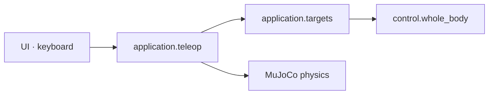

# 애플리케이션 API

앱의 실행 상태와 목표 좌표 계산을 두 모듈로 나눈다. 실행 루프를 수정할 때는
`teleop`, 좌표계나 marker 동기화를 수정할 때는 `targets` 문서로 이동한다.

| 모듈 | 책임 | 상세 문서 |
|---|---|---|
| `application.teleop` | 앱 초기화, 모드 전환, frame/physics loop | [텔레옵 앱 API](application-teleop.md) |
| `application.targets` | UI target ↔ world pose, 양손 가상 물체, marker | [목표 좌표 API](application-targets.md) |

Quaternion 배열은 `(w, x, y, z)`다. `targets`는 목표 상태만 바꾸고 actuator를
직접 쓰지 않는다.
