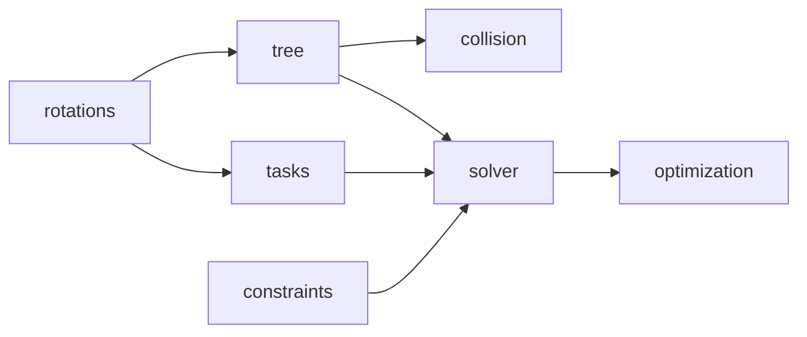

# 기구학 API

기구학 계층은 회전 수학, soft task, hard constraint, 모델 Tree, differential solver와 충돌 거리로 나뉜다.
모든 pose는 world frame이며 Quaternion은 `(w, x, y, z)` 순서다.

| 모듈 | 책임 | 상세 문서 |
|---|---|---|
| `kinematics.rotations` | Quaternion, 회전행렬, 각도·벡터 수학 | [회전 수학 API](kinematics-rotations.md) |
| `kinematics.tasks` | pose 오차와 무차원 soft velocity task | [Pose 오차와 Task API](kinematics-tasks.md) |
| `kinematics.constraints` | joint-limit box와 collision CBF | [속도 제약조건 API](kinematics-constraints.md) |
| `kinematics.tree` | MJCF 구조, FK와 geometric Jacobian | [Tree와 FK API](kinematics-tree.md) |
| `kinematics.solver` | pseudoinverse, DLS, QP와 safety projection | [Solver API](kinematics-solver.md) |
| `kinematics.optimization` | box/soft-barrier convex QP 수치 구현 | [QP 수치 API](kinematics-optimization.md) |
| `kinematics.collision` | signed distance와 관절 gradient | [충돌 기구학 API](kinematics-collision.md) |
| `kinematics.legacy` | 과거 `InverseKinematics` import 호환 | [Legacy 호환 API](kinematics-legacy.md) |

