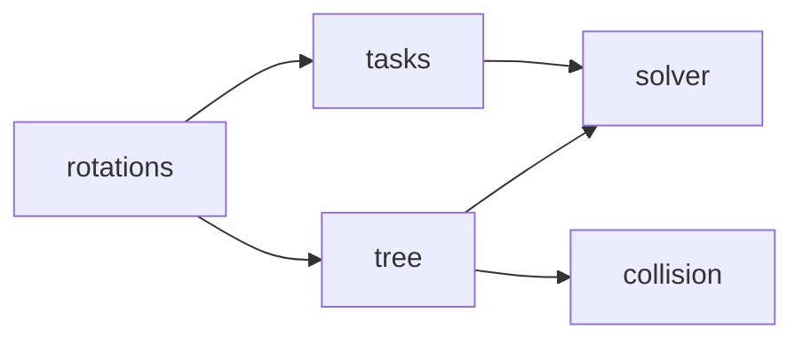

# 기구학 API

기구학 계층은 회전 수학, 공통 pose task, 모델 Tree, 단일 팔 solver와 충돌 거리 계산으로 나뉜다.
모든 pose는 world frame이며 Quaternion은 `(w, x, y, z)` 순서다.

| 모듈 | 책임 | 상세 문서 |
|---|---|---|
| `kinematics.rotations` | Quaternion, 회전행렬, 각도·벡터 수학 | [회전 수학 API](kinematics-rotations.md) |
| `kinematics.tasks` | 모든 IK의 pose 오차와 Cartesian 속도 명령 | [Pose 오차와 Task API](kinematics-tasks.md) |
| `kinematics.tree` | MJCF 구조, FK와 geometric Jacobian | [Tree와 FK API](kinematics-tree.md) |
| `kinematics.solver` | 단일 팔 위치 우선 DLS IK | [단일 팔 Solver API](kinematics-solver.md) |
| `kinematics.collision` | signed distance와 관절 gradient | [충돌 기구학 API](kinematics-collision.md) |
| `kinematics.legacy` | 과거 `InverseKinematics` import 호환 | [Legacy 호환 API](kinematics-legacy.md) |

