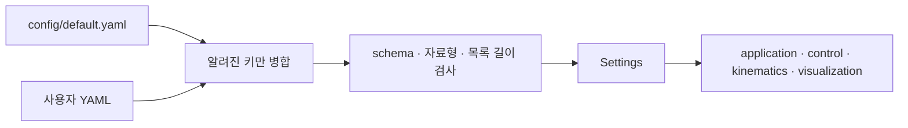

# YAML 설정

실행과 제어 설정의 기준 파일은 `config/default.yaml`이다. 기본 파일을 직접 고치기보다
변경할 항목만 담은 사용자 YAML을 만들어 실행할 때 선택하는 방식을 권장한다.

[설정 API](api/config.md){ .md-button }
[관련 테스트](testing.md){ .md-button }

## 사용자 설정 적용

### 1. 바꿀 값만 작성

```yaml
# config/local.yaml
arm_control:
  proportional_gain: 480.0
  derivative_gain: 36.0

base:
  teleop:
    cruise_speed_m_s: 0.40
    max_speed_m_s: 0.50

whole_body_ik:
  solver:
    method: dls
    dls_damping: 0.08
  collision_safe_distance_m: 0.015
```

작성하지 않은 값은 `config/default.yaml`에서 가져온다. 최상위에
`schema_version`을 다시 적을 필요는 없다.

### 2. 앱 실행

```bash
python3 src/teleop_app.py --config config/local.yaml
```

기본값만 사용할 때는 `--config`를 생략한다.

```bash
python3 src/teleop_app.py
```

`src/teleop_app.py`는 제어 모듈을 import하기 전에 `FFW_SH5_CONFIG` 환경 변수를
설정한다. 설정값은 대부분 모듈 import 시 읽히므로 실행 중 YAML 파일을 수정해도
현재 프로세스에는 다시 적용되지 않는다.

## 설정을 읽는 순서



직접 Python 프로그램이나 테스트를 실행할 때는 설정 의존 모듈보다 먼저 환경 변수를
지정한다.

```bash
FFW_SH5_CONFIG=config/local.yaml python3 tests/test_phase_6.py
```

```python
import os

os.environ["FFW_SH5_CONFIG"] = "config/local.yaml"

from ffw_sh5_grasp.control import base
```

## 설정 구역

| YAML 구역 | 적용 위치 | 주요 값 |
|---|---|---|
| `application` | `paths.py`, `application/teleop.py` | 모델, 창, 제어 주기, target 변화율, lift·grasp 입력 |
| `arm_control` | `control/arm.py` | 팔 PD gain |
| `whole_body_ik` | `control/whole_body.py`, `kinematics/solver.py` | 해법, task strength, 속도 제한, joint·collision CBF |
| `base` | `control/base.py` | 수동 속도, 스워브 형상, 조향·반전 제어 |
| `grasp` | `control/grasp.py` | 손가락 synergy와 파지 판정 기준 |
| `ui` | `visualization/ui.py` | jog 간격과 창 배치 |
| `render` | `visualization/render.py` | camera preset |

각 키의 단위와 의미는 `config/default.yaml`의 한국어 주석에 적혀 있다.

## 자주 바꾸는 값

| 목적 | 설정 키 |
|---|---|
| IK 해법 선택 | `whole_body_ik.solver.method` |
| Pseudoinverse cutoff | `whole_body_ik.solver.pseudoinverse_rcond` |
| DLS 감쇠 | `whole_body_ik.solver.dls_damping` |
| 손 위치·자세 추종 강도 | `whole_body_ik.position_weight`, `orientation_weight` |
| 베이스 자동 참여 비율 | `whole_body_ik.base.participation_scale` |
| 충돌 감시·안전거리 | `whole_body_ik.collision_buffer_m`, `collision_safe_distance_m` |
| 수동 주행 속도 | `base.teleop.cruise_speed_m_s`, `max_speed_m_s` |
| 팔 PD gain | `arm_control.proportional_gain`, `derivative_gain` |
| Marker jog 간격 | `ui.jog_position_step_m`, `jog_rotation_step_deg` |

### 베이스 자동 참여

```yaml
whole_body_ik:
  base:
    participation_scale: 0.05
```

`participation_scale`은 `[0,1]` 범위다. 이 값은 전신 IK의 base 목표와 x/y/yaw 속도
상한에 함께 적용된다. `0.0`은 base 세 축만 고정하며 lift와 양팔은 계속 계산한다.
UI의 Whole-body OFF는 base와 lift를 모두 고정하므로 동작이 다르다.

### QP strength

`position_weight`, `orientation_weight`, `rigid_grasp_weights`, `damping_weights`와
`posture_weights`는 대응 속도 상한으로 정규화한 무차원 strength다.

\[
\text{cost}=s\left(\frac{\text{velocity residual}}{\text{velocity scale}}\right)^2
\]

값이 클수록 해당 오차나 움직임을 더 비싸게 취급한다. 수식과 실제 코드 적용은
[Differential IK 수학](guide/ik-math.md)에서 확인한다.

앱 실행 중 **IK Solver** 탭에서 바꾼 해법과 weight는 현재 프로세스에만 적용된다.
다음 실행의 초기값은 YAML에서 변경한다.

## YAML에 두지 않는 값

| 값 | 관리 위치 |
|---|---|
| body·joint·site 이름, 질량, 관성, geom, actuator | `models/*.xml` |
| QP 반복 상한과 수치 허용 오차 | 해당 수치 구현 모듈 |
| 고정 UI 범위, 색상과 overlay 크기 | `visualization/*.py` |
| 테스트 합격 기준 | `tests/` |

테스트 기준을 실행 설정과 함께 바꾸면 실패를 숨길 수 있으므로 별도로 관리한다.

## 오류 검사

`load_settings()`는 앱 시작 전에 다음 항목을 검사한다.

- 파일 존재 여부와 YAML 문법
- 최상위 값이 mapping인지 여부
- 기본 설정에 없는 키
- 기본 설정과 다른 자료형 또는 목록 길이
- `NaN`, 무한대 같은 유한하지 않은 숫자
- 현재 `schema_version`과의 일치 여부

그 다음 각 모듈은 `Settings.number()`와 `Settings.integer()` 또는 자체 검사로 양수,
최솟값, 범위 순서와 `collision_buffer > collision_safe_distance` 같은 관계를 확인한다.
오류가 있으면 잘못된 기본값으로 실행하지 않고 import 또는 초기화 단계에서 예외를
발생시킨다.

!!! warning "이전 설정 파일"

    현재 스키마는 `schema_version: 5`다. 스키마 2~4 파일은 자동 변환하지 않는다.
    현재 `config/default.yaml`을 기준으로 새 사용자 파일을 만들고 필요한 값만 옮긴다.
    과거 최상위 `kinematics` 구역은 제거되었으며 solver 설정은
    `whole_body_ik.solver`에 있다.

## 변경 후 검증

```bash
python3 tests/test_config.py
python3 tests/test_phase_5.py
python3 tests/test_phase_6.py
python3 tests/test_whole_body.py
```

`test_config.py`는 기본값, 부분 덮어쓰기, 오탈자 거부, 한국어 주석과 코드에서 사용하지
않는 설정 키가 없는지 검사한다. 제어값을 바꿨다면 해당 물리 회귀도 함께 실행한다.
