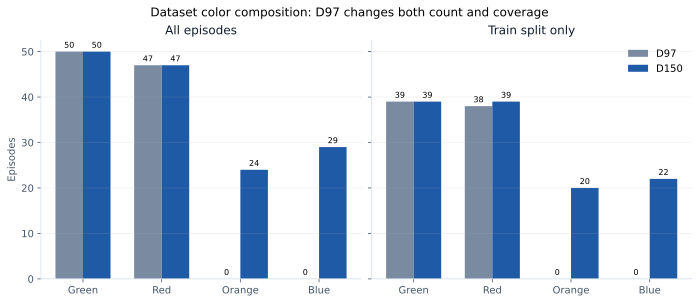
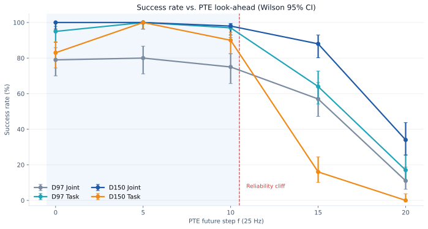
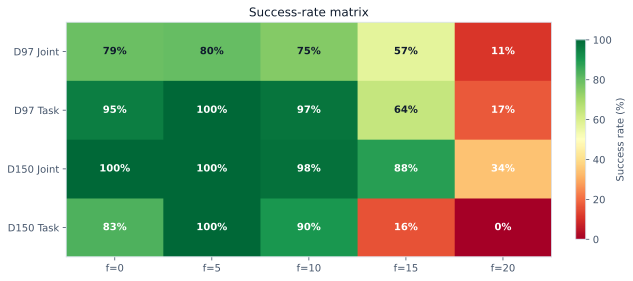
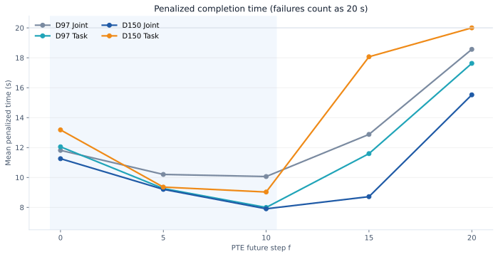
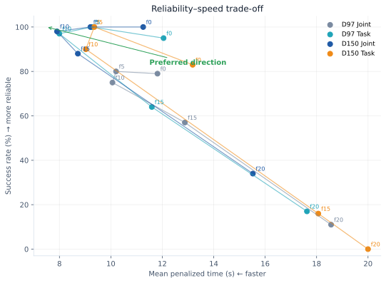
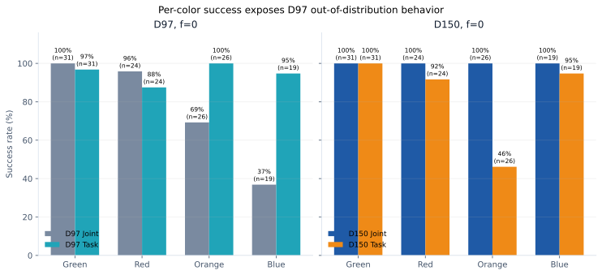
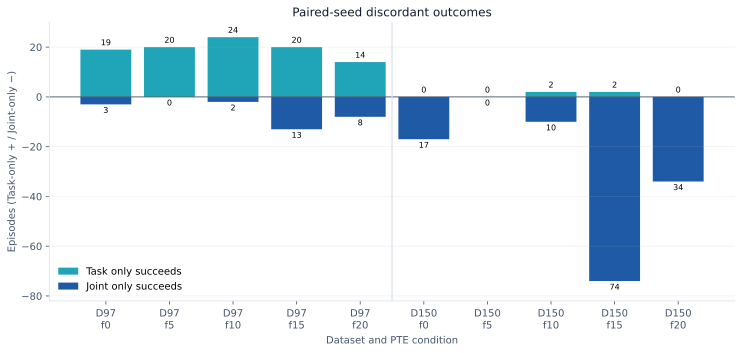
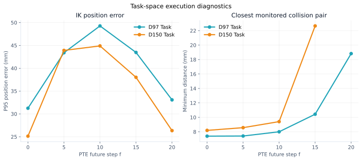
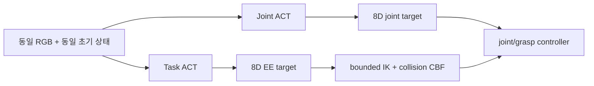

# 캔 색상 분류 평가 결과

이 페이지는 Joint/Task 표현, 데이터 수, PTE look-ahead가 캔 색상 분류 성공률과
완료 시간에 미치는 영향을 2,000회 MuJoCo rollout으로 분석한다. 모든 수치는
`outputs/evaluation/can_color_sort_pte_m005`의 `summary.csv`와 20개
`evaluation.json`/`trials.jsonl`에서 계산했다.

!!! abstract "핵심 결론"

    - 모든 정책이 **PTE `f=5`에서 100%** 성공했다. 현재 결과의 공통 운용점이다.
    - `f=10`은 더 빠르지만 D97 Joint 75%, D150 Task 90%처럼 신뢰도를 일부 잃는다.
    - `f>=15`에서는 미래 행동을 지나치게 앞당겨 대부분의 정책이 reliability cliff를
      보인다. 특히 D150 Task는 `f=15`에서 16%, `f=20`에서 0%다.
    - D97 전체에서는 Task가 Joint보다 좋아 보이지만, D97이 학습하지 않은
      파랑·주황 캔에 대한 일반화가 평균을 끌어올린 결과다. 학습 색상인 초록·빨강만
      보면 D97 Joint 98.2%, D97 Task 92.7%다.
    - 이 평가는 순수 좌표 표현만 비교하지 않는다. Task 정책은 추론 뒤에 bounded
      differential IK와 collision CBF를 사용하므로 **Task-space policy+IK 실행계**의
      end-to-end 성능이다.

## 실험 설계

| 항목 | 설정 |
|---|---|
| Task | 캔 색상에 맞는 좌·우 박스로 분류 |
| 정책 | D97 Joint, D97 Task, D150 Joint, D150 Task |
| 데이터 | 성공 episode 97개 / 색상 보강 후 150개 |
| PTE | `f = 0, 5, 10, 15, 20` |
| 실제 look-ahead | `0.0, 0.2, 0.4, 0.6, 0.8초` (25 Hz) |
| 반복 수 | 조건당 100회, 총 2,000 rollout |
| 환경 seed | 모든 셀에서 `10000..10099`를 동일 순서로 사용 |
| 최대 길이 | 500 step = 20초 |
| 성공 확정 | success 조건을 10 step 연속 만족 |
| 카메라 | `cam_high`, `cam_right_wrist` |
| ACT 구조 | 모든 정책에서 동일, 표현과 데이터만 변경 |
| Task 실행 | right EE pose+grasp 출력 → right-arm IK, speed scale 3.0 |

각 조건의 n번째 rollout은 동일 seed를 사용한다. 따라서 캔 색상·캔 초기 좌표·좌우
상자 색상 배치·로봇 qpos/qvel·MuJoCo `data.time=0`이 같다. 기존 20개 셀을
교차 검사했을 때 환경 시나리오가 불일치한 셀은 0개였다. 정책에 따라 첫 action부터
trajectory가 달라지는 것은 비교 대상인 정책 효과다.

## 데이터 구성



| Dataset | 범위 | Green | Red | Orange | Blue | 합계 |
|---|---|---:|---:|---:|---:|---:|
| D97 | 전체 | 50 | 47 | 0 | 0 | 97 |
| D97 | train | 39 | 38 | 0 | 0 | 77 |
| D150 | 전체 | 50 | 47 | 24 | 29 | 150 |
| D150 | train | 39 | 39 | 20 | 22 | 120 |

D97과 D150의 차이는 단순히 episode 53개가 늘어난 것이 아니다. D97에는 초록·빨강만
있고 D150에서 주황·파랑 support가 추가됐다. 따라서 D97/D150 비교에는 **표본 수와
색상 coverage가 동시에 변하는 confound**가 있다. D97의 파랑·주황 결과는
out-of-distribution(OOD) 일반화 성능으로 해석해야 한다.

Joint/Task 쌍은 각 데이터 조건에서 동일한 `split_seed=42`, `training_seed=1`과 정확히
같은 episode split을 사용했다.

| Run | Train/Val/Test | Best epoch | Best normalized val loss |
|---|---:|---:|---:|
| D97 Joint | 77 / 10 / 10 | 1881 | 0.08746 |
| D97 Task | 77 / 10 / 10 | 1881 | 0.06444 |
| D150 Joint | 120 / 15 / 15 | 1756 | 0.15481 |
| D150 Task | 120 / 15 / 15 | 680 | 0.11100 |

Joint와 Task는 normalization 통계와 좌표 단위가 다르므로 val loss의 절대값을 서로
비교하면 안 된다. 이 값은 같은 표현 안에서 checkpoint를 선택하기 위한 지표다.

## 전체 성공률





아래 대괄호는 100회 이항 성공률의 Wilson 95% 신뢰구간이다.

| Policy | f=0 | f=5 | f=10 | f=15 | f=20 |
|---|---:|---:|---:|---:|---:|
| D97 Joint | 79% [70.0, 85.8] | 80% [71.1, 86.7] | 75% [65.7, 82.5] | 57% [47.2, 66.3] | 11% [6.3, 18.6] |
| D97 Task | 95% [88.8, 97.8] | 100% [96.3, 100.0] | 97% [91.5, 99.0] | 64% [54.2, 72.7] | 17% [10.9, 25.5] |
| D150 Joint | 100% [96.3, 100.0] | 100% [96.3, 100.0] | 98% [93.0, 99.4] | 88% [80.2, 93.0] | 34% [25.5, 43.7] |
| D150 Task | 83% [74.5, 89.1] | 100% [96.3, 100.0] | 90% [82.6, 94.5] | 16% [10.1, 24.4] | 0% [0.0, 3.7] |

### PTE 구간별 해석

- **`f=0`**: 기존 ACT temporal ensemble이다. D150 Joint가 100%로 가장 안정적이고,
  D97 Task가 95%로 뒤를 잇는다.
- **`f=5`, 0.2초**: 네 정책 모두 100%다. 현재 측정 범위에서 속도와 신뢰도가 동시에
  개선되는 유일한 공통 지점이다.
- **`f=10`, 0.4초**: D97 Task 97%, D150 Joint 98%는 유지되지만 D97 Joint 75%,
  D150 Task 90%로 조건 민감도가 나타난다.
- **`f=15`, 0.6초**: D150 Joint만 88%를 유지한다. 나머지는 16~64%로 크게 하락한다.
- **`f=20`, 0.8초**: 모든 정책이 실패 영역에 들어간다. action chunk가 접촉·파지
  전환보다 지나치게 앞선 시점의 명령을 실행하는 것으로 해석된다.

## 완료 시간과 신뢰도–속도 절충

성공 episode만의 완료 시간은 낮은 성공률 조건에서 살아남은 쉬운 episode만 반영하는
survivorship bias가 있다. 따라서 주 비교 지표는 실패를 20초로 계산한 penalized time이다.

\[
T_{penalized}^{(i)} =
\begin{cases}
T_{completion}^{(i)}, & \text{success} \\
20\text{ s}, & \text{failure}
\end{cases}
\]



| Policy | f=0 | f=5 | f=10 | f=15 | f=20 |
|---|---:|---:|---:|---:|---:|
| D97 Joint | 11.81s / 1.000× | 10.20s / 1.158× | 10.06s / 1.174× | 12.88s / 0.917× | 18.57s / 0.636× |
| D97 Task | 12.05s / 1.000× | 9.26s / 1.301× | 8.00s / 1.507× | 11.59s / 1.039× | 17.63s / 0.684× |
| D150 Joint | 11.26s / 1.000× | 9.20s / 1.223× | 7.91s / 1.424× | 8.72s / 1.291× | 15.52s / 0.725× |
| D150 Task | 13.18s / 1.000× | 9.36s / 1.409× | 9.03s / 1.460× | 18.07s / 0.730× | 20.00s / 0.659× |

각 셀은 `평균 penalized time / f=0 대비 speedup`이다. speedup이 1보다 작으면 더
느려진 것이다.



- D97 Task와 D150 Joint의 `f=10`은 약 8초로 가장 빠른 축에 속하지만 성공률은 각각
  97%, 98%다.
- 모든 조건에서 100%를 요구한다면 `f=5`가 선택지다.
- D150 Joint는 `f=15`에서도 88%와 8.72초를 유지하지만, 100회 중 12회 실패를
  허용하는 운용 조건에서만 의미가 있다.
- `f=15,20`의 성공 episode 중앙값만 보면 빨라 보일 수 있으나 실패 penalty를 포함하면
  대부분 baseline보다 나쁘다.

평균 policy inference 시간은 Joint 약 4.32~4.64 ms, Task 약 4.73~4.93 ms다. 둘 다
25 Hz의 40 ms control budget 안이며 성공률 차이를 설명할 만큼 큰 지연은 아니다.

## 색상별 일반화



| Dataset | Representation | Green | Red | Orange | Blue |
|---|---|---:|---:|---:|---:|
| D97 | Joint | 31/31 (100%) | 23/24 (95.8%) | 18/26 (69.2%) | 7/19 (36.8%) |
| D97 | Task | 30/31 (96.8%) | 21/24 (87.5%) | 26/26 (100%) | 18/19 (94.7%) |
| D150 | Joint | 31/31 (100%) | 24/24 (100%) | 26/26 (100%) | 19/19 (100%) |
| D150 | Task | 31/31 (100%) | 22/24 (91.7%) | 12/26 (46.2%) | 18/19 (94.7%) |

### D97의 평균이 뒤집힌 이유

| D97 f=0 범위 | Joint | Task |
|---|---:|---:|
| 학습 색상: Green+Red | 54/55 (98.2%) | 51/55 (92.7%) |
| 미학습 색상: Orange+Blue | 25/45 (55.6%) | 44/45 (97.8%) |
| 전체 | 79/100 (79%) | 95/100 (95%) |

학습 분포 안에서는 예상대로 Joint가 더 높다. 전체 평균에서 Task가 우세한 것은
미학습 파랑·주황에 대한 44/45 성공이 만든 결과다. 가능한 설명은 다음과 같다.

1. 7-DoF joint action은 같은 EE 목표에 여러 팔꿈치 자세가 존재해 behavior cloning의
   조건부 target이 더 복잡하다.
2. Task 표현은 같은 목표를 Cartesian pose로 합치고, 관절 redundancy를 IK에 맡긴다.
3. Task 실행기의 속도·관절 제한과 collision CBF가 noisy pose prediction을 완화한다.
4. 파랑은 초록과 같은 blue target, 주황은 빨강과 같은 red target을 사용하므로 Task가
   물체의 정확한 색보다 목표 위치의 기하를 학습했을 가능성이 있다.

반대로 D150 Task의 주황 성공률은 46.2%로 크게 하락했다. 이는 “Task가 항상 OOD에
강하다”는 일반 법칙이 아니라, 단일 training seed와 작은 validation split에서 선택된
특정 checkpoint의 결과임을 보여준다.

## 동일 seed의 paired 비교

독립 성공률뿐 아니라 같은 seed에서 어느 정책만 성공했는지 비교하면 환경 난이도
차이를 제거할 수 있다.



| Data | f | 둘 다 성공 | Joint만 성공 | Task만 성공 | 둘 다 실패 | Exact McNemar p |
|---:|---:|---:|---:|---:|---:|---:|
| 97 | 0 | 76 | 3 | 19 | 2 | 0.000855 |
| 97 | 5 | 80 | 0 | 20 | 0 | 0.00000191 |
| 97 | 10 | 73 | 2 | 24 | 1 | 0.0000105 |
| 97 | 15 | 44 | 13 | 20 | 23 | 0.296 |
| 97 | 20 | 3 | 8 | 14 | 75 | 0.286 |
| 150 | 0 | 83 | 17 | 0 | 0 | 0.0000153 |
| 150 | 5 | 100 | 0 | 0 | 0 | 1.000 |
| 150 | 10 | 88 | 10 | 2 | 0 | 0.0386 |
| 150 | 15 | 14 | 74 | 2 | 10 | 7.75×10⁻²⁰ |
| 150 | 20 | 0 | 34 | 0 | 66 | 1.16×10⁻¹⁰ |

Exact McNemar 검정은 discordant pair인 `Joint만 성공`과 `Task만 성공`이 대칭인지 본다.
D97 `f=0,5,10`의 Task 우세와 D150 `f=0,15,20`의 Joint 우세는 같은 seed 쌍에서도
뚜렷하다. 다만 위 p-value는 10개 비교에 대한 multiple-comparison correction을 하지
않은 탐색적 수치다. `f=15,20`의 D97 차이는 유의하다고 보기 어렵다.

## Task-space IK 진단



| Policy | f | IK position error P95 | 최소 monitored distance | 최대 CBF violation |
|---|---:|---:|---:|---:|
| D97 Task | 0 | 31.25 mm | 7.40 mm | 5.58×10⁻⁴ |
| D97 Task | 5 | 43.40 mm | 7.42 mm | 5.51×10⁻⁴ |
| D97 Task | 10 | 49.27 mm | 8.00 mm | 1.83×10⁻⁴ |
| D97 Task | 15 | 43.46 mm | 10.43 mm | 1.11×10⁻⁴ |
| D97 Task | 20 | 33.08 mm | 18.82 mm | 3.69×10⁻⁵ |
| D150 Task | 0 | 25.13 mm | 8.20 mm | 1.99×10⁻⁴ |
| D150 Task | 5 | 43.91 mm | 8.57 mm | 1.46×10⁻⁴ |
| D150 Task | 10 | 44.89 mm | 9.41 mm | 5.05×10⁻⁵ |
| D150 Task | 15 | 38.01 mm | 22.65 mm | 0 |
| D150 Task | 20 | 26.35 mm | — | 0 |

PTE가 5~10으로 커지면 현재 EE pose와 실행할 미래 target 사이가 멀어져 IK position
error가 증가한다. 이후 `f=15,20`에서 오차가 다시 작아지거나 최소 거리가 증가하는
것을 안전성 개선으로 해석하면 안 된다. 성공률이 급락하면서 짧거나 다른 종류의
trajectory만 남는 selection effect가 함께 존재한다. D150 Task `f=20`의 최소 거리는
0이 아니라 finite monitored pair가 집계되지 않아 비어 있는 값이다.

constraint violation은 작지만 완전히 0은 아니다. QP의 collision slack을 허용하는
soft safety projection이므로 실제 로봇 전환 전에는 physical clearance와 접촉력을
별도로 검증해야 한다.

## Joint와 Task 결과를 해석하는 범위



Task 정책은 캔 위치, 정답 박스 label 또는 성공 판정을 입력으로 받지 않는다. 입력은
두 RGB와 현재 오른팔 EE pose+grasp뿐이며, 출력 EE pose를 IK가 joint target으로
변환한다. 따라서 직접적인 label leakage나 치팅은 없다. 하지만 Task에만 IK 제어기가
추가되므로 결과는 다음 두 요소가 결합된 시스템 비교다.

1. Joint/Task coordinate representation의 학습 난이도
2. Task 출력 뒤 IK의 feedback, rate limit, joint limit, collision CBF 효과

따라서 문서와 발표에서는 “Task 표현 자체가 Joint보다 우수하다”가 아니라
“Task-space policy+IK 실행계가 D97/OOD 조건에서 더 높은 end-to-end 성공률을 보였다”로
표현하는 것이 정확하다.

## 타당성 한계

| 한계 | 결과에 미치는 영향 | 후속 조치 |
|---|---|---|
| training seed가 조건당 1개 | 초기화·batch sampling 운을 분리하지 못함 | 조건당 3~5개 학습 seed |
| D97/D150의 색상 coverage가 다름 | 데이터 수 효과와 OOD 효과가 섞임 | 같은 색상 비율로 subset 구성 |
| Task에만 IK 실행 계층 | 표현과 controller 효과가 결합됨 | offline 공통 EE metric 추가 |
| validation이 D97 10개, D150 15개 | best checkpoint 선택 분산이 큼 | validation 확대 또는 여러 checkpoint rollout |
| MuJoCo 단일 모델 | sim dynamics에 특화될 가능성 | mass/friction/camera domain randomization |
| 조건당 100회 | 0%, 100%도 실제 확률의 확정값이 아님 | Wilson CI와 반복 실험 유지 |
| `f` 5-step 간격 | 최적점이 5와 10 사이일 수 있음 | `f=3..10` 세밀 탐색 |

## 권장 결론과 후속 실험

1. **기본 성능 보고는 `f=0`**으로 한다. 기존 ACT와 직접 비교 가능한 기준점이다.
2. **실제 운용 후보는 `f=5`**로 둔다. 네 checkpoint 모두 100%이며 penalized time도
   baseline보다 개선됐다.
3. **속도 우선 후보는 정책별로 검증한 `f=10`**이다. 공통 안전 기본값으로 사용하면
   안 된다.
4. D97은 `Green+Red`와 `Orange+Blue`를 나눠 ID/OOD 결과로 보고한다.
5. Joint 예측을 FK한 EE pose와 Task 예측 EE pose를 동일 단위의 offline error로
   비교해 표현 효과를 controller와 분리한다.
6. 같은 dataset/split에서 training seed 3~5개를 학습하고, seed별 100 rollout의
   hierarchical mean과 신뢰구간을 보고한다.
7. real robot에서는 우선 `f=0,5`만 낮은 속도에서 검증하고 collision clearance,
   접촉력, emergency stop을 함께 기록한다.

## 재현 방법과 원본 파일

평가 계획과 실행:

```bash
python3 src/il.py evaluate-color-sort --dry-run

MUJOCO_GL=egl python3 src/il.py evaluate-color-sort \
  --num-episodes 100 \
  --pte-steps 0 5 10 15 20 \
  --seed 10000 \
  --output-dir outputs/evaluation/can_color_sort_pte_m005
```

이 페이지의 그래프 재생성:

```bash
python3 -m pip install -r requirements-presentation.txt
.venv/bin/python scripts/generate_evaluation_docs.py
```

| 파일 | 내용 |
|---|---|
| `summary.csv` | 20개 cell의 성공률·CI·시간·IK 요약 |
| `summary.json` | summary의 JSON 표현 |
| `<policy>/f_XXX/evaluation_config.json` | checkpoint와 평가 설정 |
| `<policy>/f_XXX/trials.jsonl` | seed별 원시 결과 |
| `<policy>/f_XXX/evaluation.json` | cell summary와 100개 episode |
| `scripts/generate_evaluation_docs.py` | 이 페이지의 8개 SVG 생성기 |

ACT 구조는 [ACT 아키텍처](guide/il/act.md), 학습·평가 명령은
[Joint/Task 학습과 PTE 평가](modular-act-training.md)에서 이어서 확인한다.
