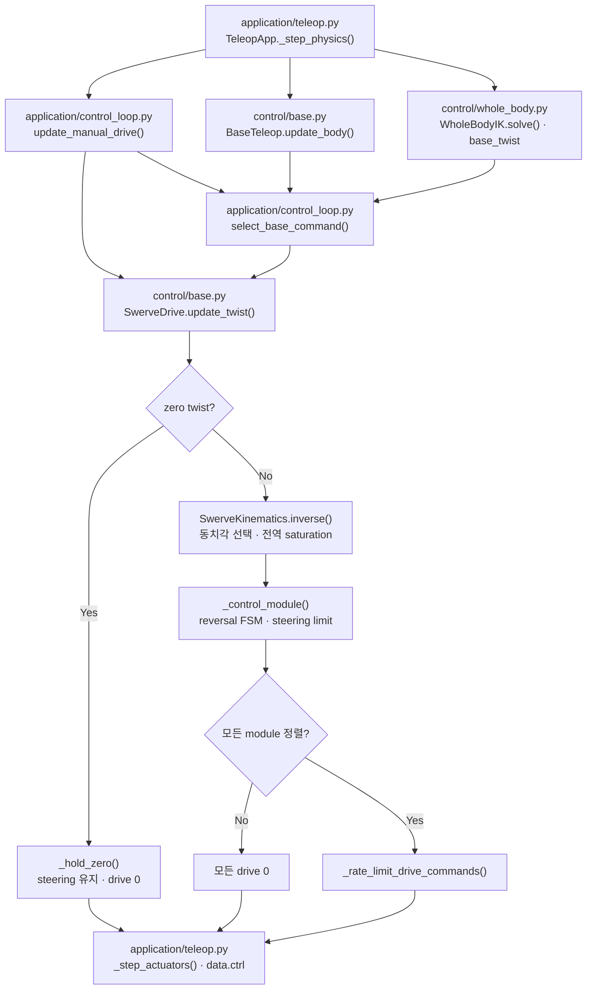

# 모바일 베이스와 스워브 제어

!!! info "핵심 알고리즘 학습 순서 5/6"

    [전신 IK](whole_body_ik.md)가 반환한 `BodyTwist`를 세 wheel module의 조향각과
    구동 속도로 바꾸는 단계다. 다음은 [손 파지와 접촉 판정](grasp.md)이다.

구현은 `src/ffw_sh5_grasp/control/base.py`에 있다. 키보드와 전신 IK는 모두
body-frame `BodyTwist(vx, vy, wz)`를 만들며, 이후 같은 스워브 제어 경로를 사용한다.
설정값은 `config/default.yaml`의 `base` 구역에 있다.

## 구성별 역할

| 구성 | 역할 |
|---|---|
| `BaseTeleop` | 키 입력을 평활화된 body-frame 속도로 변환 |
| `SwerveKinematics` | body twist와 wheel state 사이의 순수 기구학 |
| `SwerveDrive` | 조향 제한, 반전 FSM, 정렬 gate와 drive rate limit |

`BaseTeleop`은 바퀴를 모르고, `SwerveKinematics`는 키보드·MuJoCo·actuator를 모른다.
`SwerveDrive`만 wheel feedback과 이전 명령 상태를 사용한다.

## 기호와 좌표계

| 기호 | 의미 | 단위·frame |
|---|---|---|
| \((v_x,v_y,\omega)\) | 차체 속도 | m/s, m/s, rad/s · body frame |
| \((x_i,y_i)\) | 차체 중심에서 module \(i\)까지의 위치 | m · body frame |
| \((v_{i,x},v_{i,y})\) | module 위치의 평면 속도 | m/s · body frame |
| \(\beta_i\) | body frame에서 본 wheel 진행 방향 | rad |
| \(\delta_i\) | module joint angle offset | rad |
| \(\theta_i\) | steering joint 목표 | rad |
| \(\dot\phi_i\) | wheel drive 목표 | rad/s |
| \(r\) | wheel 반지름 | m |

## 스워브 역기구학

차체가 병진하면서 회전하면 module \(i\)의 속도는 중심 속도와 회전 접선속도의
합이다.

\[
\begin{bmatrix}v_{i,x}\\v_{i,y}\end{bmatrix}
=
\begin{bmatrix}v_x-\omega y_i\\v_y+\omega x_i\end{bmatrix}
\]

이 벡터의 방향과 크기를 구하면 wheel 진행 방향과 구동 속도가 된다.

\[
\beta_i=\operatorname{atan2}(v_{i,y},v_{i,x}),\qquad
s_i=\sqrt{v_{i,x}^2+v_{i,y}^2},\qquad
\dot\phi_i=\frac{s_i}{r}
\]

<figure markdown>
  
  <figcaption>빨강은 차체 병진 속도, 주황은 module 위치의 회전 접선속도, 초록은 둘을 더한 최종 module 속도다.</figcaption>
</figure>

조향 joint에는 module offset을 제거한 각도를 사용한다.

\[
\theta_i^{raw}=\operatorname{normalize}(\beta_i-\delta_i)
\]

### 동치 조향 상태

같은 wheel 속도 벡터는 다음 두 상태로 표현할 수 있다.

\[
(\theta_i,\dot\phi_i)
\equiv(\theta_i+\pi,-\dot\phi_i)
\]

`_nearest_feasible_state()`는 `angle + k*pi` 후보 중 조향 범위 안에 있고 현재 각도에서
이동 비용이 가장 작은 상태를 선택한다. 기본 범위는 약 ±2π지만, 좁은 범위를 주입한
테스트에서도 같은 규칙을 사용한다.

모듈 하나라도 drive 속도 상한을 넘으면 모든 wheel 속도에 같은 배율을 곱한다.

\[
\gamma=\min\left(1,
\frac{\dot\phi_{max}}{\max_i|\dot\phi_i|}\right)
\]

이 전역 saturation은 병진과 회전의 비율을 보존한다.

## 스워브 정기구학

wheel \(i\)는 진행 방향 성분만 관측한다. \(\beta_i=\theta_i+\delta_i\)라 하면 각
module이 만드는 한 행은 다음과 같다.

\[
\begin{bmatrix}
\cos\beta_i & \sin\beta_i &
-y_i\cos\beta_i+x_i\sin\beta_i
\end{bmatrix}
\begin{bmatrix}v_x\\v_y\\\omega\end{bmatrix}
=r\dot\phi_i
\]

`SwerveKinematics.forward()`는 세 행을 쌓고 `np.linalg.lstsq(..., rcond=1e-6)`로
`BodyTwist`를 복원한다. 평행한 wheel에서 관측할 수 없는 방향은 truncated SVD가
최소-norm 값으로 처리한다.

## 제어 순서

`SwerveDrive.update_twist()`는 기구학 결과를 actuator 명령으로 바로 보내지 않고 다음
순서로 제한한다.

| 순서 | 구현 동작 |
|---:|---|
| 1 | deadband 적용; zero twist면 현재 조향각을 유지하고 drive를 즉시 0으로 설정 |
| 2 | `SwerveKinematics.inverse()`로 실행 가능한 wheel state 계산 |
| 3 | module별 reversal FSM과 steering rate limit 적용 |
| 4 | 실제 steering feedback으로 세 module의 정렬 여부 확인 |
| 5 | 하나라도 미정렬이면 모든 drive 명령을 0으로 gate |
| 6 | 모두 정렬되면 drive 가속·제동 변화율 제한 후 반환 |

### 방향 반전 FSM

움직이는 wheel의 drive 부호가 바뀌면 다음 상태를 거친다.

```text
DECELERATING → STEERING → ACCELERATING → NORMAL
```

이미 정지한 wheel은 감속할 회전 에너지가 없으므로 방향을 즉시 바꾼다. 조향 변화율은
지연된 feedback이 아니라 이전 **명령 궤적**을 기준으로 제한하고, feedback은 정렬과
FSM 전이 판정에만 사용한다.

## 명령 중재

`application/control_loop.py::select_base_command()`는 manual command와 전신 IK
command를 다음 우선순위로 선택한다.

| 상태 | `commanded_base_twist` |
|---|---|
| 주행 키 입력 중 | `BaseTeleop.update_body()` 출력 |
| 키 해제 후 차체가 아직 움직임 | zero twist |
| 정지 확인 후 Whole-body ON | `WholeBodyIK.solve()`의 base twist |
| 그 외 | zero twist |

키 해제 직후 WBIK 명령으로 전환하지 않는 이유는 물리 제동 중인 차체에 반대 명령이
겹치는 것을 막기 위해서다. 정지 확인 뒤 `BaseTeleop.reset_motion()`으로 남은 smoothing
상태를 지운다.

## 코드 대응 { #equation-to-code }

| 단계 | 함수 | 파일 |
|---|---|---|
| 키 입력 평활화 | `BaseTeleop.update_body()` | `control/base.py` |
| body twist → wheel state | `SwerveKinematics.inverse()` | `control/base.py` |
| wheel feedback → body twist | `SwerveKinematics.forward()` | `control/base.py` |
| 동치 조향 상태 선택 | `_nearest_feasible_state()` | `control/base.py` |
| reversal·조향·정렬 처리 | `_control_module()` | `control/base.py` |
| drive 변화율 제한 | `_rate_limit_drive_commands()` | `control/base.py` |
| base feedback·수동 상태 | `update_manual_drive()` | `application/control_loop.py` |
| manual/WBIK 중재 | `select_base_command()` | `application/control_loop.py` |
| actuator 기록 | `TeleopApp._step_actuators()` | `application/teleop.py` |

## 함수 흐름 { #base-function-flow }



## 출력과 주요 API

`update_twist()`는 module 이름을 `(steer_angle_rad, drive_angvel_rad_s)`에 대응시키는
사전을 반환한다.

| API | 반환·역할 |
|---|---|
| `BodyTwist(vx, vy, wz)` | body-frame 속도 값 |
| `BaseTeleop.update_body(keys, dt, measured_twist=None)` | 평활화된 `BodyTwist`; `measured_twist`는 호환 인자 |
| `BaseTeleop.reset_motion()` | 병진·yaw smoothing 상태 초기화 |
| `SwerveKinematics.inverse(...)` | wheel state 사전과 saturation scale |
| `SwerveKinematics.forward(...)` | feedback으로 추정한 `BodyTwist` |
| `SwerveDrive.update_twist(...)` | 최종 wheel actuator 명령 사전 |

## 검증

`tests/test_phase_5.py`는 실제 wheel-floor contact에서 정지 유지, 전후·횡·회전·결합
주행, 반전, release 제동과 base-wheel 내부 접촉 제외를 검사한다.
`tests/test_whole_body.py`는 inverse↔forward 왕복, 좁은 조향 범위의 동치각, 전역
saturation과 manual/WBIK handover를 검사한다.

```bash
# 스워브 단위·물리 회귀
python3 tests/test_phase_5.py
# 전신 IK와 베이스 연결 회귀
python3 tests/test_whole_body.py
```

[← 이전: 팔 토크 제어](arm_control.md) ·
[전체 학습 순서](index.md#algorithm-learning-order) ·
[다음: 손 파지와 접촉 판정 →](grasp.md)
