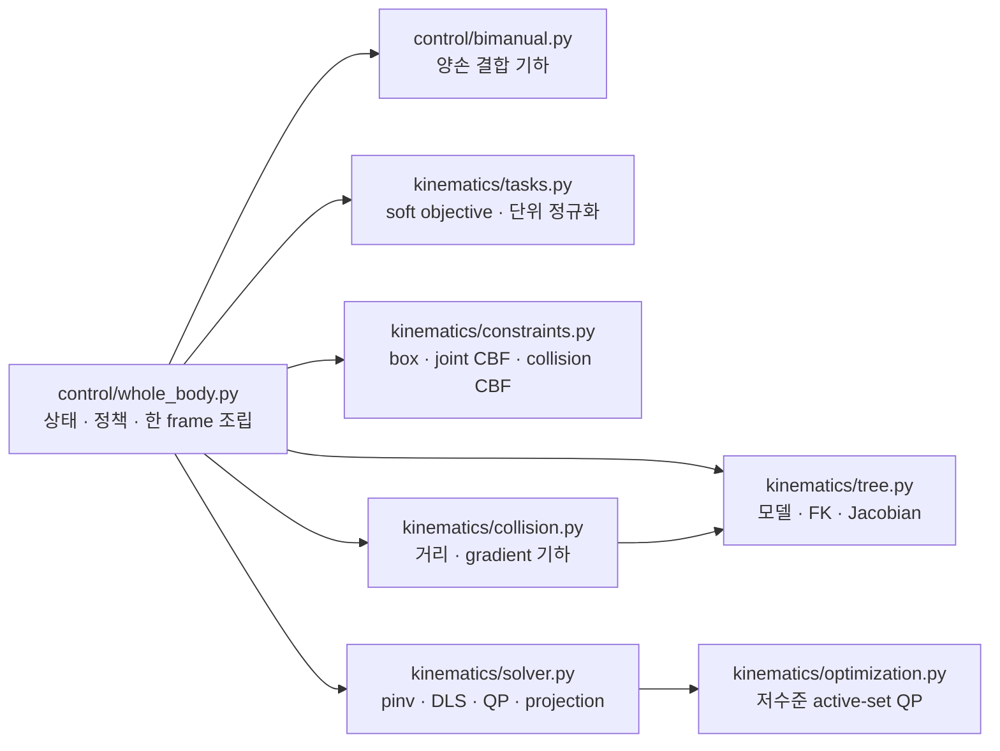

# 코드 분리와 병합 기준

이 프로젝트는 파일 길이가 아니라 **수학적 역할, 상태 소유권, 의존 방향**을 기준으로
나눈다. 참고한 PyRoki도 cost/constraint factory, residual 구현, robot model, collision,
solver를 구분하되 작은 residual마다 파일 하나를 만들지는 않는다.

- [PyRoki 저장소](https://github.com/chungmin99/pyroki)
- [PyRoki 논문](https://arxiv.org/abs/2505.03728)

## 현재 IK 계층

`WholeBodyIK.solve()`의 순서는 다음으로 고정한다.

1. 현재 pose/Jacobian과 target으로 손·양손·base soft task를 만든다.
2. damping/posture task를 같은 무차원 residual 규칙으로 추가한다.
3. 물리 속도와 joint-limit에서 box bound를 만든다.
4. 선택한 pseudoinverse, DLS 또는 QP로 속도를 푼다.
5. base의 물리적 fade/가속도 제한을 적용한다.
6. collision CBF safety projection을 마지막에 적용한다.
7. 관절 위치와 actuator 계층 명령으로 변환한다.

## 파일을 분리하는 조건

다음 중 하나가 명확할 때 분리한다.

| 기준 | 예시 |
|---|---|
| 입력 자료형과 수학적 계약이 다르다 | collision geometry와 velocity barrier |
| 상태 소유자가 다르다 | target reference는 controller, FK topology는 tree |
| 수치 라이브러리 의존성이 다르다 | task 표현과 active-set QP |
| 다른 controller에서도 재사용할 수 있다 | pose residual, joint velocity bound |
| 독립된 단위 테스트 불변식이 있다 | quaternion, QP, CBF bound |

## 파일을 합치거나 만들지 않는 조건

다음 경우에는 별도 파일을 만들지 않는다.

| 기준 | 적용 |
|---|---|
| 항상 같은 입력과 같은 변경 이유를 가진 작은 함수군 | pose error와 pose velocity command는 `tasks.py`에 함께 둔다 |
| 이름만 바꿔 전달하는 thin wrapper | 실시간 경로의 손별 `KinematicsSolver` wrapper를 제거했다 |
| 구현 하나만 가진 의미 없는 problem DTO | matrix/vector/lower/upper를 solver에 직접 전달한다 |
| 한 controller의 상태ful 정책 | base fade와 가속도 ramp는 `whole_body.py`에 남긴다 |
| 특정 기하 도메인의 내부 helper | collision contact normal은 `collision.py` 내부에 둔다 |

따라서 “제약조건 하나당 파일 하나”가 규칙은 아니다. joint-limit과 collision CBF는
둘 다 generalized velocity inequality를 만드는 같은 추상화라 `constraints.py`에
묶는다. 반대로 `collision.py`는 MuJoCo geometry와 최근접점 계산이라는 별도 변경
이유가 있어 분리한다.

## 새 기능을 넣을 위치

- 새 soft tracking/regularization 항: `kinematics/tasks.py`
- 새 generalized velocity bound 또는 선형 barrier: `kinematics/constraints.py`
- 새 양손 상대 기하: `control/bimanual.py`
- 새 충돌 shape/거리 근사: `kinematics/collision.py`
- 새 IK 해법: `kinematics/solver.py`
- 새 QP factorization/active-set 알고리즘: `kinematics/optimization.py`
- UI에서 조절하는 정책값과 frame 순서: `control/whole_body.py`

추가 전에는 먼저 기존 모듈의 입력/출력 계약으로 표현 가능한지 확인한다. 표현 가능하면
함수를 추가하고, 새로운 상태 소유권이나 수학적 계약이 생길 때만 파일을 추가한다.

## 큰 파일을 무조건 나누지 않은 이유

이번 점검에서는 IK 외의 큰 모듈도 같은 기준으로 확인했다.

| 파일 | 판단 |
|---|---|
| `application/teleop.py` | model/data와 controller 생명주기를 소유하는 composition root라 유지. 계산식은 이미 `targets`, `control`, `visualization`로 빠져 있다. |
| `visualization/ui.py` | 함수가 크지만 모두 같은 ImGui frame과 app UI 상태를 사용한다. 창별 파일로 나누면 상태 전달 wrapper만 늘어나므로 유지. |
| `control/base.py` | teleop filter, swerve kinematics, reversal FSM이 하나의 base command pipeline을 이루며 같은 설정 상수를 공유하므로 도메인 모듈로 유지. |
| `control/grasp.py` | synergy command와 접촉 판정은 같은 손 joint/actuator 이름 해석을 공유하고 합계가 작아 유지. |
| `kinematics/collision.py` | 거리 방식은 여러 개지만 모두 `CollisionConstraint`를 만드는 geometry 전략이라 한 카탈로그로 유지. |

이 판단은 영구 규칙이 아니다. 예를 들어 hardware adapter가 추가되어 base kinematics를
여러 backend가 공유하게 되면 `control/base.py`의 순수 kinematics를 별도 모듈로 옮길
근거가 생긴다. 지금은 파일 길이 외에 독립 변경 이유가 충분하지 않다.
