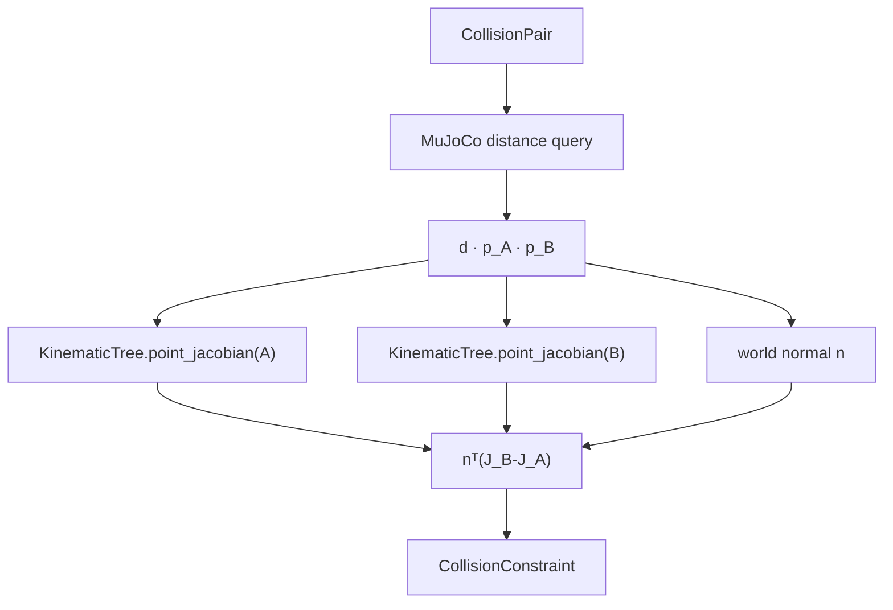

# Collision Distance와 Gradient

!!! info "기구학 학습 순서 3/3"
    FK의 point Jacobian을 signed-distance 변화율로 연결한다. 속도 선택은
    [Differential IK](ik-math.md)와 [전신 IK](whole_body_ik.md)가 담당한다.

`kinematics/collision.py`는 geometry pair마다 다음 값을 반환한다.

| 값 | 의미 |
|---|---|
| `distance` | signed distance \(d\); 양수는 분리, 음수는 침투 |
| `point_a`, `point_b` | world 최근접점 |
| `gradient` | controlled velocity에 대한 \(\nabla_qd\) |

이 모듈은 live `MjData`를 읽지만 qpos와 ctrl을 쓰지 않는다.

## Distance gradient

분리 상태의 A→B 법선은

\[
n=\frac{p_B-p_A}{\|p_B-p_A\|}
\]

이고 최근접점 속도는 \(\dot p_A=J_A\dot q\), \(\dot p_B=J_B\dot q\)다.
따라서

\[
\dot d=n^T(\dot p_B-\dot p_A)
=\underbrace{n^T(J_B-J_A)}_{\nabla_qd}\dot q
\]

<figure markdown>
  
  <figcaption>초록 화살표는 최근접점 pₐ에서 pᵦ로 향하는 법선 n이다. 파랑·빨강 점 속도의 법선 방향 차이만 거리 변화율 ḋ에 기여한다.</figcaption>
</figure>

`KinematicTree.point_jacobian()`의 joint 열은

\[
J_{p,i}^{slide}=a_{w,i},\qquad
J_{p,i}^{hinge}=a_{w,i}\times(p-c_{w,i})
\]

를 사용한다. 여러 pair가 같은 body를 사용할 때 `frame_cache`가 joint frame을
재사용한다.



침투 상태에서는 MuJoCo segment convention에 맞춰 gradient 부호를 뒤집는다. segment가
거의 0이면 contact normal, geometry center 방향 순으로 fallback한다.

## Distance mode

| mode | 대상 | 계산 |
|---|---|---|
| `geom` | 대부분의 pair | MuJoCo 최근접점 |
| `table_top` | palm box–table | table-normal support-point clearance |
| `bounding_sphere` | palm–palm | 보수적 sphere 거리 |

`table_top`은 table XY footprint 안에서만 제약을 만든다. `bounding_sphere`는 box
feature 전환에 따른 gradient jump를 줄인다. 특수 mode는 지정된 pair에만 적용한다.

## 기본 collision pair

`default_collision_pairs(model)`는 다음을 포함한다.

- 양팔 사이와 같은 팔의 비인접 link
- 팔과 base, lift, 상체, head
- 팔·palm과 table

주행·파지·물체 물리에 필요한 wheel–floor, finger–can, can–table 접촉과 구조상 인접한
shoulder link는 제외한다.

## CBF 경계

`collision.py`는 \(\dot d=\nabla d\dot q\)까지 계산한다.
`kinematics.constraints.collision_velocity_barriers()`가 다음 bound를 만든다.

\[
\nabla d\,\dot q\ge-\alpha(d-d_{safe})
\]

| 단계 | 담당 |
|---|---|
| distance와 최근접점 | `kinematics/collision.py` |
| point Jacobian과 gradient | `KinematicTree`, `kinematics/collision.py` |
| CBF lower bound | `kinematics/constraints.py` |
| soft projection | `kinematics/solver.py`, `kinematics/optimization.py` |
| 화면 표시 | `visualization/render.py` |

controller와 renderer는 같은 `CollisionConstraint`를 사용한다.

## 검증

`tests/test_whole_body.py`는 analytic gradient와 중앙 유한차분을 비교하고,
self/table collision의 분리 명령, buffer 밖 nominal command 불변성, pair 제외 규칙과
overlay 최근접점을 검사한다.

```bash
python3 tests/test_whole_body.py
```

[← 이전: Quaternion과 Orientation Error](quaternion-math.md) ·
[다음: Differential IK 수학 →](ik-math.md)
