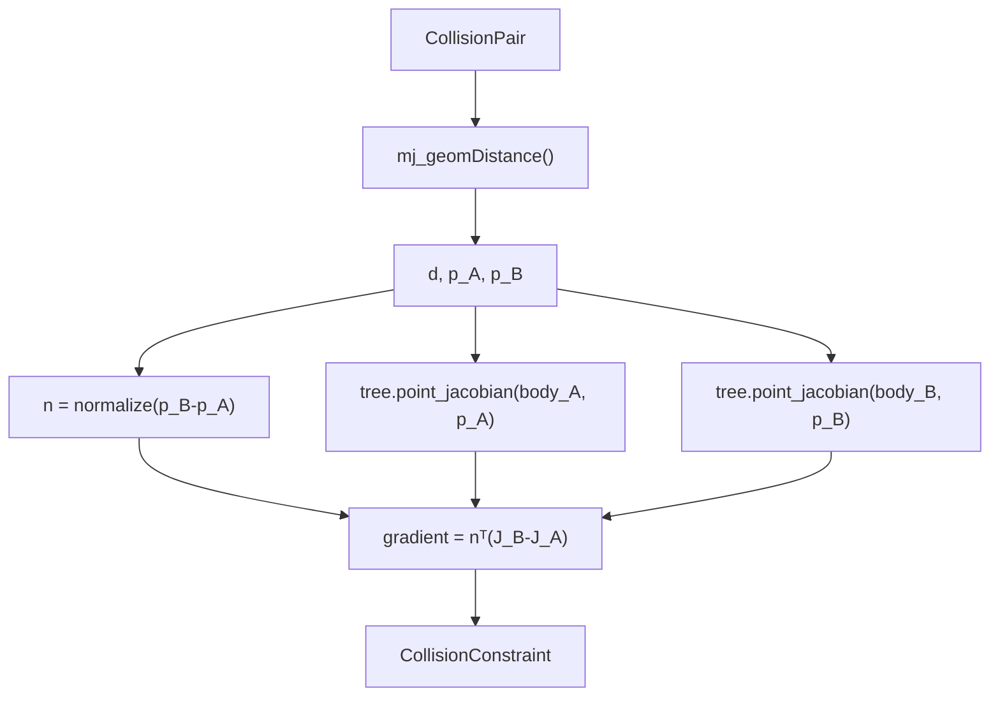

# Collision Distance와 Gradient

!!! info "기구학 학습 순서 4/4"
    이 문서는 FK의 point Jacobian을 geometry signed-distance 변화율로 연결한다.
    다음은 이 pose/Jacobian을 역문제로 푸는
    [DLS와 위치 우선 IK 수학](ik-math.md)이다.

## 1. 문제와 경계

`kinematics/collision.py`는 geometry pair마다 다음 값을 만든다.

| 출력 | 의미 |
|---|---|
| `distance` | 두 geometry의 signed distance \(d\) |
| `point_a, point_b` | 거리 계산에 사용한 world 최근접점 |
| `gradient` | controlled velocity에 대한 \(\nabla_q d\) |

이 모듈은 “어떤 속도를 선택할지” 결정하지 않는다. `WholeBodyIK`가 gradient를
collision CBF로 바꾸고, `control/optimization.py`가 안전한 속도를 푼다.

일반 tree FK와 달리 geometry의 현재 world pose와 contact normal이 필요하므로
기구학 모듈 중 이 파일만 live `MjData`를 읽는다. 그래도 `data.qpos`나 `data.ctrl`을
쓰지는 않는다.

## 2. 기호

| 기호 | 의미 |
|---|---|
| \(p_A,p_B\) | geometry A/B의 world 최근접점 |
| \(d\) | signed distance; 양수는 분리, 음수는 침투 |
| \(n\) | A에서 B로 향하는 world 단위 법선 |
| \(J_A,J_B\) | 최근접점의 \(3×N\) translational Jacobian |
| \(\dot q\) | WBIK가 제어하는 generalized velocity |

분리 상태에서

\[
n=\frac{p_B-p_A}{\|p_B-p_A\|}
\]

다.

## 3. Distance 변화율 유도

두 점의 속도는

\[
\dot p_A=J_A\dot q
\]

\[
\dot p_B=J_B\dot q
\]

다. 두 점의 상대속도 중 법선 방향 성분만 거리를 바꾼다.

\[
\dot d
=n^T(\dot p_B-\dot p_A)
\]

Jacobian 식을 대입하면

\[
\dot d
=n^T(J_B\dot q-J_A\dot q)
\]

\[
\dot d
=n^T(J_B-J_A)\dot q
\]

따라서

\[
\boxed{
\nabla_q d=n^T(J_B-J_A)}
\]

이다.

<figure markdown>
  
  <figcaption>두 최근접점의 상대속도를 법선에 투영하면 signed distance의 순간 변화율이 된다.</figcaption>
</figure>

\(\nabla_qd\,\dot q>0\)이면 분리되고, 0보다 작으면 접근한다.

## 4. 최근접점의 Point Jacobian

`KinematicTree.point_jacobian()`은 geometry가 붙은 body의 조상 joint frame을
순회한다. world point \(p\)에 대해

\[
J_{p,i}^{slide}=a_{w,i}
\]

\[
J_{p,i}^{hinge}
=a_{w,i}\times(p-c_{w,i})
\]

를 사용한다. 이는 site Jacobian 위쪽 3행과 같은 식이다. 차이는 site의 고정 local
position 대신 MuJoCo distance query가 반환한 world 최근접점 \(p_A,p_B\)를 넣는다는
점뿐이다.

여러 pair가 같은 body를 반복 사용할 수 있으므로 `frame_cache`는 body별 joint world
frame을 한 query cycle 동안 재사용한다.

## 5. 일반 Geometry Mode의 코드 흐름



핵심 코드가 수식과 같은 순서로 놓여 있다.

```python
jacobian_a = tree.point_jacobian(
    data.qpos, body_a, point_a, joint_ids, frame_cache
)
jacobian_b = tree.point_jacobian(
    data.qpos, body_b, point_b, joint_ids, frame_cache
)
gradient = normal @ (jacobian_b - jacobian_a)
```

침투 상태에서는 MuJoCo 최근접점 segment 방향의 convention이 분리 상태와 달라질 수
있어 `raw_distance < 0`이면 gradient 부호를 뒤집는다. segment 길이가 0에 가까우면
현재 contact normal, geometry center 방향 순으로 fallback을 선택한다.

## 6. 왜 특수 Distance Mode가 필요한가

일반 `mj_geomDistance()`가 모든 조합에서 항상 부드러운 것은 아니다. convex feature가
바뀌는 경계에서 최근접점이나 0 distance가 불연속적으로 선택되는 조합만 별도 mode를
쓴다.

| mode | 대상 | 거리 정의 |
|---|---|---|
| `geom` | 대부분의 mesh/primitive | MuJoCo 실제 최근접점 |
| `table_top` | palm box와 table top | table normal 방향 support-point clearance |
| `bounding_sphere` | palm과 palm | 보수적인 bounding-sphere 거리 |

### 6.1 Table top

table normal을 \(n_T\), robot geometry의 table 방향 support point를 \(p_R\), table
top의 대응점을 \(p_T\)라 하면

\[
d=n_T^T(p_R-p_T)
\]

\[
\nabla d=n_T^T(J_R-J_T)
\]

를 사용한다. table의 유한한 XY footprint 밖에서는 무한 평면처럼 constraint를
만들지 않는다.

### 6.2 Bounding sphere

두 중심을 \(c_A,c_B\), 반지름을 \(r_A,r_B\)라 하면

\[
d=\|c_B-c_A\|-r_A-r_B
\]

이고

\[
n=\frac{c_B-c_A}{\|c_B-c_A\|}
\]

\[
\nabla d=n^T(J_B-J_A)
\]

다. 실제 box 거리보다 보수적이지만 palm feature 전환에 따른 gradient jump를 줄인다.

특수 mode는 확인된 pair에만 사용하며 모든 mesh 거리를 sphere나 plane으로 바꾸지 않는다.

## 7. Collision pair를 고르는 규칙

`default_collision_pairs(model)`는 collision-enabled geometry를 body별로 인덱싱한 뒤
다음을 감시한다.

- 오른팔과 왼팔의 link/palm 조합
- 같은 팔에서 충분히 떨어진 비인접 link
- 팔과 base/lift/상체/head
- 팔·palm과 table

다음은 의도된 접촉이므로 제외한다.

- wheel–floor: 주행에 필요
- finger–can: grasp에 필요
- can–table: 물체 물리에 필요
- 구조상 항상 가까운 shoulder 인접 link

pair 수를 늘리는 것이 항상 안전한 것은 아니다. 필요한 접촉까지 CBF로 막으면 로봇이
주행하거나 물체를 잡을 수 없다.

## 8. Gradient에서 CBF로 이어지는 경계

이 모듈의 출력은

\[
\dot d=\nabla d\,\dot q
\]

까지다. 다음 inequality는 `WholeBodyIK._collision_constraints()`가 만든다.

\[
\nabla d\,\dot q
\ge-\alpha(d-d_{safe})
\]

즉 역할은 다음처럼 나뉜다.

| 단계 | 담당 |
|---|---|
| \(d,p_A,p_B\) query | `kinematics/collision.py` |
| \(J_A,J_B,\nabla d\) | `KinematicTree` + `kinematics/collision.py` |
| CBF lower bound | `control/whole_body.py` |
| soft constrained solve | `control/optimization.py` |
| 선과 색상 표시 | `visualization/render.py` |

렌더링과 controller가 같은 `CollisionConstraint`를 사용하므로 화면의 선과 safety
판단이 다른 distance implementation을 쓰지 않는다.

## 9. 수식과 코드의 대응

| 수식 | 코드 |
|---|---|
| \(n=(p_B-p_A)/\|p_B-p_A\|\) | `normal` |
| \(J_A,J_B\) | `tree.point_jacobian()` |
| \(\nabla d=n^T(J_B-J_A)\) | `gradient = normal @ (...)` |
| table support clearance | `_table_top_distance_gradient()` |
| sphere clearance | `_bounding_sphere_distance_gradient()` |
| 감시 pair 구성 | `default_collision_pairs()` |

## 10. 검증

`tests/test_whole_body.py`는 다음 주장을 각각 gate로 검사한다.

- analytic \(\nabla d\)와 중앙 유한차분의 일치
- self-collision 접근 velocity가 분리 방향으로 바뀌는지
- table 하강에서 CBF 위반이 감소하는지
- buffer 밖 pair가 기존 nominal command를 바꾸지 않는지
- 의도된 contact가 기본 pair에서 제외되는지
- collision overlay가 같은 최근접점을 표시하는지

```bash
python3 tests/test_whole_body.py
```

[← 이전: Quaternion과 Orientation Error](quaternion-math.md) ·
[다음: DLS와 위치 우선 IK 수학 →](ik-math.md)
