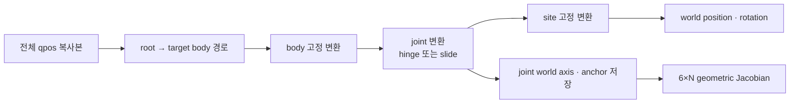

# FK와 Geometric Jacobian: Tree에서 Pose까지

!!! info "기구학 학습 순서 2/4"
    [Kinematic Tree](kinematic-tree.md)가 만든 root→target 경로와 joint metadata를
    실제 pose와 Jacobian으로 바꾸는 과정이다. 다음은 pose 출력과 orientation error를
    다루는 [Quaternion 수학](quaternion-math.md)이다.

## 먼저 보는 전체 흐름



FK와 Jacobian을 별도 상태에서 두 번 계산하지 않는다. `_forward_body()`가 body pose를
누적하는 동안 각 joint의 world axis와 anchor를 저장하고, `forward_site()`가 같은
결과로 site pose와 Jacobian을 함께 만든다.

## 1. 기호와 좌표계

| 기호 | 크기 | 좌표계·의미 |
|---|---:|---|
| \(R_p,p_p\) | \(3×3,\ 3×1\) | parent body의 world pose |
| \(R_b^0,p_b^0\) | \(3×3,\ 3×1\) | MJCF에 저장된 parent→body 고정 변환 |
| \(R_b,p_b\) | \(3×3,\ 3×1\) | joint 적용 전 body world pose |
| \(a,r\) | \(3×1,\ 3×1\) | body-local joint axis와 anchor |
| \(a_w,c_w\) | \(3×1,\ 3×1\) | 같은 axis와 anchor의 world 표현 |
| \(q,q_0,\delta\) | scalar | 현재값, `model.qpos0` 기준값, 실제 변위 \(q-q_0\) |
| \(R_s,p_s\) | \(3×3,\ 3×1\) | body→site 고정 변환 |
| \(J\) | \(6×N\) | \([v;\omega]\) 순서의 world-frame geometric Jacobian |

이 문서의 열벡터는 모두 왼쪽에서 회전행렬을 곱한다. 변환을 합성할 때도
`rotation = parent_rotation @ local_rotation` 순서를 사용한다.

## 2. Body 고정 변환

parent frame의 한 점 \(p_b^0\)를 world로 옮기려면 먼저 \(R_p\)로 회전한 뒤
\(p_p\)를 더한다.

\[
\boxed{p_b=p_p+R_pp_b^0}
\]

orientation은 회전행렬 합성이므로

\[
\boxed{R_b=R_pR_b^0}
\]

이다. `_forward_body()`의 첫 두 갱신이 그대로 이 식이다.

```python
position = position + rotation @ body.position
rotation = rotation @ body.rotation
```

여기서 갱신 전 `position, rotation`이 \(p_p,R_p\), `body.position,
body.rotation`이 \(p_b^0,R_b^0\)다.

## 3. Joint의 world axis와 anchor

joint axis \(a\)와 anchor \(r\)는 body-local 값이다. joint 적용 직전 body pose를
사용해 world로 변환한다.

\[
\boxed{a_w=R_ba}
\]

\[
\boxed{c_w=p_b+R_br}
\]

```python
axis_world = rotation @ joint.axis
anchor_world = position + rotation @ joint.position
joint_frames[joint_id] = (
    joint.kind, axis_world, anchor_world
)
```

이 값을 joint 변환 전에 저장하는 이유는 Jacobian이 **현재 joint의 회전축과 회전
중심**을 필요로 하기 때문이다.

현재 관절 위치만 쓰지 않고 기준값을 빼는 이유도 중요하다.

\[
\boxed{\delta=q-q_0}
\]

```python
displacement = (
    qpos[joint.qpos_adr]
    - self.qpos0[joint.qpos_adr]
)
```

MJCF의 body/site 고정 변환은 \(q_0\) 자세를 기준으로 컴파일되어 있으므로 실제로
추가할 joint 변환은 절대값 \(q\)가 아니라 \(\delta\)다.

## 4. Slide joint 유도

slide joint는 orientation을 바꾸지 않고 world axis 방향으로 \(\delta\)만큼 이동한다.

\[
p_b'=p_b+a_w\delta
\]

\[
R_b'=R_b
\]

코드는 병진만 갱신한다.

```python
if joint.kind == _SLIDE:
    position = position + axis_world * displacement
```

따라서 slide joint의 위치 Jacobian 열은 axis 그 자체다.

\[
\frac{\partial p}{\partial q_i}=a_{w,i}
\]

## 5. Hinge joint 회전 유도

### 5.1 Rodrigues 회전

단위축 \(a=[a_x,a_y,a_z]^T\)와 각도 \(\delta\)의 회전행렬은

\[
R_a(\delta)
=I\cos\delta
+(1-\cos\delta)aa^T
+[a]_\times\sin\delta
\]

이다. 여기서

\[
[a]_\times=
\begin{bmatrix}
0&-a_z&a_y\\
a_z&0&-a_x\\
-a_y&a_x&0
\end{bmatrix}
\]

이며 `rotations.axis_rotation()`이 이 항들을 직접 배열로 만든다.

body-local 회전을 오른쪽에 합성하므로

\[
\boxed{R_b'=R_bR_a(\delta)}
\]

이다.

```python
rotation = rotation @ axis_rotation(
    joint.axis, displacement
)
```

### 5.2 왜 position도 다시 계산하는가

joint anchor가 body 원점과 같지 않으면 orientation만 바꿀 때 world anchor가
움직여 버린다. 회전 중심 \(c_w\)는 회전 전후 같은 world 점이어야 한다.

\[
c_w=p_b'+R_b'r
\]

양변에서 \(R_b'r\)을 빼면

\[
\boxed{p_b'=c_w-R_b'r}
\]

을 얻는다.

```python
position = anchor_world - rotation @ joint.position
```

이 한 줄이 없으면 joint anchor가 body 원점이 아닌 link에서 회전할 때 link 전체가
잘못된 원점을 중심으로 공전한다.

## 6. 여러 body를 누적한 뒤 Site 합성

`body_paths[site.body_id]`의 모든 body와 joint를 처리한 결과를 \(R_e,p_e\)라 하자.
site는 마지막 body에 고정된 local transform \(R_s,p_s\)를 가진다.

\[
\boxed{p_{site}=p_e+R_ep_s}
\]

\[
\boxed{R_{site}=R_eR_s}
\]

```python
position, rotation, joint_frames = self._forward_body(
    qpos, site.body_id
)
site_position = position + rotation @ site.position
site_rotation = rotation @ site.rotation
```

<figure markdown>
  
  <figcaption>고정 body 변환, joint 변환, site 고정 변환을 root에서 target 방향으로 합성한다.</figcaption>
</figure>

## 7. Geometric Jacobian 유도 { #geometric-jacobian }

작은 generalized velocity와 site twist의 관계는

\[
\begin{bmatrix}
v_{site}\\
\omega_{site}
\end{bmatrix}
=J(q)\dot q
\]

이다.

### 7.1 Slide column

slide joint \(i\)는 axis 방향 선속도만 만든다.

\[
\boxed{
J_i^{slide}
=
\begin{bmatrix}
a_{w,i}\\
0
\end{bmatrix}}
\]

### 7.2 Hinge column

hinge joint의 각속도는

\[
\omega_i=a_{w,i}\dot q_i
\]

다. 회전 중심에서 site까지의 벡터를

\[
r_i=p_{site}-c_{w,i}
\]

라 하면 rigid-body point velocity는

\[
v_i=\omega_i\times r_i
\]

이므로

\[
v_i
=a_{w,i}\times(p_{site}-c_{w,i})\dot q_i
\]

다. 따라서 한 열은

\[
\boxed{
J_i^{hinge}
=
\begin{bmatrix}
a_{w,i}\times(p_{site}-c_{w,i})\\
a_{w,i}
\end{bmatrix}}
\]

가 된다.

`_point_jacobian_from_frames()`가 위쪽 3행을 만들고, `forward_site()`가 hinge의
world axis를 아래쪽 3행에 기록한다.

```python
jacobian[:3] = self._point_jacobian_from_frames(
    site_position, joint_ids, joint_frames
)
for column, joint_id in enumerate(joint_ids):
    frame = joint_frames.get(int(joint_id))
    if frame is not None and frame[0] == _HINGE:
        jacobian[3:, column] = frame[1]
```

target site의 조상 경로에 없는 joint는 `joint_frames`에 없으므로 해당 열은 0으로
남는다. 이 0은 예외가 아니라 “그 관절은 이 site를 움직이지 않는다”는 정확한
기구학 결과다.

## 8. 수식과 코드의 대응

| 유도 결과 | 코드 변수·함수 |
|---|---|
| \(p_b=p_p+R_pp_b^0\) | `position + rotation @ body.position` |
| \(R_b=R_pR_b^0\) | `rotation @ body.rotation` |
| \(a_w=R_ba\) | `axis_world` |
| \(c_w=p_b+R_br\) | `anchor_world` |
| \(\delta=q-q_0\) | `displacement` |
| \(R_a(\delta)\) | `axis_rotation()` |
| \(p_b'=c_w-R_b'r\) | hinge의 `position` 갱신 |
| \(p_{site},R_{site}\) | `site_position`, `site_rotation` |
| \(J_i^{slide},J_i^{hinge}\) | `_point_jacobian_from_frames()`, `jacobian[3:]` |

## 9. 출력과 Quaternion 경계

내부 FK는 회전 합성이 명확한 \(3×3\) rotation matrix를 사용한다. 공개
`SiteKinematics`는 orientation을 quaternion으로 반환한다.

```python
return SiteKinematics(
    position=site_position,
    quaternion=quaternion_from_rotation(site_rotation),
    jacobian=jacobian,
)
```

행렬→quaternion 변환과 IK가 사용하는 shortest orientation error는 다음 문서에서
별도로 유도한다. FK 식과 quaternion double-cover 문제를 한 절에 섞지 않는 이유다.

## 10. 검증

`tests/test_phase_3.py`는 세 층을 따로 검사한다.

| 주장 | 검사 |
|---|---|
| FK pose가 모델과 같다 | MuJoCo engine site pose와 위치·회전 비교 |
| Jacobian이 pose 변화율이다 | 각 joint의 ±ε 중앙 유한차분 |
| 호출자가 준 상태를 바꾸지 않는다 | 입력 배열과 live state의 read-only 확인 |

```bash
python3 tests/test_phase_3.py
```

[← 이전: Kinematic Tree](kinematic-tree.md) ·
[다음: Quaternion과 Orientation Error →](quaternion-math.md)
