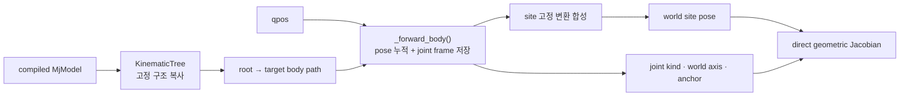

# Kinematic Tree, FK와 Geometric Jacobian

!!! info "기구학 학습 순서 1/3"
    컴파일된 MuJoCo 모델에서 tree를 만들고, root→site FK를 계산하면서 Jacobian을
    기하식으로 직접 구성한다. 다음은 [Quaternion 자세 오차](quaternion-math.md)다.

`KinematicTree.forward_site()`는 chain rule로 FK 식을 미분하거나 관절을 조금씩
흔드는 수치미분을 사용하지 않는다. FK에서 얻은 joint axis·anchor와 site 위치로
각 Jacobian 열을 바로 계산한다.



## Kinematic Tree

원본 XML을 다시 파싱하지 않고 `include`, `default`, compiler 설정이 반영된
`mujoco.MjModel`에서 FK에 필요한 값만 복사한다.

| 구조 | 저장 정보 |
|---|---|
| `KinematicBody` | parent id, parent 기준 위치·회전, 소속 joint id |
| `KinematicJoint` | 종류, body-local axis·anchor, qpos/dof 주소, limit |
| `KinematicSite` | 소속 body, body 기준 위치·회전 |

`qpos_adr`은 관절 위치를 읽는 주소이고 `dof_adr`은 velocity 자유도 주소다. 둘을
같은 값으로 가정하지 않는다.

`KinematicTree.__init__()`은 다음을 한 번 만든다.

1. `model.qpos0`와 body/joint/site 고정 정보 복사
2. 이름 lookup 생성
3. body별 root 경로 `body_paths` 생성
4. UI용 `children_by_body`와 `sites_by_body` 생성

target body의 경로는 parent를 따라 root까지 올라간 뒤 순서를 뒤집는다.

```python
def _body_path(self, body_id):
    path = []
    while body_id != 0:
        path.append(body_id)
        body_id = self.bodies[body_id].parent_id
    return tuple(reversed(path))
```

tree는 topology만 보관한다. 호출자가 전달한 NumPy `qpos`가 평가할 자세를 결정하며,
live `MjData`와 `mj_forward()`은 사용하지 않는다.

## Body와 joint FK { #body-joint }

parent world pose를 \((R_p,p_p)\), parent→body 고정 변환을 \((R_b^0,p_b^0)\)라 하면

\[
p_b=p_p+R_pp_b^0,\qquad R_b=R_pR_b^0
\]

이다. joint 변환 전에 body-local axis \(a\)와 anchor \(r\)를 world로 바꿔 저장한다.

\[
a_w=R_ba,\qquad c_w=p_b+R_br
\]

MJCF 고정 변환은 `model.qpos0` 자세 기준이므로 관절 변위는

\[
\delta=q-q_0
\]

이다.

slide joint:

\[
p_b'=p_b+a_w\delta,\qquad R_b'=R_b
\]

hinge joint:

\[
R_b'=R_bR_a(\delta),\qquad p_b'=c_w-R_b'r
\]

\(R_a\)는 `axis_rotation()`이 만드는 Rodrigues 회전이다. 두 번째 hinge 식은 회전
전후 anchor \(c_w\)를 같은 world 점에 유지한다.

## Site pose

마지막 body pose \((R_e,p_e)\)와 body→site 고정 변환 \((R_s,p_s)\)를 합성한다.

\[
p_{site}=p_e+R_ep_s,\qquad R_{site}=R_eR_s
\]

내부 FK는 rotation matrix를 사용하고 `SiteKinematics`는 position, quaternion,
world-frame `6×N` Jacobian을 반환한다.

## 미분 없이 Jacobian 열 만들기 { #geometric-jacobian }

Jacobian 열 하나는 “해당 joint만 단위 속도로 움직일 때 site에 생기는 순간
선속도와 각속도”다. 이 정의에 rigid-body 속도 공식을 바로 적용한다.

### Slide joint

slide joint가 \(\dot q_i=1\)이면 모든 자손 점은 world axis \(a_{w,i}\) 방향으로
1 m/s 이동하고 회전하지 않는다.

\[
J_i^{slide}=
\begin{bmatrix}
a_{w,i}\\
0
\end{bmatrix}
\]

### Hinge joint

hinge joint가 \(\dot q_i=1\)이면 각속도는 \(a_{w,i}\)다. 회전 중심 \(c_{w,i}\)에서
site까지의 lever arm을 \(p_{site}-c_{w,i}\)라 하면 점 속도는
\(\omega\times r\)이므로

\[
J_i^{hinge}=
\begin{bmatrix}
a_{w,i}\times(p_{site}-c_{w,i})\\
a_{w,i}
\end{bmatrix}
\]

이다. 이 과정에는 \(\partial p/\partial q\) 전개, symbolic differentiation 또는
관절 perturbation이 없다.

실제 구현도 같은 순서다.

```python
if kind == _SLIDE:
    jacobian[:, column] = axis_world
elif kind == _HINGE:
    jacobian[:, column] = np.cross(
        axis_world, point_world - anchor_world)

# forward_site()의 angular rows
if frame is not None and frame[0] == _HINGE:
    jacobian[3:, column] = frame[1]
```

`joint_ids`가 Jacobian 열 순서를 정한다. target의 조상 경로에 없는 joint는
`joint_frames`에 없으므로 해당 열은 0이다.

## 계산 순서

`forward_site(qpos, site_id, joint_ids)`는 다음만 수행한다.

1. `body_paths[site.body_id]`를 root부터 순회한다.
2. body 고정 변환을 합성한다.
3. 각 joint의 world axis와 anchor를 `joint_frames`에 저장한다.
4. `q-qpos0`의 slide/hinge 변환을 적용한다.
5. site 고정 변환을 합성해 `p_site`와 `R_site`를 얻는다.
6. 저장한 joint frame으로 translational Jacobian 열을 만든다.
7. hinge axis를 rotational Jacobian 열에 넣는다.
8. rotation matrix를 quaternion으로 바꿔 `SiteKinematics`를 반환한다.

`point_jacobian()`도 같은 열 공식을 collision 최근접점에 적용한다. site의 고정
위치 대신 distance query가 준 world point를 넣는 차이만 있다.

## 코드 대응

| 단계 | 코드 |
|---|---|
| model 구조 복사 | `_copy_body()`, `_copy_joint()`, `_copy_site()` |
| root 경로 | `_body_path()`, `body_paths` |
| FK와 joint frame | `_forward_body()` |
| point Jacobian 열 | `_point_jacobian_from_frames()` |
| site pose + 6×N Jacobian | `forward_site()` |
| collision point Jacobian | `point_jacobian()` |

## 검증

런타임은 직접 geometric 공식을 사용하지만 테스트는 독립 검증을 위해 중앙
유한차분을 사용한다.

- `tests/test_phase_3.py`: tree FK와 MuJoCo pose 비교, Jacobian 중앙 유한차분
- `tests/test_phase_6.py`: UI Kinematic Tree와 solver topology 공유
- `tests/test_whole_body.py`: runtime FK 우회 금지와 collision point Jacobian

```bash
python3 tests/test_phase_3.py
python3 tests/test_phase_6.py
python3 tests/test_whole_body.py
```

[← 기구학 전체 안내](kinematics.md) ·
[다음: Quaternion과 Orientation Error →](quaternion-math.md)
