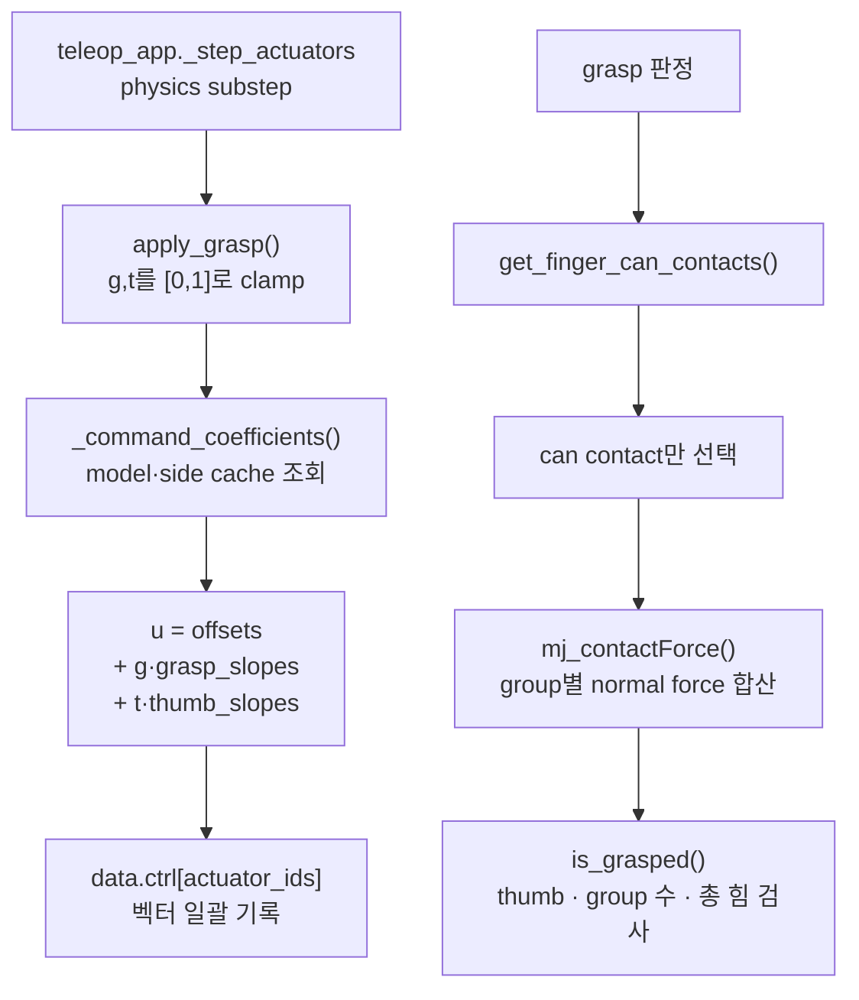

# `src/ffw_sh5_grasp/control/grasp.py`

!!! info "핵심 알고리즘 학습 순서 6/6"
    팔과 base가 목표 pose를 추종한 뒤 손가락 actuator 명령과 실제 contact force로
    파지를 완성하는 마지막 단계다. 전체 순서는
    [핵심 알고리즘 학습 순서](index.md#algorithm-learning-order)에서 다시 볼 수 있다.

손가락 synergy를 actuator target으로 변환하고, 접촉력으로 grasp 여부를 판정한다.

열림 비율, 엄지 각도와 접촉력 판정 임계값은 `config/default.yaml`의 `grasp` 구역에서
조절한다. 사용자 파일 적용법은 [YAML 파라미터 설정](../configuration.md)에 있다.

## Target 구조

| UI 값 | 적용 대상 |
|---|---|
| `grasp` | 검지/중지 curl, 약지/새끼 cosmetic curl |
| `thumb` | 엄지 pitch/IP curl, 엄지 MCP yaw ramp |

## 주요 상수

| 이름 | 역할 |
|---|---|
| `FINGER_CURL_JOINTS` | 검지/중지 curl 관절 목록 |
| `THUMB_CURL_JOINTS` | 엄지 pitch/IP 관절 목록 |
| `THUMB_PRESHAPE` | 엄지 CMC 고정 pre-shape |
| `THUMB_YAW_REST`, `THUMB_YAW_CURL` | thumb 값에 따른 MCP yaw 범위 |
| `RING_PINKY_CURL_JOINTS` | 약지/새끼 cosmetic curl 관절 |
| `FINGER_BODY_GROUPS` | 접촉 body를 손가락 그룹으로 매핑 |
| `BODY_TO_FINGER_GROUP` | 접촉 판정 때 재사용하는 body→finger 역매핑 |

## 기호와 입력

| 기호 | 범위·단위 | 코드 표현 |
|---|---|---|
| \(g\) | \([0,1]\), grasp synergy | `grasp` |
| \(t\) | \([0,1]\), thumb synergy | `thumb` |
| \(u\) | actuator position target 벡터 | `data.ctrl[actuator_ids]` |
| \(b\) | synergy가 0일 때의 offset 벡터 | `offsets` |
| \(c_g,c_t\) | grasp/thumb에 대한 slope 벡터 | `grasp_slopes`, `thumb_slopes` |
| \([lo,hi]\) | rad · 각 관절의 유효 range | `model.jnt_range[joint_id]` |

## 수식 유도

모든 손가락 actuator 명령은 두 synergy에 대한 affine 식 하나로 표현한다.

\[
\boxed{u=b+c_g g+c_t t}
\]

검지·중지 관절에서 range 폭을 \(\Delta=hi-lo\), 미리 굽혀 두는 비율을
\(f=\text{FINGER_OPEN_FRAC}\)라 하자. 보간 비율과 목표각은

\[
\operatorname{frac}=f+g(1-f)
\]

\[
\theta=lo+\operatorname{frac}\,\Delta
=(lo+f\Delta)+g(1-f)\Delta
\]

이므로 offset은 \(lo+f\Delta\), grasp slope는 \((1-f)\Delta\)다. 오른손 엄지
curl도 \(g\) 대신 \(t\)를 써서 같은 방식으로 계산한다.

왼손 엄지는 mirror range의 높은 쪽에서 열리므로 방향이 반대다.

\[
\theta=hi-[f+t(1-f)]\Delta
=(hi-f\Delta)+t[-(1-f)\Delta]
\]

따라서 offset은 \(hi-f\Delta\), thumb slope는 음수다. 부호를 관절 이름이나
range 값에서 추측하지 않고 `THUMB_CURL_OPEN_AT_HI`로 명시한다.

엄지 yaw와 약지·새끼도 같은 affine 형태다.

\[
\theta_{yaw}(t)=\theta_{rest}
+t(\theta_{curl}-\theta_{rest})
\]

\[
\theta_{ring/pinky}(g)=lo
+g\,\text{RING_PINKY_MAX_FRAC}\,(hi-lo)
\]

model의 joint range와 actuator 연결은 실행 중 바뀌지 않는다. 그래서
`_command_coefficients()`가 \(b,c_g,c_t\)와 actuator id를 model·side별로 한 번
계산해 캐싱하고, 매 physics substep의 `apply_grasp()`는 위 벡터식 한 번만 수행한다.

파지 판정은 target 위치가 아니라 실제 contact normal force를 사용한다. 손가락 그룹
\(k\)의 힘은 해당 contact들의 법선 성분을 합친 값이다.

\[
F_k=\sum_{c\in k}|f_{n,c}|
\]

기본 판정은 thumb 그룹을 포함한 서로 다른 두 그룹 이상이 접촉하고
\(\sum_kF_k\ge0.05\,\mathrm N\)일 때만 참이다.

## 수식에서 코드까지

| 수식 단계 | 코드 표현 | 함수 |
|---|---|---|
| \(b,c_g,c_t\) 구성 | `offsets`, `grasp_slopes`, `thumb_slopes` | `_command_coefficients()` |
| \(u=b+c_g g+c_t t\) | `offsets + grasp * grasp_slopes + thumb * thumb_slopes` | `apply_grasp()` |
| \(F_k=\sum|f_n|\) | `forces[group] += abs(force_vec[0])` | `get_finger_can_contacts()` |
| group 수·thumb·총 힘 조건 | `len(forces)`, `"thumb" in forces`, `sum(forces.values())` | `is_grasped()` |

## 함수

| 함수 | 역할 |
|---|---|
| `_validate_side(side)` | 손 방향을 `l`/`r`로 제한하고 잘못된 입력을 명확히 거부 |
| `_resolve_joint_actuator(model, joint_name)` | joint id와 actuator id를 찾고 캐싱 (actuator 탐색 자체는 `mujoco_utils.find_actuator_for_joint()` 사용) |
| `_command_coefficients(model, side)` | actuator id와 affine coefficient를 model·side별로 계산·캐싱 |
| `apply_grasp(model, data, grasp, thumb, side="r")` | 두 synergy를 clamp하고 벡터 affine 식으로 actuator target 기록 |
| `get_finger_can_contacts(model, data, side="r")` | 캔과 닿은 finger group별 normal force 합산 |
| `is_grasped(model, data, min_fingers=2, min_total_force=0.05, require_thumb=True, side="r")` | 접촉력 기준 grasp 성공 여부 반환 |

## 함수 흐름



coefficient cache는 고정된 model 정보만 저장하고 `data.ctrl` 값은 저장하지 않는다.
따라서 매 substep의 synergy는 즉시 반영되면서 joint/actuator 이름 탐색만 반복하지 않는다.

## 사용 위치

`application/teleop.py`의 `_step_actuators()`가 물리 substep마다 양손에 대해 호출한다.

```python
grasp.apply_grasp(model, data, grasp=targets["grasp_r"], thumb=targets["thumb_r"], side="r")
grasp.apply_grasp(model, data, grasp=targets["grasp_l"], thumb=targets["thumb_l"], side="l")
```

## 데이터 접근

| 읽기 | 쓰기 |
|---|---|
| `model.jnt_range`, `data.contact`, `mj_contactForce` | `data.ctrl[finger_actuator]` |

## 검증

```bash
python3 tests/test_phase_1.py
python3 tests/test_phase_2.py
python3 tests/test_phase_4.py
```

Phase 1은 손가락 관절과 관통 한계, Phase 2는 contact-force 기반 pick 성공률,
Phase 4는 양손 모델에서 좌우 mirror mapping과 실제 파지를 확인한다.

[← 이전: 모바일 스워브 제어](base_teleop.md) ·
[전체 학습 순서](index.md#algorithm-learning-order)
