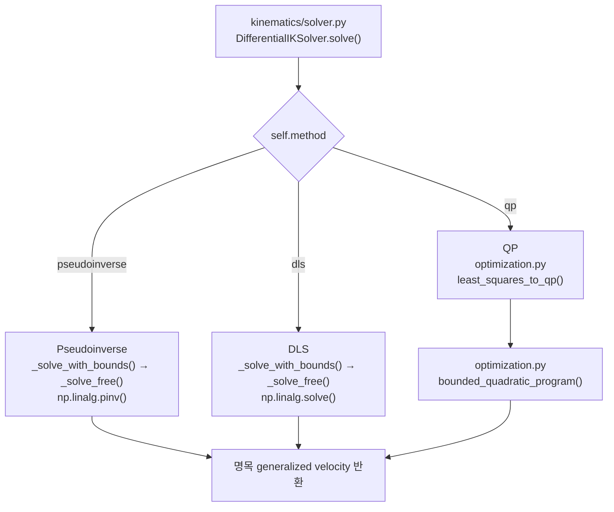

# Differential IK 수학

!!! info "핵심 알고리즘 학습 순서 2/6"
    [기구학 학습 안내](kinematics.md)의 pose/Jacobian을 velocity-level 역문제로 푼다.
    실제 전신 task 조립은 [전신 IK](whole_body_ik.md)를 참고한다.

이 페이지는 `kinematics/solver.py`와 `kinematics/optimization.py`가 푸는
pseudoinverse, DLS, box-QP만 설명한다.

## 1. Pose 오차에서 관절 속도까지

현재 위치 \(p(q)\), 목표 위치 \(p^*\)의 오차는

\[
e_p=p^*-p(q)
\]

이고 `pose_velocity_command()`는 이를 제한된 목표 선속도로 바꾼다.

\[
v_p^*=\operatorname{clip}(K_pe_p-D_pv_p)
\]

자세도 최단 회전 오차 \(e_R\)로 같은 계산을 한다.

\[
\omega^*=\operatorname{clip}(K_Re_R-D_R\omega)
\]

현재 자세에서 geometric Jacobian은 world-frame twist와 generalized velocity를
연결한다.

\[
\begin{bmatrix}v_p\\\omega\end{bmatrix}=J(q)\dot q
\]

solver는 \(J\dot q\simeq[v_p^*,\omega^*]^T\)를 풀고 앱은 Euler 적분으로 다음
명령 위치를 만든다.

\[
q_{next}=q+\dot q\Delta t
\]

속도 상한, damping, 다른 task와 제약이 없다면

\[
\dot e_p=-K_pe_p
\]

이므로 양의 gain에서 오차가 감소한다. 실제 구현은 모든 task와 bound를 함께
절충하므로 개별 오차의 단조 감소를 보장하지 않는다.

## 2. Task 정규화와 적층

soft task \(i\)의 residual은

\[
e_i(\dot q)=J_i\dot q-v_i^*
\]

이다. `velocity_task()`의 실제 입력 이름은 `strengths`와 `velocity_scales`다.
각 residual 행의 weight는 코드와 같은 식으로 계산한다.

\[
\operatorname{weight}_{i,k}
=\frac{\operatorname{strength}_{i,k}}
{\operatorname{velocity\_scale}_{i,k}^2}
\]

`strength`는 해당 오차의 상대적 중요도이고, `velocity_scale`은 위치 오차에는 m/s,
회전 오차에는 rad/s처럼 residual과 같은 단위의 기준 속도다. 따라서 전체 비용은

\[
\min_{\dot q}\sum_{i,k}
\operatorname{strength}_{i,k}
\left(
\frac{[J_i\dot q-v_i^*]_k}
{\operatorname{velocity\_scale}_{i,k}}
\right)^2
\]

이다. `velocity_task()`는 코드에서 다음 두 값을 만든다.

```python
# residual 비용의 제곱근을 구해 Jacobian과 목표 속도 양쪽에 적용한다.
scale = np.sqrt(weight)
# 각 Jacobian 행을 strength와 물리 속도 scale로 정규화한다.
matrix = scale[:, None] * jacobian
# 목표 속도에도 같은 scale을 적용해 residual의 해를 보존한다.
target = scale * target_velocity
```

`stack_velocity_tasks()`는 각 task의 `matrix`와 `target`을 세로로 쌓는다. 가중·적층된
전체 자코비안과 목표 속도는 개별 자코비안과 구분해 \(\bar J,\bar v\)로 표기한다.

\[
\bar J=\operatorname{vstack}(\text{task.matrix}),\qquad
\bar v=\operatorname{concat}(\text{task.target})
\]

\(\bar J\)는 양손·common-base task의 자코비안과 posture, QP damping의 identity
행까지 가중해 쌓은 행렬이다. 각속도에 대한 자코비안은 별도로 \(J_\omega\)라고
표기하며, 한 손의 geometric Jacobian \(J_i=[J_p^T,J_\omega^T]^T\) 안에 들어간다.
최종 문제는 다음과 같다.

\[
\min_{\dot q}\|\bar J\dot q-\bar v\|^2
\]

위치의 m/s와 회전의 rad/s처럼 단위가 다른 residual은 각 속도 상한으로 정규화된다.

## 3. 세 해법 { #solver-methods }

### Pseudoinverse

최종 해는 다음과 같다.

\[
\boxed{
\dot q=\bar J^+\bar v
=(\bar J^T\bar J)^{-1}\bar J^T\bar v
}
\]

오른쪽 역행렬 식은 \(\bar J\)가 full column rank일 때 성립한다. 실제 구현은 rank가
부족한 경우도 처리할 수 있는 `np.linalg.pinv()`를 사용한다.

??? example "실제 코드 · `DifferentialIKSolver._solve_free()`"

    ```python
    # Moore-Penrose 역행렬로 최소-norm 속도를 구한다.
    return np.linalg.pinv(
        matrix, rcond=self.pseudoinverse_rcond) @ vector
    ```

### Damped least squares { #damped-least-squares }

DLS는 큰 속도에도 비용을 준다.

\[
\min_{\dot q}\frac12\|\bar J\dot q-\bar v\|^2
+\frac{\lambda^2}{2}\|\dot q\|^2
\]

정지 조건은

\[
(\bar J^T\bar J+\lambda^2I)\dot q=\bar J^T\bar v
\]

이고 코드도 이 선형계를 푼다. singular direction의 gain은

\[
\frac{\sigma}{\sigma^2+\lambda^2}
\]

이므로 \(\sigma\to0\)에서 속도가 폭증하지 않는다. \(\lambda\)가 커질수록 속도는
작아지고 task residual은 커진다. 이 단일 \(\lambda\)는 QP 전용 자유도별 damping
strength와 별개다.

??? example "실제 코드 · `DifferentialIKSolver._solve_free()`"

    ```python
    # normal matrix JᵀJ를 만든다.
    normal = matrix.T @ matrix
    # 대각에 λ²을 더해 singular direction의 속도 증폭을 줄인다.
    normal.flat[::normal.shape[0] + 1] += self.dls_damping ** 2
    # (JᵀJ + λ²I)q̇ = Jᵀv를 직접 푼다.
    return np.linalg.solve(normal, matrix.T @ vector)
    ```

### QP

least-squares를 표준 QP로 쓰면

\[
\min_{\dot q}\frac12\dot q^TH\dot q+g^T\dot q,
\qquad H=2\bar J^T\bar J,\quad g=-2\bar J^T\bar v
\]

이다. `least_squares_to_qp()`가 \(H,g\)를 만들고
`bounded_quadratic_program()`이 box 안에서 푼다. \(H\succeq0\)이므로 convex이며,
모든 자유도에 양의 damping 행이 있으면 해가 유일하다.

??? example "실제 코드 · `DifferentialIKSolver.solve()`"

    ```python
    # ||Jq̇-v||²을 1/2 q̇ᵀHq̇ + gᵀq̇ 형태로 변환한다.
    hessian, linear = least_squares_to_qp(matrix, vector)
    # velocity/joint-limit box를 포함한 convex QP를 푼다.
    return bounded_quadratic_program(hessian, linear, lower, upper)
    ```

`bounded_quadratic_program()`의 실제 핵심은 active 변수는 bound에 고정하고, free
변수만 다시 푸는 반복이다. 후보가 box 밖이면 처음 닿는 bound까지만 이동하고,
후보가 box 안이면 KKT gradient 부호를 검사한다.

??? example "실제 코드 · `bounded_quadratic_program()` active-set"

    ```python
    # lower == upper인 축은 처음부터 고정한다.
    fixed = upper - lower <= TOLERANCE
    movable = ~fixed
    x = np.zeros(variable_count, dtype=float)
    x[fixed] = 0.5 * (lower[fixed] + upper[fixed])

    # movable 축의 reduced QP를 풀어 초기 feasible point를 만든다.
    if np.any(movable):
        reduced_hessian = hessian[np.ix_(movable, movable)]
        reduced_linear = (
            linear[movable] + hessian[np.ix_(movable, fixed)] @ x[fixed])
        solution, *_ = np.linalg.lstsq(
            reduced_hessian, -reduced_linear, rcond=None)
        x[movable] = np.clip(solution, lower[movable], upper[movable])

    # 초기값에서 bound에 붙은 축을 active로 표시한다.
    active_lower = movable & (x <= lower + TOLERANCE)
    active_upper = movable & ~active_lower & (x >= upper - TOLERANCE)

    iteration_count = ITERATION_MULTIPLIER * variable_count + EXTRA_ITERATIONS
    for _ in range(iteration_count):
        # active 축은 고정하고 free 축만 다시 푼다.
        active = fixed | active_lower | active_upper
        free = ~active
        candidate = x.copy()
        if np.any(free):
            reduced_hessian = hessian[np.ix_(free, free)]
            reduced_linear = (
                linear[free] + hessian[np.ix_(free, active)] @ x[active])
            candidate[free], *_ = np.linalg.lstsq(
                reduced_hessian, -reduced_linear, rcond=None)

        # 후보가 box 밖이면 처음 만나는 bound까지의 step을 찾는다.
        direction = candidate - x
        step = 1.0
        for index in np.flatnonzero(free):
            if candidate[index] < lower[index] - TOLERANCE:
                step = min(
                    step, (lower[index] - x[index]) / direction[index])
            elif candidate[index] > upper[index] + TOLERANCE:
                step = min(
                    step, (upper[index] - x[index]) / direction[index])
        if step < 1.0 - TOLERANCE:
            # 처음 닿은 축을 active로 등록하고 다시 푼다.
            x += max(0.0, step) * direction
            x = np.clip(x, lower, upper)
            active_lower |= free & (direction < 0.0) & (
                x <= lower + TOLERANCE)
            active_upper |= free & (direction > 0.0) & (
                x >= upper - TOLERANCE)
            continue

        # feasible 후보는 KKT gradient 부호를 검사한다.
        x = np.clip(candidate, lower, upper)
        gradient = hessian @ x + linear
        lower_violation = np.where(active_lower, -gradient, -np.inf)
        upper_violation = np.where(active_upper, gradient, -np.inf)
        lower_index = int(np.argmax(lower_violation))
        upper_index = int(np.argmax(upper_violation))
        worst_lower = lower_violation[lower_index]
        worst_upper = upper_violation[upper_index]
        if max(worst_lower, worst_upper) <= TOLERANCE:
            # 모든 KKT 조건을 만족하면 종료한다.
            break
        # 가장 크게 부호를 위반한 bound를 해제한다.
        if worst_lower >= worst_upper:
            active_lower[lower_index] = False
        else:
            active_upper[upper_index] = False

    # 최종 결과를 box 안으로 제한한다.
    return np.clip(x, lower, upper)
    ```

## 4. Box constraint { #box-active-set }

세 해법 모두 다음 속도 box를 적용한다.

\[
l_i\le\dot q_i\le u_i
\]

box에는 물리 속도 상한, joint-limit CBF, Whole-body OFF와 FK 자유도의
\(l_i=u_i=0\) 고정이 포함된다. unconstrained 해를 마지막에 clip하면 포화된 열의
residual을 다른 자유도에 재분배할 수 없으므로 최적해가 아닐 수 있다.

### Active-set 핵심

변수는 lower-active, upper-active, free로 나눈다. Active 변수는 bound에 고정하고
free 변수만 reduced 문제로 다시 푼다. 후보가 box 밖이면 처음 만나는 bound까지만
이동해 해당 변수를 active로 추가한다.

feasible 후보에서는 gradient \(r=H\dot q+g\)의 KKT 부호를 검사한다.

| 상태 | 최적 조건 |
|---|---:|
| free | \(r_i=0\) |
| lower-active | \(r_i\ge0\) |
| upper-active | \(r_i\le0\) |

부호를 위반한 bound는 active set에서 해제한다. Convex QP에서 이 조건을 만족한
feasible 해는 전역 최적해다.

## 5. 해법별 bound 처리 { #bounded-solver-paths }

| 해법 | free solve | bound 처리 |
|---|---|---|
| Pseudoinverse | \(\bar J^+\bar v\) | 위반 축 고정 후 남은 열 재계산 |
| DLS | \((\bar J^T\bar J+\lambda^2I)^{-1}\bar J^T\bar v\) | 위반 축 고정 후 damped 재계산 |
| QP | \(H=2\bar J^T\bar J,\ g=-2\bar J^T\bar v\) | feasible step과 KKT 부호로 active set 갱신 |

Pseudoinverse와 DLS의 `_solve_with_bounds()`도 단순 clip이 아니다.

## 6. Solver 함수 흐름

아래는 task와 bound를 받은 뒤 명목 속도를 구하는 solver 내부 흐름이다. 전신 task
생성부터 actuator 적용까지의 흐름은 [전신 IK 함수 흐름](whole_body_ik.md#whole-body-function-flow)을
참고한다.



## 7. Collision soft-CBF 보정 { #7-collision-safety-projection }

충돌 보정의 목적은 명목 속도를 가능한 적게 바꾸면서, 가까워진 geometry 쌍의 접근
속도를 줄이는 것이다.

### 7.1 거리 조건

충돌 쌍 \(j\)의 signed distance를 \(d_j\), 안전 거리를 \(d_{safe}\)라 한다. 코드가
사용하는 거리 여유는 \(d_j-d_{safe}\)다.

\[
\nabla_q d_j^T\dot q
\ge -\alpha_{eff}(d_j-d_{safe}),\qquad
\alpha_{eff}=\min\left(\text{gain},\frac{1}{\max(\Delta t,10^{-5})}\right)
\]

`collision_velocity_barriers()`는 이를 \(G_j\dot q\ge h_j\) 형태로 반환한다.

\[
G_j=\nabla_qd_j^T,\qquad
h_j=-\alpha_{eff}(d_j-d_{safe})
\]

| 현재 거리 | 하한 \(h_j\) | 요구되는 움직임 |
|---|---:|---|
| \(d_j>d_{safe}\) | 음수 | 제한된 접근 허용 |
| \(d_j=d_{safe}\) | 0 | 더 가까워지는 속도 금지 |
| \(d_j<d_{safe}\) | 양수 | 거리가 증가하는 속도 요구 |

### 7.2 코드가 푸는 비용

`enforce_constraints()`는 자유도마다 단위와 속도 상한이 다르므로 먼저 무차원
속도를 만든다.

\[
y_i=\frac{\dot q_i}{v_i^{lim}},\qquad
y_{ref,i}=\frac{\dot q_{ref,i}}{v_i^{lim}}
\]

충돌 부등식도 task 선속도 상한 \(v_{task}^{max}\)로 나눈다.

\[
\widetilde G_{ji}=\frac{G_{ji}v_i^{lim}}{v_{task}^{max}},\quad
\widetilde h_j=\frac{h_j}{v_{task}^{max}}
\]

정규화한 bound를 \(\widetilde l,\widetilde u\)라 하면 실제 비용은 다음과 같다.

\[
\min_{\widetilde l\le y\le\widetilde u}
\|y-y_{ref}\|^2
+\rho\sum_j\max(0,\widetilde h_j-\widetilde G_jy)^2
\]

첫 항은 명목 속도와의 차이, 두 번째 항은 CBF 위반 비용이다. \(\rho\)는
`collision_slack_weight`이며, 코드는 별도 slack 변수 없이 위반량의 제곱을 직접
더한다.

### 7.3 반환값

`bounded_quadratic_program_with_barriers()`는 현재 위반한 행을 비용에 추가하고,
위반 행 집합이 같아질 때까지 box-QP를 다시 푼다. 반복 상한은 barrier가 \(m\)개일 때
\(2m+4\)회다.

마지막으로 정규화 전 위반량을 반환한다.

\[
\text{collision\_constraint\_violation}
=\max_j\max(0,h_j-G_j\dot q)
\]

단위는 m/s다. soft penalty이므로 이 값은 0이 아닐 수 있다.

## 8. 보장 범위

| 항목 | 구현이 보장하는 범위 |
|---|---|
| 속도 box | 수치 tolerance 범위에서 만족 |
| QP 최적성 | active-set이 KKT 조건에 도달한 현재 frame의 convex box-QP |
| collision CBF | 위반 비용을 줄이는 soft 보정이며 hard safety 보장은 아님 |
| 충돌 예측 | 현재 frame의 거리와 gradient만 사용하며 미래 trajectory는 보장하지 않음 |
| IK 수렴 | 한 frame의 velocity solve이며 nonlinear IK 전역 수렴은 보장하지 않음 |

세부 task와 파일별 호출 흐름은 [전신 IK](whole_body_ik.md), 수치 API는
[Differential IK Solver](../api/kinematics.md#solver)를 참고한다.
