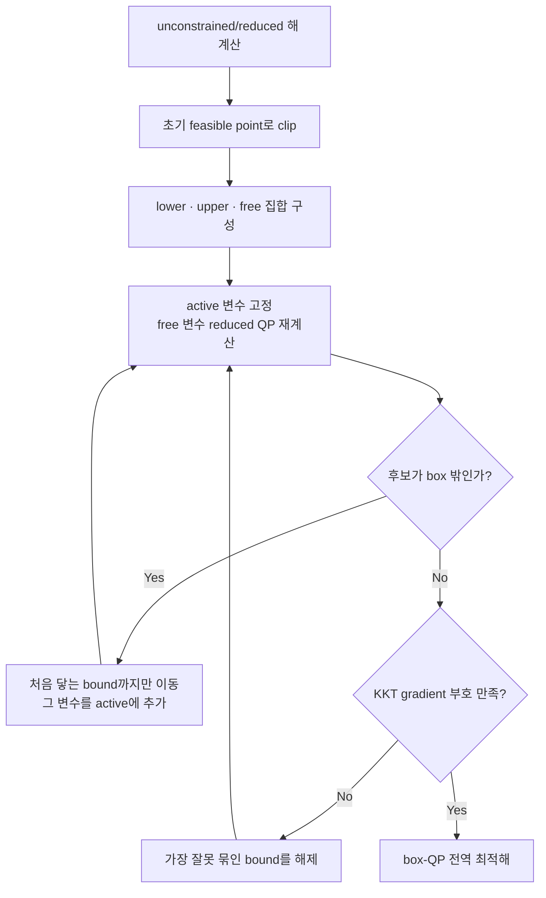

# Differential IK 수학

이 페이지는 pseudoinverse, Damped Least Squares(DLS), box-constrained QP가 같은
velocity task에서 어떻게 유도되는지 설명한다. 특히 결과식만 적지 않고 목적함수에서
해를 얻는 과정과 box active-set의 최적성 조건을 코드에 대응한다.

## 1. 위치 오차가 속도 task가 되는 과정

목표 pose는 위치 자체로 주어진다. 현재 관절 자세를 \(q\), 손의 현재 위치를
\(p(q)\), 목표 위치를 \(p^*\)라 하면 위치 오차는 다음과 같다.

\[
e_p=p^*-p(q)
\]

이 오차의 단위는 m이다. 하지만 전신 controller가 한 frame에서 직접 결정하는 값은
다음 관절 자세 \(q_{next}\)가 아니라 base, lift, 양팔의 generalized velocity
\(\dot q\)다. 따라서 오차를 줄일 Cartesian 목표 속도로 먼저 바꾼다.

\[
v_p^*=\operatorname{clip}\left(K_p e_p-D_pv_p\right)
\]

여기서 \(K_p\)는 위치 gain, \(D_p\)는 현재 손 선속도 \(v_p\)의 damping gain이다.
\(\operatorname{clip}\)은 목표 선속도가 설정한 상한을 넘지 않게 한다. 자세도 최단
회전 오차 \(e_R\)에서 같은 방식으로 목표 각속도 \(\omega^*\)를 만든다.

\[
\omega^*=\operatorname{clip}\left(K_R e_R-D_R\omega\right)
\]

현재 자세 주변에서 Jacobian으로 선형화하면 손 twist와 generalized velocity의 관계는
다음과 같다.

\[
\begin{bmatrix}v_p\\\omega\end{bmatrix}
\simeq J(q)\dot q
\]

따라서 한 control frame의 IK는 \(e_p\)를 직접 없애는 \(\Delta q\)를 푸는 대신,
그 오차를 줄이도록 만든 목표 twist를 추종하는 \(\dot q\)를 푼다.

\[
J(q)\dot q\simeq
\begin{bmatrix}v_p^*\\\omega^*\end{bmatrix}
\]

마지막에 한 frame 시간 \(\Delta t\) 동안 적분해 다음 관절 자세를 얻는다.

\[
q_{next}=q+\dot q\Delta t
\]

즉 매 frame의 흐름은 다음과 같다.

```text
target pose - current pose
-> pose error
-> desired Cartesian twist
-> Jacobian-based qdot solve
-> q_next = q + qdot * dt
-> next frame에서 새 pose error 계산
```

### 1.1 위치 오차가 실제로 줄어드는 이유

목표 위치가 제어 주기 동안 고정이고, clipping과 damping을 잠시 빼자. 오차의 시간
미분은 다음과 같다.

\[
\begin{aligned}
e_p &= p^*-p(q),\\
\dot e_p
&= \frac{d}{dt}p^*-\frac{d}{dt}p(q),\\
&= 0-\dot p,\\
&= -\dot p.
\end{aligned}
\]

목표 선속도를 \(v_p^*=K_pe_p\)로 정하고 solver가 정확히
\(\dot p=v_p^*\)를 만든다면 다음이 성립한다.

\[
\dot e_p=-K_pe_p.
\]

scalar gain \(K_p=k_p>0\)라면 해는

\[
e_p(t)=\exp(-k_pt)e_p(0)
\]

이다. 즉 오차 벡터의 방향은 유지한 채 크기가 지수적으로 0으로 줄어든다. 실제
구현은 속도 상한, damping, 다른 task 및 제약 때문에 이 등식을 정확히 만족하지는
않는다. 그래도 \(K_pe_p\)는 현재 위치 오차를 줄이는 방향의 Cartesian 속도 목표다.

`pose_velocity_command()`의 실제 선속도 식은 다음과 같다.

\[
v_p^*=\operatorname{clip}_{v_{max}}
\left(K_pe_p-D_pv_p\right).
\]

여기서 \(D_pv_p\)는 이미 같은 방향으로 빠르게 움직일 때 목표 속도를 낮춰
overshoot를 줄이고, \(\operatorname{clip}_{v_{max}}\)은 벡터 방향은 유지하면서
norm을 \(v_{max}\) 이하로 제한한다. 자세 항도 같은 논리로 처리한다.

### 1.2 Jacobian이 속도 관계가 되는 과정

관절 위치가 \(q=[q_1,\ldots,q_n]^T\)이고 손 위치가 \(p(q)\in\mathbb R^3\)일 때,
각 위치 성분 \(p_a\)의 chain rule은 다음과 같다.

\[
\dot p_a
=\frac{d p_a}{dt}
=\sum_{j=1}^{n}\frac{\partial p_a}{\partial q_j}\dot q_j,
\qquad a\in\{1,2,3\}.
\]

세 식을 행렬로 쌓으면 위치 Jacobian \(J_p\in\mathbb R^{3\times n}\)과 손
선속도의 관계가 된다.

\[
J_p(q)=
\begin{bmatrix}
\dfrac{\partial p_1}{\partial q_1} & \cdots &
\dfrac{\partial p_1}{\partial q_n}\\
\vdots & \ddots & \vdots\\
\dfrac{\partial p_3}{\partial q_1} & \cdots &
\dfrac{\partial p_3}{\partial q_n}
\end{bmatrix},
\qquad
\dot p=J_p(q)\dot q.
\]

회전의 미소 변화도 angular Jacobian \(J_\omega\in\mathbb R^{3\times n}\)로
\(\omega=J_\omega(q)\dot q\)라고 쓸 수 있다. 이 둘을 쌓은 geometric Jacobian은

\[
J(q)=
\begin{bmatrix}J_p(q)\\J_\omega(q)\end{bmatrix}
\in\mathbb R^{6\times n},
\qquad
\begin{bmatrix}\dot p\\\omega\end{bmatrix}=J(q)\dot q
\]

다. 현재 구현은 이 world-frame Jacobian과 world-frame pose error를 조합한다.

### 1.3 Position-level \(\Delta q\)와의 정확한 연결

한 frame 동안 \(\dot q\)가 일정하다고 두면 Euler 적분은

\[
q_{k+1}=q_k+\dot q_k\Delta t.
\]

따라서 그 frame의 관절 변화량을 \(\Delta q_k\)라고 정의하면

\[
\Delta q_k=q_{k+1}-q_k=\dot q_k\Delta t.
\]

Jacobian 속도식 \(J_p\dot q\simeq K_pe_p\)의 양변에 \(\Delta t\)를 곱하면

\[
J_p\Delta q\simeq K_p\Delta t\,e_p.
\]

특히 \(K_p\Delta t=1\)이면 익숙한 position-level 선형화
\(J_p\Delta q\simeq e_p\)와 같은 모양이 된다. 이 프로젝트가 velocity-level을
선택한 이유는 속도 상한, base 가속도 제한, joint-limit CBF, collision CBF가 모두
\(\dot q\)의 제약으로 자연스럽게 표현되기 때문이다. 실제 변환은
`kinematics.tasks.pose_velocity_command()`가 수행한다.

## 2. 문제 정의와 task 적층

전신 generalized velocity를 다음과 같이 둔다.

\[
x=\dot q=[v_x,v_y,\omega_z,\dot q_{lift},\dot q_{right},\dot q_{left}]^T
\in\mathbb R^n
\]

각 soft task \(i\)는 Jacobian \(J_i\), 목표 속도 \(v_i^*\), 무차원 strength
\(s_i\), 대표 물리 속도 \(\sigma_i\)를 가진다.

\[
\min_x\sum_i s_i\left\|
\frac{J_ix-v_i^*}{\sigma_i}\right\|^2
\]

한 task에서 \(\sqrt{s_i}/\sigma_i\)를 norm 안으로 넣으면 같은 비용을 다음처럼
쓸 수 있다.

\[
s_i\left\|\frac{J_ix-v_i^*}{\sigma_i}\right\|^2
=\left\|\frac{\sqrt{s_i}}{\sigma_i}(J_ix-v_i^*)\right\|^2.
\]

실제 구현처럼 행마다 strength 또는 속도 scale이 다를 때 이 계수들을 대각행렬
\(W_i\)로 모은다. 그러면 \(i\)번째 task의 weighted residual은

\[
r_i(x)=W_iJ_ix-W_iv_i^*
\]

가 된다.

\(W_i=\operatorname{diag}(\sqrt{s_i}/\sigma_i)\)라 두고 행을 쌓으면

\[
A=\begin{bmatrix}W_1J_1\\W_2J_2\\\vdots\end{bmatrix},
\qquad
b=\begin{bmatrix}W_1v_1^*\\W_2v_2^*\\\vdots\end{bmatrix}
\]

이므로 모든 soft task는 하나의 least-squares 문제가 된다.

\[
\min_x\|Ax-b\|^2
\]

`kinematics.tasks.velocity_task()`가 각 \(W_iJ_i,W_iv_i^*\)를 만들고
`stack_velocity_tasks()`가 \(A,b\)로 결합한다. 위치 m/s와 회전 rad/s는 각각의
대표 속도로 나뉘므로 서로 다른 residual 단위를 그대로 비교하지 않는다.

## 3. Pseudoinverse 유도

먼저

\[
f(x)=\frac12\|Ax-b\|^2
\]

를 먼저 원소별로 쓴다. \(A\in\mathbb R^{m\times n}\), \(b\in\mathbb R^m\)이고
\(A\)의 \(k,j\) 원소를 \(A_{kj}\)라 하면, residual의 \(k\)번째 성분은

\[
r_k(x)=\sum_{j=1}^{n}A_{kj}x_j-b_k
\]

이다. 따라서 목적함수는

\[
f(x)=\frac12\sum_{k=1}^{m}r_k(x)^2
=\frac12\sum_{k=1}^{m}
\left(\sum_{j=1}^{n}A_{kj}x_j-b_k\right)^2.
\]

행렬식으로도 같은 내용을 전개할 수 있다.

\[
\begin{aligned}
f(x)
&=\frac12(Ax-b)^T(Ax-b)\\
&=\frac12\left((Ax)^TAx-(Ax)^Tb-b^TAx+b^Tb\right)\\
&=\frac12\left(x^TA^TAx-x^TA^Tb-b^TAx+b^Tb\right)\\
&=\frac12x^TA^TAx-x^TA^Tb+\frac12b^Tb.
\end{aligned}
\]

마지막 줄에서는 \(x^TA^Tb\)와 \(b^TAx\)가 transpose 관계인 같은 scalar라서
두 항을 합쳤다.

\(x_j\)에 대한 편미분은 chain rule로 다음과 같이 나온다.

\[
\begin{aligned}
\frac{\partial f}{\partial x_j}
&=\frac12\sum_{k=1}^{m}2r_k(x)
\frac{\partial r_k(x)}{\partial x_j}\\
&=\sum_{k=1}^{m}r_k(x)A_{kj}\\
&=\sum_{k=1}^{m}A_{kj}
\left(\sum_{\ell=1}^{n}A_{k\ell}x_\ell-b_k\right).
\end{aligned}
\]

이 \(n\)개의 편미분을 세로로 쌓으면 gradient다.

\[
\nabla f(x)=A^T(Ax-b)=A^TAx-A^Tb.
\]

이고 정지 조건은 normal equation이다.

\[
A^TAx=A^Tb
\]

\(A^TA\)가 가역이면 양변 왼쪽에 \((A^TA)^{-1}\)를 곱해

\[
x=(A^TA)^{-1}A^Tb
\]

를 얻는다. 하지만 로봇 Jacobian은 redundancy나 singularity 때문에 rank가 부족할 수
있다. 이때 SVD

\[
A=U\Sigma V^T
\]

를 사용한다. 이 식을 \(A^TA\)에 대입하면

\[
\begin{aligned}
A^TA
&=(U\Sigma V^T)^T(U\Sigma V^T)\\
&=V\Sigma^TU^TU\Sigma V^T\\
&=V\Sigma^T\Sigma V^T.
\end{aligned}
\]

\(\Sigma^T\Sigma\)의 유효 대각 성분은 \(\sigma_j^2\)다. 따라서 normal equation을
각 singular direction으로 보면 \(\sigma_j^2\)로 나눠야 하고, \(A^Tb\)에 들어 있던
\(\sigma_j\) 하나와 합쳐 최종 gain \(1/\sigma_j\)가 남는다.

를 사용하고, 0이 아닌 singular value만 역수로 바꾼

\[
A^+=V\Sigma^+U^T
\]

를 정의하면

\[
x^*=A^+b
\]

가 residual을 최소화하는 해 중 Euclidean norm이 가장 작은 해가 된다. 코드에서는
`np.linalg.pinv(A, rcond=...) @ b`가 이 계산을 수행한다.

!!! note "Pseudoinverse가 불안정해지는 이유"
    작은 singular value \(\sigma_j\) 방향의 gain은 \(1/\sigma_j\)다. 따라서
    \(\sigma_j\to0\)이면 작은 Cartesian 오차도 매우 큰 관절 속도로 증폭될 수 있다.

## 4. Damped least squares { #damped-least-squares }

### 4.1 목적함수에서 normal equation까지

DLS는 task residual뿐 아니라 큰 해 자체에도 비용을 부여한다.

\[
f_\lambda(x)
=\frac12\|Ax-b\|^2+\frac{\lambda^2}{2}\|x\|^2,
\qquad \lambda>0
\]

두 항을 전개하면

\[
f_\lambda(x)
=\frac12x^TA^TAx-x^TA^Tb+\frac12b^Tb
+\frac{\lambda^2}{2}x^Tx
\]

이다. regularization 항을 성분별로 쓰면

\[
\frac{\lambda^2}{2}\|x\|^2
=\frac{\lambda^2}{2}\sum_{\ell=1}^{n}x_\ell^2.
\]

따라서 \(x_j\)에 대한 미분은

\[
\frac{\partial}{\partial x_j}
\left(\frac{\lambda^2}{2}\sum_{\ell=1}^{n}x_\ell^2\right)
=\lambda^2x_j
\]

다. 앞 절의 least-squares 미분과 합치면

\[
\frac{\partial f_\lambda}{\partial x_j}
=\sum_{k=1}^{m}A_{kj}
\left(\sum_{\ell=1}^{n}A_{k\ell}x_\ell-b_k\right)
+\lambda^2x_j.
\]

이 성분별 미분을 벡터로 쌓으면

\[
\nabla f_\lambda(x)
=A^T(Ax-b)+\lambda^2x
\]

최솟값에서 gradient가 0이므로

\[
A^TAx-A^Tb+\lambda^2x=0
\]

이고 항을 정리하면

\[
(A^TA+\lambda^2I)x=A^Tb
\]

를 얻는다. 따라서 DLS 해는

\[
\boxed{x_\lambda=(A^TA+\lambda^2I)^{-1}A^Tb}
\]

다.

### 4.2 이 정지점이 유일한 전역 최솟값인 이유

Hessian은

\[
\nabla^2 f_\lambda=A^TA+\lambda^2I
\]

다. 임의의 0이 아닌 벡터 \(z\)에 대해

\[
z^T(A^TA+\lambda^2I)z
=\|Az\|^2+\lambda^2\|z\|^2>0
\]

이므로 Hessian은 positive definite다. 따라서 목적함수는 strictly convex이고 위
정지점은 유일한 전역 최솟값이다. \(A\)가 rank deficient여도 \(\lambda>0\)이면
행렬이 가역이 되는 이유도 이 식에서 확인할 수 있다.

### 4.3 SVD로 보는 singularity 억제

\(A=U\Sigma V^T\)를 DLS 해에 대입하는 과정을 쓰면

\[
\begin{aligned}
x_\lambda
&=(A^TA+\lambda^2I)^{-1}A^Tb\\
&=\left(V\Sigma^T\Sigma V^T+\lambda^2VV^T\right)^{-1}
V\Sigma^TU^Tb\\
&=V\left(\Sigma^T\Sigma+\lambda^2I\right)^{-1}\Sigma^TU^Tb.
\end{aligned}
\]

\(j\)번째 singular direction에서 가운데 대각 성분은
\(\sigma_j/(\sigma_j^2+\lambda^2)\)가 된다. 따라서

\[
x_\lambda
=V\operatorname{diag}\left(
\frac{\sigma_j}{\sigma_j^2+\lambda^2}
\right)U^Tb
\]

가 된다. Pseudoinverse와 DLS의 singular 방향 gain을 비교하면 다음과 같다.

| 방법 | singular direction gain |
|---|---:|
| Pseudoinverse | \(1/\sigma_j\) |
| DLS | \(\sigma_j/(\sigma_j^2+\lambda^2)\) |

\(\sigma_j\to0\)일 때 DLS gain은 0으로 가므로 특이 방향의 속도가 폭증하지 않는다.
반대로 \(\sigma_j\gg\lambda\)이면 gain은 거의 \(1/\sigma_j\)가 되어 pseudoinverse와
비슷하게 동작한다.

### 4.4 \(\lambda\)가 만드는 절충

- \(\lambda\to0\): pseudoinverse에 가까워지고 task 추종은 강하지만 singularity에 민감하다.
- \(\lambda\) 증가: 관절 속도는 작아지지만 task residual은 커진다.
- \(\lambda\to\infty\): \(x_\lambda\to0\)이다.

현재 UI의 DLS damping은 이 단일 \(\lambda\)다. 이는 QP에서 base/lift/arm별로
설정하는 damping task와 다르다. 또한 \(\lambda^2\|x\|^2\)는 generalized velocity
좌표의 Euclidean norm이므로 자유도 단위나 좌표 scale을 바꾸면 같은 물리적 의미를
보존하지 않는다. 자유도별 물리 속도 상한으로 정규화된 사용 비용이 필요하면 QP의
damping weights가 더 명시적인 표현이다.

코드 대응은 다음 두 줄이다.

```python
normal = matrix.T @ matrix
normal.flat[::normal.shape[0] + 1] += dls_damping ** 2
x = np.linalg.solve(normal, matrix.T @ vector)
```

## 5. Least-squares를 QP로 바꾸는 과정

표준 convex QP를

\[
\min_x\frac12x^THx+g^Tx
\]

로 쓴다. Least-squares를 전개한 식

\[
\|Ax-b\|^2=x^TA^TAx-2b^TAx+b^Tb
\]

에 \(1/2\)를 곱한 QP 목적함수를 대입해 계수를 비교하면

\[
\begin{aligned}
\frac12x^THx+g^Tx
&=x^TA^TAx-2b^TAx+\underbrace{b^Tb}_{\text{constant}}\\
&=\frac12x^T\left(2A^TA\right)x
+\left(-2A^Tb\right)^Tx+b^Tb.
\end{aligned}
\]

\(b^Tb\)는 \(x\)와 무관하므로 최적해에 영향을 주지 않는다. 따라서

\[
H=2A^TA,\qquad g=-2A^Tb
\]

로 두면 같은 최적해를 갖는다. 이것이 `least_squares_to_qp()`의 두 반환값이다.

이 QP에 제약이 없다고 가정하면 gradient는

\[
\nabla\left(\frac12x^THx+g^Tx\right)=Hx+g
\]

이고, \(H=2A^TA\), \(g=-2A^Tb\)를 대입하면

\[
Hx+g=2A^T(Ax-b).
\]

따라서 QP의 정지 조건 \(Hx+g=0\)은 앞 절의 normal equation
\(A^TAx=A^Tb\)와 정확히 같다.

\(A^TA\)는 positive semidefinite이므로 목적함수는 convex다. QP damping task가
모든 자유도에 양의 비용을 주면 positive definite가 되어 해도 유일해진다. 일부
가중치가 0이면 해가 여러 개일 수 있지만, convex 문제이므로 KKT 조건을 만족하는
해는 여전히 전역 최적해다.

## 6. Box constraint란 무엇인가

Box는 변수마다 독립적인 하한과 상한이 있는 feasible set이다.

\[
l_i\le x_i\le u_i,\qquad i=1,\ldots,n
\]

2차원에서는 직사각형, 3차원에서는 직육면체, \(n\)차원에서는 hyperrectangle이다.
이 프로젝트에서 box는 다음을 한꺼번에 표현한다.

- base, lift, arm의 물리 최대 속도
- joint-limit CBF가 현재 위치에 따라 좁힌 접근 속도
- Whole-body OFF 또는 FK mode 자유도의 \(l_i=u_i=0\)
- base participation scale이 줄인 base 속도 범위

단순히 unconstrained 해를 마지막에 `clip`하는 것만으로는 일반적으로 최적해가 되지
않는다. 한 자유도가 포화되면 Jacobian의 결합 때문에 다른 자유도의 최적값도 다시
계산해야 하기 때문이다.

## 7. Box active-set이란 무엇인가 { #box-active-set }

Active-set은 최적해에서 어느 bound가 실제 equality처럼 작동하는지를 추정하고
수정하는 방법이다. 각 변수는 세 집합 중 하나에 속한다.

| 집합 | 상태 | 값 |
|---|---|---|
| lower-active \(\mathcal L\) | 하한에 붙음 | \(x_i=l_i\) |
| upper-active \(\mathcal U\) | 상한에 붙음 | \(x_i=u_i\) |
| free \(\mathcal F\) | bound 사이에서 움직임 | \(l_i<x_i<u_i\) |

`active`는 “constraint 기능이 켜져 있다”는 뜻이 아니라, **현재 후보 해에서 해당
bound가 equality로 붙어 있다**는 뜻이다.

### 7.1 Active 변수를 고정하고 free 변수 다시 풀기

Active 변수 \(x_\mathcal A\)를 bound 값으로 고정한다. QP gradient
\(Hx+g\)의 free 성분이 0이어야 하므로 block equation은

\[
H_{\mathcal{FF}}x_\mathcal F
+H_{\mathcal{FA}}x_\mathcal A+g_\mathcal F=0
\]

이다. 따라서 free 후보는

\[
x_\mathcal F
=-H_{\mathcal{FF}}^+
\left(g_\mathcal F+H_{\mathcal{FA}}x_\mathcal A\right)
\]

로 다시 계산한다. 코드의 `reduced_hessian`, `reduced_linear`, `np.linalg.lstsq()`가
이 식이다. 역행렬 대신 least-squares를 쓰므로 reduced Hessian이 singular한 경우도
처리한다.

### 7.2 새 후보가 box 밖으로 나가면

현재 feasible point \(x\)에서 free solution \(x_c\)로 가는 방향을

\[
p=x_c-x
\]

라 두고

\[
x(\alpha)=x+\alpha p,\qquad0\le\alpha\le1
\]

중 처음 bound에 닿는 가장 작은 \(\alpha\)까지만 이동한다. 예를 들어 \(p_i>0\)이면

\[
\alpha_i=\frac{u_i-x_i}{p_i}
\]

이고, \(p_i<0\)이면 하한까지의 비율을 사용한다. 먼저 닿은 변수를 active set에
추가한 뒤 나머지 free 변수를 다시 푼다. 이 line search 때문에 모든 중간 해가 box
안에 남는다.

### 7.3 후보가 feasible하면 KKT 조건 검사

Box-QP의 Lagrangian을

\[
\mathcal L(x,\mu,\nu)
=\frac12x^THx+g^Tx+\mu^T(l-x)+\nu^T(x-u)
\]

로 둔다. \(\mu,\nu\ge0\)는 각각 하한과 상한 multiplier다. Convex QP의 KKT 조건은

\[
\begin{aligned}
&l\le x\le u &&\text{(primal feasibility)}\\
&Hx+g-\mu+\nu=0 &&\text{(stationarity)}\\
&\mu_i(l_i-x_i)=0,\quad \nu_i(x_i-u_i)=0
&&\text{(complementarity)}
\end{aligned}
\]

이다. 이를 변수 상태별 gradient \(r=Hx+g\)로 바꾸는 과정도 직접 확인할 수 있다.

free 변수는 complementarity 때문에 \(\mu_i=\nu_i=0\)이고, 따라서

\[
r_i=0.
\]

하한에 붙은 변수는 \(x_i=l_i\)라서 상한 multiplier는 \(\nu_i=0\)이다. stationarity
\(r_i-\mu_i+\nu_i=0\)는

\[
r_i=\mu_i\ge0
\]

가 된다. 반대로 상한에 붙은 변수는 \(x_i=u_i\), \(\mu_i=0\)이므로

\[
r_i=-\nu_i\le0
\]

다. 즉 다음 표의 부호 조건은 별도 규칙이 아니라 KKT stationarity와 multiplier의
non-negativity에서 바로 나온다.

| 변수 상태 | 최적 조건 | 이유 |
|---|---:|---|
| free | \(r_i=0\) | 양방향으로 움직일 수 있음 |
| lower-active | \(r_i\ge0\) | 허용된 \(+\) 방향 이동이 비용을 낮추지 않음 |
| upper-active | \(r_i\le0\) | 허용된 \(-\) 방향 이동이 비용을 낮추지 않음 |

하한에서 \(r_i<0\)이면 \(x_i\)를 증가시킬 때 비용이 감소하므로 하한을 active로
유지한 판단이 틀렸다. 반대로 상한에서 \(r_i>0\)이면 값을 줄일 때 비용이 감소한다.
코드는 가장 크게 위반한 bound 하나를 active set에서 해제한 뒤 다시 푼다.

```python
gradient = hessian @ x + linear
lower_violation = np.where(active_lower, -gradient, -np.inf)
upper_violation = np.where(active_upper, gradient, -np.inf)
```

모든 free gradient가 0이고 active bound의 부호 조건도 맞으면 KKT 조건을 만족한다.
목적함수가 convex이므로 이 조건은 지역 최솟값이 아니라 전역 최솟값의 충분조건이다.

### 7.4 전체 반복 흐름



## 8. 왜 단순 clip과 다른가: 2변수 예제

다음 문제를 생각한다.

\[
\min_{x_1,x_2}(x_1-2)^2+(x_2-x_1)^2
\]

\[
0\le x_1\le1,\qquad0\le x_2\le3
\]

Unconstrained 해는 \((2,2)\)다. 단순 clip은 \((1,2)\)를 반환하지만, \(x_1=1\)을
상한에 고정한 뒤 free 변수 \(x_2\)를 다시 풀면

\[
\frac{\partial f}{\partial x_2}=2(x_2-x_1)=0
\quad\Rightarrow\quad x_2=x_1=1
\]

이므로 active-set 해는 \((1,1)\)이다. 실제 비용도

\[
f(1,2)=2,\qquad f(1,1)=1
\]

로 active-set 해가 더 작다. 포화된 자유도의 task를 다른 자유도에 재분배하려면
clip 이후의 reduced solve가 필요한 이유다.

## 9. Pseudoinverse/DLS의 bound 처리와 QP active-set 차이

두 경로는 같은 아이디어를 쓰지만 목적함수 표현이 다르다.

| 코드 | 대상 | 반복 방식 |
|---|---|---|
| `DifferentialIKSolver._solve_with_bounds()` | pseudoinverse/DLS | 포화축을 고정하고 남은 \(A_\mathcal F\)로 residual 재계산 |
| `bounded_quadratic_program()` | QP | Hessian/gradient와 KKT 부호로 bound 추가·해제 |

Pseudoinverse/DLS 경로도 단순 clip하지 않고 포화축을 고정한 뒤 나머지 열로 task를
다시 푼다. QP 경로는 명시적인 Hessian을 가지므로 KKT multiplier 부호까지 검사해
active bound를 다시 해제할 수 있다.

## 10. Collision soft barrier의 active set

Collision barrier \(Gx\ge h\)는 box처럼 완전한 hard inequality로 넣지 않고 위반량에
quadratic slack 비용을 준다.

\[
\min_x\frac12x^THx+g^Tx
+\rho\|\min(Gx-h,0)\|^2,
\qquad l\le x\le u
\]

현재 위반 중인 barrier 행 집합을 \(\mathcal C\)라 하면 해당 구간의 추가 비용은

\[
\rho\|G_\mathcal Cx-h_\mathcal C\|^2
\]

이고 다음과 같이 QP 항에 합쳐진다.

\[
H' = H+2\rho G_\mathcal C^TG_\mathcal C,
\qquad
g' = g-2\rho G_\mathcal C^Th_\mathcal C
\]

`bounded_quadratic_program_with_barriers()`는 이 augmented box-QP를 푼 뒤 위반 집합을
다시 계산하고, 집합이 변하지 않을 때까지 반복한다. 여기서 active는 **현재 slack
비용을 내는 충돌 barrier 행**을 뜻하며, 앞 절의 lower/upper active variable과는
구분해야 한다.

Soft barrier를 사용하는 이유는 joint velocity box와 collision 조건이 동시에 완전히
만족될 수 없는 순간에도 infeasible로 중단하지 않고, `collision_slack_weight`에 따라
최소 위반 해를 반환하기 위해서다.

## 11. 증명이 보장하는 범위

- DLS 식은 주어진 한 frame의 선형화된 task에서 유일한 전역 최솟값이다.
- Convex box-QP에서 KKT 조건을 만족한 active-set 해는 전역 최적해다.
- Hessian이 positive semidefinite이면 최적해가 여러 개일 수 있다.
- 구현은 부동소수점 tolerance와 반복 상한을 사용하므로 exact arithmetic 증명과는
  구분해야 한다. 회귀 테스트는 작은 QP를 완전탐색한 결과와 비교한다.
- 이는 nonlinear FK 전체의 global IK 수렴이나 미래 trajectory의 무충돌을 증명하지
  않는다. 매 frame Jacobian과 CBF를 다시 계산하는 closed-loop 제어가 필요하다.

자세 오차와 실제 task 구성은 [전신 IK](whole_body_ik.md), 코드 책임 경계는
[코드 분리 기준](code-architecture.md)을 참고한다.
