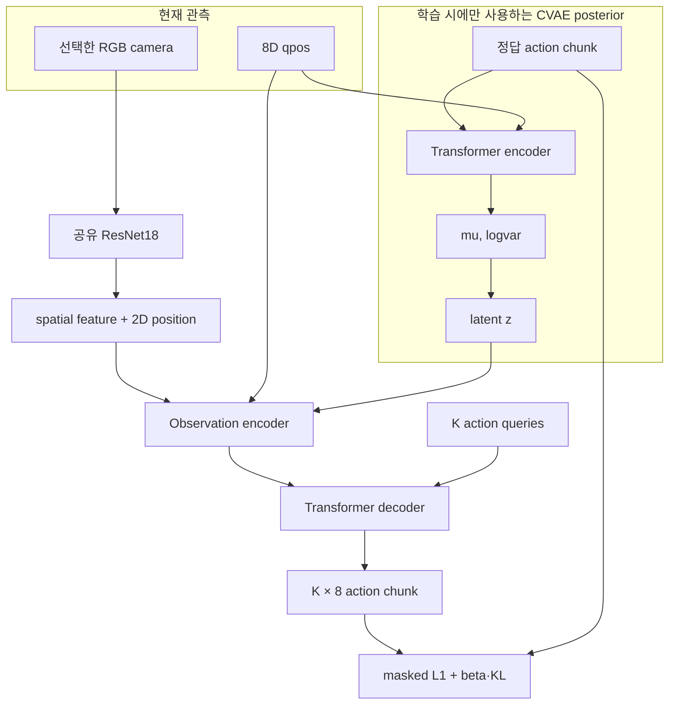
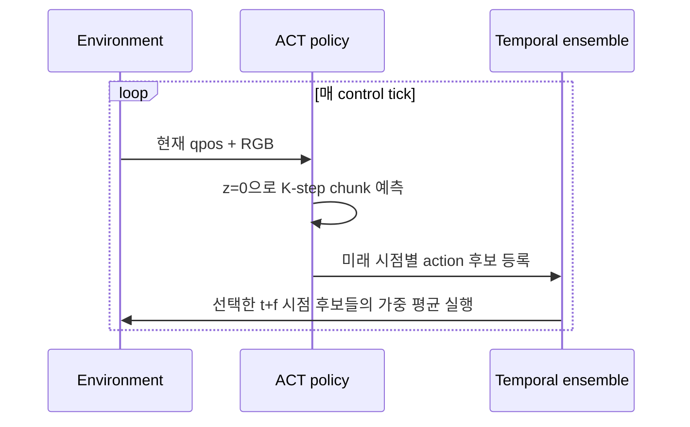

# ACT 아키텍처

ACT(Action Chunking with Transformers)는 영상과 로봇 상태를 받아 미래의 여러 행동을
한 번에 예측하는 CVAE Transformer 정책이다. ALOHA 논문에서 제안됐지만 특정 로봇에만
묶인 알고리즘은 아니다. 이 프로젝트는 정책 구조는 유지하면서 FFW-SH5의 관절 차원,
카메라와 제어 주기에 맞췄다.

## 구성 요소와 역할

| 구성 요소 | 역할 |
|---|---|
| Behavior cloning | demonstration의 관측에서 전문가 행동을 지도학습 |
| ResNet18 | RGB를 공간 정보를 유지한 feature map으로 변환 |
| 2D positional embedding | 이미지 feature의 행·열 위치 제공 |
| CVAE posterior | 정답 chunk의 행동 style을 latent `z`로 압축 |
| Transformer | 이미지·qpos·latent와 action query의 관계를 attention으로 계산 |
| Action chunking | 한 번에 미래 `K`개 행동을 공동 예측 |
| Temporal ensemble | 여러 시점에 예측된 동일 실행 시점의 후보를 가중 평균 |

RNN은 위 구성에 포함되지 않는다. ACT는 recurrent hidden state 대신 매 control tick의
관측에서 action chunk를 다시 예측한다.

## 왜 action 하나가 아니라 chunk인가

한 step씩 독립적으로 예측하면 긴 작업에서 오류가 계속 누적되고 행동이 흔들릴 수
있다. ACT는 `K`개 행동을 하나의 trajectory 구간처럼 공동 예측한다.

- 접근, grasp, 이동처럼 연속된 행동의 관계를 학습한다.
- 긴 episode를 더 짧은 chunk 단위 예측 문제로 바꾼다.
- 같은 관측에서 생성된 행동들이 하나의 latent style을 공유한다.
- 새 관측마다 chunk를 다시 예측해 이전 계획을 수정할 수 있다.

현재 기본값은 `K=90`, 제어 주기는 25 Hz이므로 하나의 chunk가 최대 3.6초를 나타낸다.
ALOHA 논문의 50 Hz 기준 90 step은 1.8초이므로, step 수가 같아도 실제 시간 horizon은
다르다.

## 학습 아키텍처

카메라마다 ResNet을 따로 학습하는 것이 아니라 하나의 backbone을 공유한다. feature를
global pooling하지 않기 때문에 물체 위치를 위한 공간 격자가 남는다. decoder의
`K`개 learned action query는 각각 chunk 안의 출력 위치에 대응한다.

## 추론과 temporal ensemble

예를 들어 실행 시점 12의 행동은 시점 10에서 예측한 chunk의 세 번째 값, 시점 11에서
예측한 두 번째 값, 시점 12에서 예측한 첫 번째 값이 모두 후보가 될 수 있다. temporal
ensemble은 **동일한 실행 시점**을 대상으로 한 후보만 지수 가중 평균한다. 서로 다른
실행 시점의 행동을 단순 smoothing하는 것과는 다르다.

Teleop의 `PTE future steps`가 `f=0`이면 위의 기존 ACT 동작을 그대로 사용한다.
`f>0`이면 현재 시점 후보 대신 이미 예측한 `t+f` 후보를 실행한다. 값 변경 시 기존
history를 비우고 즉시 새 chunk를 질의하므로 서로 다른 `f`의 후보는 섞이지 않는다.

policy가 끝나거나 사용자가 중단하면 runner의 chunk history를 비우고 teleop의 IK
제어권으로 돌아가야 한다. 이전 rollout의 temporal state가 다음 rollout에 남으면
현재 관측과 관계없는 action 후보가 섞일 수 있다.

## 현재 tensor 계약

배치 크기를 `B`, 카메라 수를 `N`, chunk 길이를 `K`라고 하면 주요 shape은 다음과 같다.

| 값 | shape | 설명 |
|---|---|---|
| qpos | `[B, 8]` | 오른팔 7축 + grasp |
| images | `[B, N, 3, H, W]` | 현재 `N=2`, RGB |
| target actions | `[B, K, 8]` | 학습 시 정답 chunk |
| is_pad | `[B, K]` | episode 끝 이후 padding |
| latent | `[B, 32]` | CVAE style |
| prediction | `[B, K, 8]` | 정규화된 action chunk |

저장된 HDF5의 16차원 qpos/action에서 오른팔 `8..15`를 선택한 뒤 위 8차원 계약을
만든다. 모델 출력은 dataset 통계로 역정규화되고, 실행 환경의 16차원 action 계약으로
다시 확장된다.

## 코드 읽기 순서

| 순서 | 모듈 | 확인할 내용 |
|---:|---|---|
| 1 | `imitation/act/dataset_loader.py` | sample timestep, chunk, padding, normalization |
| 2 | `imitation/act/backbone.py` | ResNet18 feature와 2D position |
| 3 | `imitation/act/transformer.py` | encoder/decoder attention |
| 4 | `imitation/act/policy.py` | posterior, latent, action query, loss |
| 5 | `imitation/act/trainer.py` | optimizer와 checkpoint lifecycle |
| 6 | `imitation/runtime/runner.py` | 복원, 역정규화, temporal ensemble |

실제 import root는 `src/ffw_sh5_grasp/imitation/`이다. 상세한 파일 책임은
[IL 코드 구조](../imitation-code-structure.md), 논문 설정과 현재 로봇의 정확한 차이는
[ACT 구현과 논문 대응](../act-implementation.md)에서 확인한다.

## 구현 확인 기준

- 학습 시 posterior가 qpos와 정답 action chunk를 받고 있는가?
- 추론 시 정답 action 없이 `z=0`으로 실행되는가?
- ResNet feature의 공간 축과 2D positional embedding이 유지되는가?
- padding action이 reconstruction loss에서 제외되는가?
- normalization 통계가 checkpoint를 학습한 train split과 같은가?
- temporal ensemble이 동일 target timestep 후보만 합치는가?
- policy 종료와 중단 시 history를 초기화하고 IK로 복귀하는가?

이 기준을 코드 수준에서 확인하려면 [논문과 현재 구현 대응](../act-implementation.md)을
이어 읽는다.
