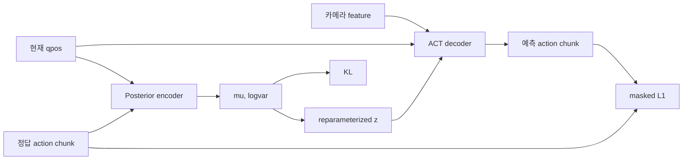

# VAE와 CVAE

## 잠재변수가 필요한 이유

로봇 demonstration에는 같은 물체 배치에서도 속도, 접근 방향, 손목 자세처럼 서로 다른
올바른 행동 style이 들어갈 수 있다. 이를 하나의 deterministic regression으로 평균내면
실제로 관측되지 않은 어색한 trajectory가 나올 수 있다. 잠재변수 `z`는 관측만으로
직접 설명하기 어려운 행동 variation을 압축해 표현한다.

## VAE

VAE(Variational Autoencoder)는 encoder가 입력 `x`를 latent distribution으로 바꾸고,
decoder가 latent sample로 `x`를 복원하도록 학습한다.

\[
q_\phi(z|x)=\mathcal N(\mu,\operatorname{diag}(\sigma^2))
\]

직접 sampling하면 gradient를 전달할 수 없으므로 reparameterization trick을 사용한다.

\[
z=\mu+\sigma\odot\epsilon, \qquad
\epsilon\sim\mathcal N(0,I)
\]

loss는 reconstruction 항과 posterior가 표준정규 prior에서 멀어지지 않게 하는 KL 항으로
구성한다.

\[
L=L_{recon}+\beta D_{KL}(q_\phi(z|x)\|\mathcal N(0,I))
\]

## Conditional VAE

CVAE는 복원할 대상 `x`뿐 아니라 조건 `c`를 함께 사용한다.

\[
q_\phi(z|x,c), \qquad p_\theta(x|z,c)
\]

ACT에서는 다음처럼 대응한다.

| CVAE 용어 | ACT에서의 의미 |
|---|---|
| 조건 `c` | 현재 qpos와 카메라 관측 |
| 복원 대상 `x` | 미래 action chunk |
| latent `z` | demonstration의 행동 style |
| encoder | qpos와 정답 action chunk를 읽는 posterior Transformer |
| decoder | 관측과 latent에서 action chunk를 만드는 Transformer |

## ACT 학습 경로



posterior encoder는 `[CLS] + qpos + action tokens`를 처리한다. `[CLS]` 출력에서 `mu`와
`logvar`를 만들고, sampled `z`를 observation 쪽 Transformer에 전달한다. episode
끝을 넘어 padding된 action은 attention과 L1 loss에서 mask한다.

현재 reconstruction loss는 유효한 action에 대한 L1이고, 전체 loss는 다음과 같다.

\[
L = \operatorname{masked\ L1}(\hat a,a)
  + \beta D_{KL}(q_\phi(z|a,q)\|\mathcal N(0,I))
\]

기본 `beta=10`, latent 차원은 32다.

## ACT 추론 경로

추론 시에는 정답 action chunk를 알 수 없으므로 posterior encoder를 사용할 수 없다.
현재 ACT 공개 구현과 이 프로젝트는 prior의 평균인 `z=0`을 사용한다.

```text
현재 qpos + 카메라 feature + z=0
                 ↓
             action chunk
```

즉, `z=0`은 학습 누락이나 임의의 우회가 아니라 CVAE의 prior mean을 사용하는
deterministic inference 방식이다. 다양한 style을 sampling해 비교하려면 별도의 실험
정책과 안전 검증이 필요하다.

## 해석할 때 주의할 점

- KL이 너무 작으면 decoder가 latent를 무시하는 posterior collapse일 수 있다.
- KL이 지나치게 크면 reconstruction이 나빠져 실제 action 정확도가 떨어질 수 있다.
- train/validation의 L1과 KL을 각각 기록해야 total loss만 볼 때 원인을 놓치지 않는다.
- validation KL의 변동만으로 실패를 단정하지 말고 L1, rollout 성공률과 함께 본다.
- inference에는 정답 action이 들어가면 안 된다. 들어가면 실제 운용에서 재현할 수 없는
  데이터 누수다.

이제 [ACT 아키텍처](act.md)에서 ResNet18, CVAE Transformer, action chunking과 temporal
ensemble이 하나의 정책으로 연결되는 과정을 본다.
