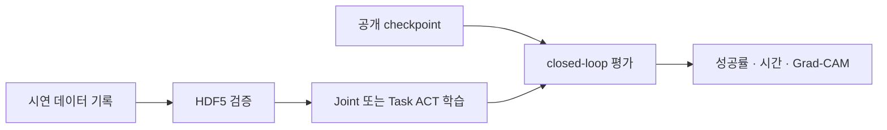

# 모방학습 안내

이 프로젝트는 ALOHA 논문의 ACT 구조를 FFW-SH5 MuJoCo의 `can_to_box`와
`can_color_sort` 작업에 적용한다. 처음부터 모든 문서를 읽을 필요는 없다. 아래에서
현재 목적에 맞는 경로 하나를 선택한다.

-   :material-download: **학습된 정책을 바로 실행하고 싶다**

    D97/D150 Joint·Task checkpoint를 받은 뒤 closed-loop 평가 또는 GUI를 실행한다.

    [공개 정책 다운로드](../../huggingface.md#2-d97d150)

-   :material-database-plus: **데이터를 모아 직접 학습하고 싶다**

    시연 데이터 기록, HDF5 검증, ACT 학습과 평가를 순서대로 진행한다.

    [명령어 레퍼런스](../../imitation-commands.md) ·
    [Joint/Task 실험](../../modular-act-training.md)

-   :material-chart-box: **실험 결과를 해석하고 싶다**

    D97/D150, Joint/Task와 PTE의 성공률·시간·색상별 차이를 확인한다.

    [연구 개요](../../research-report.md) ·
    [평가 결과](../../evaluation-results.md)

-   :material-book-open-variant: **ACT를 이해하거나 코드를 수정하고 싶다**

    행동 복제부터 CVAE Transformer와 현재 Python 모듈의 책임까지 따라간다.

    [ACT 아키텍처](act.md) ·
    [코드 구조](../imitation-code-structure.md)

## 전체 작업 흐름

| 단계 | 기준 문서 | 여기서 확인할 내용 |
|---|---|---|
| 설치·공개 자산 | [공개 정책·데이터셋](../../huggingface.md) | 고정 revision 다운로드, 실행, HDF5 경로 |
| 명령 실행 | [모방학습 명령어](../../imitation-commands.md) | record, validate, train, evaluate, Grad-CAM 옵션 |
| 데이터 계약 | [데이터 수집과 실기 전환](../imitation-sim2real.md) | 관측/action 정렬, camera, 실제 로봇 경계 |
| 비교 실험 | [Joint/Task 학습과 PTE](../../modular-act-training.md) | 표현별 YAML, split, 평가 행렬 |
| 결과 | [평가 결과 상세 분석](../../evaluation-results.md) | 2,000 rollout 통계와 해석 한계 |
| 구현 | [모방학습 코드 구조](../imitation-code-structure.md) | 패키지 책임과 변경별 검증 |

## 현재 정책 계약

| 항목 | 값 |
|---|---|
| Task | `can_to_box`, `can_color_sort` |
| Policy camera | `cam_high`, `cam_right_wrist` |
| 수집 주기 | RGB, qpos/action, EE pose를 같은 25 Hz tick에 기록 |
| Joint 표현 | 오른팔 관절 7 + grasp |
| Task 표현 | world-frame 오른손 EE pose 7 + grasp |
| ACT 출력 | 기본 `[batch, 90, 8]` action chunk |
| 실행 | Joint는 actuator target, Task는 bounded right-arm IK로 변환 |
| PTE | chunk의 `t+f` 후보를 현재 시점에 사용; 센서 주기는 바꾸지 않음 |

Checkpoint는 representation metadata와 그 학습 split에서 계산한
`dataset_stats.pkl`을 함께 사용해야 한다. 공개 dataset은
`datasets/can_color_sort_hf/data` 아래로 내려오며, 로컬 수집 기본 경로와 다르다.

## 개념을 공부하는 순서

실행보다 이론이 목적이라면 아래 순서로 읽는다.

1. [행동 복제와 데이터](foundations.md)
2. [CNN과 ResNet18](vision-encoder.md)
3. [RNN과 Transformer](sequence-models.md)
4. [VAE와 CVAE](cvae.md)
5. [ACT 아키텍처](act.md)
6. [논문과 현재 구현 대응](../act-implementation.md)

RNN은 현재 ACT 정책의 구성 요소가 아니라 Transformer와의 차이를 이해하기 위한 기반
지식이다. 구현을 수정할 때는 마지막으로 [코드 구조](../imitation-code-structure.md)와
[테스트와 검증](../../testing.md)을 확인한다.

## 먼저 피해야 할 실수

- HDF5 expert action을 closed-loop 정책 평가 결과로 사용하지 않는다.
- Joint checkpoint와 Task `dataset_stats.pkl`처럼 representation과 통계를 섞지 않는다.
- D97에는 주황·파랑 학습 episode가 없으므로 D150과의 차이를 순수 데이터 수 효과로
  해석하지 않는다.
- PTE `f`를 camera와 joint state의 sampling rate 변경으로 해석하지 않는다.
- Grad-CAM을 색상 인식의 인과적 증거로 과장하지 않는다.
