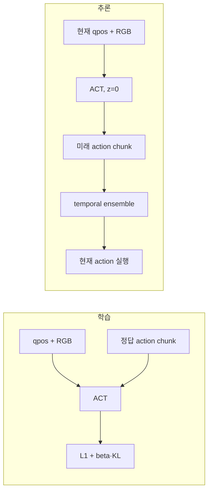

# 모방학습(IL) 전체 안내

모방학습(Imitation Learning, IL)은 전문가가 수행한 관측과 행동을 데이터로 모아
정책(policy)이 같은 행동을 재현하도록 학습하는 방법이다. 이 프로젝트의 목표는
ALOHA 로봇 자체를 복제하는 것이 아니라, ALOHA 논문에서 제안한 ACT 학습 구조를
FFW-SH5와 `can_to_box` 및 `can_color_sort` 작업에 적용하는 것이다.

문서 계층은 다음처럼 이해하면 된다.

```text
모방학습(IL)
├── 행동 복제와 데이터 계약
├── 시각 encoder
│   └── CNN / ResNet18
├── 시계열 모델
│   ├── RNN / LSTM / GRU
│   └── Transformer
├── 잠재변수 모델
│   └── VAE / CVAE
└── ACT
    ├── ResNet18 시각 특징
    ├── CVAE Transformer
    ├── Action chunking
    └── Temporal ensemble
```

ACT는 IL의 한 구현 방법이다. 따라서 문서 메뉴도 **IL → ACT**로 묶는 것이 맞다.
RNN은 ACT의 구성 요소는 아니지만, 로봇 시계열 정책에서 Transformer를 사용하는
이유와 차이를 이해하기 위한 기반 지식으로 함께 다룬다.

## 권장 학습 순서

| 순서 | 문서 | 이해할 질문 |
|---:|---|---|
| 1 | [행동 복제와 데이터](foundations.md) | 무엇을 입력하고 어떤 행동을 정답으로 학습하는가? |
| 2 | [CNN과 ResNet18](vision-encoder.md) | RGB가 어떻게 공간 feature token이 되는가? |
| 3 | [RNN과 Transformer](sequence-models.md) | 시간 문맥을 어떻게 표현하며 ACT는 왜 Transformer를 쓰는가? |
| 4 | [VAE와 CVAE](cvae.md) | 같은 상황에서 여러 올바른 행동이 있을 때 어떻게 표현하는가? |
| 5 | [ACT 아키텍처](act.md) | 위 요소가 어떻게 하나의 action-chunk 정책이 되는가? |
| 6 | [논문과 현재 구현 대응](../act-implementation.md) | 논문과 FFW-SH5 구현에서 같은 점과 다른 점은 무엇인가? |
| 7 | [IL 코드 구조](../imitation-code-structure.md) | 수정하려는 책임이 어느 Python 모듈에 있는가? |
| 8 | [Joint/Task 학습과 PTE 평가](../../modular-act-training.md) | 같은 조건의 정책을 어떻게 재현하고 비교하는가? |

## 이 프로젝트의 학습 문제

한 timestep의 수집 관측은 양팔 관절 상태, 양쪽 EE pose와 세 카메라 영상이다.
ACT 설정의 `camera_names`에서 학습에 사용할 시점만 고른다. 학습 target은 현재부터
미래까지의 오른팔 행동 묶음이다.

| 구분 | 현재 구현 |
|---|---|
| 관측 상태 | Joint: 오른팔 7축 + grasp, Task: 오른손 EE pose 7 + grasp |
| 시각 관측 | 기본 `cam_high`, `cam_right_wrist`; HDF5에는 left wrist도 저장 |
| 학습 target | `chunk_size`개의 8D 절대 joint target 또는 EE pose target |
| 기본 chunk | 90 step |
| 제어 주기 | 25 Hz |
| 정책 출력 | `[batch, 90, 8]` action chunk |
| 실행 | Joint는 actuator target, Task는 오른팔 IK로 변환 후 ensemble/PTE 적용 |

HDF5에는 ALOHA 호환 양팔 16차원과 양쪽 EE pose를 모두 저장한다. Joint 정책은 오른팔
index `8..15`, Task 정책은 오른손 pose와 grasp만 선택한다. 하나의 원본 데이터셋에서
표현만 바꾸므로 데이터 수와 split을 고정한 공정한 비교가 가능하다.

## 학습과 추론의 차이



학습 때만 정답 action chunk가 CVAE posterior의 입력으로 들어간다. 추론 때는 미래의
정답을 알 수 없으므로 action 입력이 없고 latent `z=0`을 사용한다. 이 차이는
데이터 누수 없이 ACT를 구현했는지 확인하는 가장 중요한 기준 중 하나다.

## 다음 단계

- 실행 명령은 [모방학습 명령어](../../imitation-commands.md)를 참고한다.
- 데이터 수집부터 실제 로봇 전환까지는
  [데이터와 실기 전환](../imitation-sim2real.md)을 참고한다.
- 모델을 수정하기 전에는 먼저 [ACT 아키텍처](act.md)의 tensor 흐름과
  [논문 대응표](../act-implementation.md)를 확인한다.
