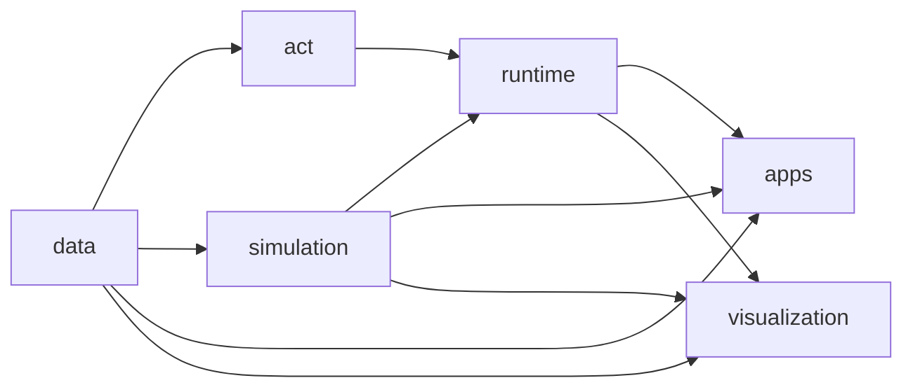

# 모방학습 코드 구조

모방학습 코드는 데이터, MuJoCo 실행 경계, ACT 알고리즘, 추론 실행, 사용자 앱을
분리한다. 기능은 아래의 책임별 패키지에만 두며 `imitation/` 최상위에는 공개 상수와
패키지 설명 외의 구현 모듈을 두지 않는다.

```text
ffw_sh5_grasp/imitation/
├── data/                  # MuJoCo·PyTorch에 의존하지 않는 episode 계층
│   ├── schema.py          # 16D state/action 이름과 index 계약
│   ├── episode.py         # HDF5 읽기·검증·원자적 저장
│   ├── validation.py      # RGB 전체를 읽지 않는 dataset 검사
│   ├── recording.py       # obs_t/action_t 정렬과 episode 저장
│   ├── replay.py          # 저장 action의 결정적 재실행
│   └── paths.py           # episode 파일 경로 규칙
├── simulation/            # MuJoCo와 policy 사이의 adapter
│   ├── action.py          # 16D action 검증·관절/손 명령 분리
│   ├── state.py           # MuJoCo state를 16D qpos/qvel로 투영
│   ├── cameras.py         # policy RGB camera 렌더링
│   ├── task.py            # can reset과 성공 조건
│   └── environment.py     # actuator-level control loop와 observation
├── act/                   # 논문에 대응하는 모델과 학습
│   ├── backbone.py        # ResNet18과 2D 위치 embedding
│   ├── transformer.py     # positional encoder/decoder
│   ├── policy.py          # CVAE ACT forward와 loss
│   ├── dataset_loader.py  # lazy action-chunk sampling과 normalization
│   ├── trainer.py         # 기존 joint trainer lifecycle
│   ├── modular_representations.py # 오른팔 Joint/Task 8D 표현
│   ├── modular_dataset_loader.py  # 같은 HDF5를 표현별 tensor로 변환
│   └── modular_trainer.py # 공통 조건의 Joint/Task 학습 lifecycle
├── runtime/               # 학습된 정책의 실행 계층
│   ├── runner.py          # checkpoint 복원과 temporal ensemble
│   ├── catalog.py         # outputs/act checkpoint 탐색
│   ├── task_space.py      # task pose 출력과 오른팔 IK 연결
│   └── evaluation.py      # closed-loop 평가, PTE와 결과 집계
├── apps/                  # GLFW/ImGui 사용자 애플리케이션
│   ├── base.py            # 공통 key-edge와 렌더 프레임
│   ├── leader.py          # demonstration leader
│   ├── recording.py       # episode 기록 UI
│   └── policy.py          # 독립 policy 실행 UI
└── visualization/         # Rerun·W&B 출력 adapter
```

## 의존 방향



- `data`는 MuJoCo, GLFW, PyTorch를 import하지 않는다.
- `simulation`은 ACT 모델을 알지 못하고 16D 계약만 구현한다.
- `act`는 실제 로봇이나 GUI를 알지 못하고 tensor 학습만 담당한다.
- `runtime`이 ACT 출력과 environment action 사이를 연결한다.
- `apps`는 입력과 화면 lifecycle만 소유하고 알고리즘을 재구현하지 않는다.
- `visualization`은 관측 결과를 표시하지만 제어나 dataset 상태를 변경하지 않는다.

## 정식 import 예시

```python
from ffw_sh5_grasp.imitation.data.episode import load_episode
from ffw_sh5_grasp.imitation.runtime.runner import ACTPolicyRunner
from ffw_sh5_grasp.imitation.simulation.environment import AIWorkerMujocoEnv
```

이전 flat import 경로는 제거되었다. 데이터는 `data`, MuJoCo 경계는 `simulation`,
checkpoint 실행은 `runtime`, UI는 `apps`에서 직접 import한다.

## 변경별 최소 검증

| 변경 영역 | 최소 검증 |
|---|---|
| `data/` | `test_il_dataset`, `test_il_dataset_validation`, record alignment |
| `simulation/` | action, state adapter, camera, env, replay |
| `act/` | ACT forward/loss, Joint/Task 표현과 1-epoch training smoke test |
| `runtime/` | temporal aggregation/PTE, task IK, closed-loop smoke test |
| `apps/` | policy/record UI smoke test와 teleop policy→IK 전환 |

전체 변경 후에는 `test_il_*.py`와 기존 whole-body/Phase 6 회귀를 함께 실행한다.

실행 명령은 루트에 여러 스크립트로 흩어놓지 않고 `src/il.py`에서 통합한다. 실제
argument parser는 `ffw_sh5_grasp/cli/<command>.py`에 있으며 dispatcher는 선택된
command만 import한다. 기존 학습은 `python3 src/il.py train --config ...`, Joint/Task
학습은 `python3 src/il.py train-modular --config ...`, 평가 행렬은
`python3 src/il.py evaluate-color-sort`로 실행한다.
