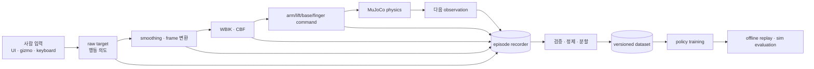

# 모방학습 데이터와 실기 전환

이 문서는 현재 텔레오퍼레이션을 이후 모방학습 데이터 수집기로 확장하고, 학습 정책을
실물 FFW-SH5 계열 로봇으로 옮길 때 필요한 **데이터 계약, 기록 위치, 리플레이,
하드웨어 경계와 안전 절차**를 정의한다.

!!! warning "현재 구현 범위"
    이 저장소에는 아직 학습용 episode recorder, dataset loader, policy runner,
    실물 하드웨어 드라이버가 없다. `tests/record_demo.py`는 검증 장면을 GIF로 만드는
    개발 도구이지 학습 데이터를 기록하는 프로그램이 아니다. 아래에서
    `build_observation()`, `DatasetRecorder`, `RobotHardware`처럼 제시하는 이름은
    **추가 구현 시 지켜야 할 제안 인터페이스**이며 현재 API가 아니다.

## 먼저 결정할 정책의 출력

현재 제어 계층을 그대로 활용하려면 정책이 저수준 torque를 직접 예측하기보다
사람이 UI로 만드는 것과 같은 **작은 task-space 목표 변화량**을 예측하는 구성이
가장 자연스럽다.

| 정책 출력 후보 | 기존 코드에 연결하는 곳 | 실기 전환성 | 권장 |
|---|---|---:|---:|
| 손 pose 변화량 + `grasp`/`thumb` | `application.targets` → `WholeBodyIK.solve()` | 높음 | 첫 버전 |
| base `BodyTwist` + 손 pose 변화량 | app arbitration → WBIK/swerve | 중간 | 이동 조작 데이터가 충분할 때 |
| arm/lift 목표 위치 | `WholeBodyCommand` 다음 계층 | 중간 | controller 모방 연구용 |
| wheel·finger actuator 값 또는 arm torque | `data.ctrl` 직전 | 낮음 | 초기 실기 배포에는 비권장 |

task-space 정책을 쓰면 관절 한계, collision CBF, 스워브 변환과 팔 저수준 제어를
정책 밖에 둘 수 있다. 정책이 실패해도 기존 안전 계층이 마지막 명령을 제한할 수
있다는 장점이 있다. target frame과 world pose의 관계는
[목표와 좌표 변환](teleop_targets.md), WBIK 입력·출력은
[전신 IK와 충돌 회피](whole_body_ik.md)를 먼저 읽는다.

권장 action 한 개는 다음처럼 정의할 수 있다.

\[
a_t = [\Delta p_r,\Delta\theta_r,\Delta p_l,\Delta\theta_l,
       \Delta g_r,\Delta t_r,\Delta g_l,\Delta t_l]
\]

- \(\Delta p\): startup-anchor 또는 task frame에서 표현한 위치 변화량(m)
- \(\Delta\theta\): 같은 frame의 rotation-vector 변화량(rad)
- \(\Delta g,\Delta t\): `grasp`, `thumb` scalar 변화량

quaternion 네 성분을 그대로 회귀할 수도 있지만 단위 길이와 \(q\equiv-q\)를 별도로
처리해야 한다. 현재 코드의 최단 자세 오차 규칙은
[Quaternion과 자세 오차](quaternion-math.md)에 설명되어 있다.

## 데이터 파이프라인



한 가지 action만 저장하면 나중에 정책 계층을 바꾸기 어렵다. 한 control frame에서
다음 네 수준을 함께 기록한다.

1. **사람 의도**: raw `app.targets`, 키 상태, gizmo/capture/release event
2. **정규화 action**: smoothed hand world pose와 선택한 학습 action 변화량
3. **solver 출력**: `WholeBodyCommand.generalized_velocity`, base twist, arm/lift 목표
4. **최종 명령**: wheel 명령, finger synergy, 실제 `data.ctrl`

학습에는 한 수준만 선택하되, 나머지는 데이터 오류와 controller 문제를 분리하는 데
사용한다.

## episode와 step 스키마

배열의 순서를 코드에 암묵적으로 박아 두지 말고 모든 episode metadata에 joint,
actuator, camera 이름 순서를 저장한다. 최소 스키마는 다음과 같다.

### Episode metadata

| 필드 | 내용 |
|---|---|
| `schema_version`, `episode_id` | 포맷 버전과 불변 식별자 |
| `git_commit`, `model_hash` | 코드와 `models/full_scene.xml` 재현 정보 |
| `seed`, `reset_parameters` | 캔 초기 pose와 domain randomization 값 |
| `control_hz`, `physics_dt` | 현재 기본값은 각각 25 Hz, 0.001 s |
| `joint_names`, `actuator_names` | 모든 벡터의 고정 순서 |
| `controller_config` | IK weight, gain, bound, collision 거리, torque gain |
| `camera_calibration` | RGB/depth를 쓸 때 intrinsics와 world extrinsics |
| `task`, `success`, `failure_reason` | task 정의와 종료 판정 |

### Step record

| 묶음 | 최소 필드 |
|---|---|
| 시간 | `sequence`, monotonic wall time, sim/robot time, `dt`, dropped-frame 여부 |
| proprioception | 이름 순서가 고정된 `qpos`, `qvel`, base pose/twist, wheel steer/velocity |
| task state | 양손 pose, 캔 pose/twist, 캔 기준 손 상대 pose |
| contact/safety | 손가락 그룹별 법선력, 최소 충돌 거리, active pair, CBF 위반량 |
| mode | whole-body ON/OFF, 손별 IK/FK, Bimanual capture, manual override |
| action | raw target, 학습 action, WBIK 출력, 최종 actuator command |
| vision(선택) | RGB/depth 경로 또는 frame index와 정확한 sensor timestamp |

관측 \(o_t\)를 읽고 action \(a_t\)를 적용한 뒤 생긴 상태는 \(o_{t+1}\)로 저장한다.
이 한 칸 정렬을 지키지 않으면 정책이 지연을 잘못 학습한다. 물리 substep 전체가
필요한 torque 연구가 아니라면 1 kHz `mj_step()`마다 중복 저장하지 말고 25 Hz control
frame을 기본 표본으로 사용한다.

파일 형식은 논리 스키마와 분리한다. 소규모 검증은 압축 NPZ도 가능하지만, 다수 episode와
영상이 생기면 chunk 단위 읽기와 metadata를 지원하는 HDF5/Zarr 계열 또는
step table + 별도 영상 파일 구성이 관리하기 쉽다. 어떤 형식을 택하든 episode 단위
원자적 완료 표시와 `schema_version`은 유지한다.

## 코드에 recorder를 넣을 위치

[앱 조립과 물리 루프](teleop_app.md)의 `_step_physics()`가 한 control frame의 명령을
모두 볼 수 있는 유일한 조립 지점이다. 구현할 때는 계산 모듈마다 파일 쓰기를 흩뿌리지
말고 recorder 하나에 immutable snapshot을 넘긴다.

```python
# 아래 이름은 설계 예시이며 아직 구현되어 있지 않다.
observation_t = build_observation(app)
human_intent = build_human_action(app)
command = app.whole_body_solver.solve(...)
app._step_actuators(wheel_commands)
observation_next = build_observation(app)

recorder.append_transition(
    observation=observation_t,
    action=human_intent,
    controller_command=command,
    next_observation=observation_next,
)
```

실제 `_step_actuators()`는 한 render frame 안에서 여러 물리 substep을 실행한다.
따라서 `observation_t`는 substep 전에, `observation_next`는 모든 substep 뒤에 캡처해야
한다. renderer가 느려져도 sensor/control timestamp를 화면 표시 시각과 섞지 않는다.

## 수집에서 학습까지 사용 순서

1. 성공 조건과 실패 조건을 먼저 코드로 고정한다. 파지는 순간적인
   `grasp.is_grasped()` 한 번이 아니라 일정 시간 접촉 유지와 물체 높이까지 함께 본다.
2. recorder 없이 10회 정도 수동 수행해 action 범위와 episode 시작·종료 event를 정한다.
3. 작은 파일 1개로 관측–action–다음 관측 정렬, quaternion norm, 이름 순서를 검사한다.
4. 성공뿐 아니라 놓침, 충돌 안전 개입, 중단 episode도 명시적 label로 수집한다.
5. episode 단위로 train/validation/test를 나눈다. 같은 reset seed의 인접 frame을
   서로 다른 split에 넣지 않는다.
6. 위치·속도·힘의 정규화 통계는 train split에서만 구하고 dataset version과 함께 저장한다.
7. 학습 전에 기록 action을 [target 변환](teleop_targets.md)과 WBIK에 다시 넣는
   target-level replay로 데이터 계약을 검증한다.
8. 정책은 먼저 offline dataset과 deterministic sim에서 평가하고, 그다음 보지 않은
   물체 pose와 dynamics randomization에서 평가한다.

### 데이터 품질 gate

- timestamp와 `sequence`가 단조 증가하고 빠진 frame이 표시되는가
- 모든 수치가 finite이며 quaternion norm이 1에 가까운가
- joint/actuator vector 길이와 이름 목록이 매 step 동일한가
- position, velocity, `data.ctrl`, target rate가 코드의 limit 안에 있는가
- action 이후의 상태가 정확히 `next_observation`에 들어갔는가
- RGB/depth와 proprioception의 timestamp 차이가 허용 범위 안인가
- success/failure와 초기 물체 pose가 한쪽에만 몰리지 않았는가
- 수동 개입과 collision CBF 개입을 label로 구분했는가

## 리플레이는 세 단계로 나눈다

| 방식 | 목적 | 판정 |
|---|---|---|
| 상태 재현 | 초기 qpos/qvel, seed, 모델 설정이 복구되는지 | 첫 observation 일치 |
| target-level closed-loop replay | 기록한 target action을 현재 controller에 다시 입력 | 손/object 궤적과 성공 결과 허용 오차 내 일치 |
| actuator open-loop replay | 기록 `data.ctrl`을 그대로 적용 | dynamics 변경 감지용; 정책 평가에는 사용하지 않음 |

open-loop actuator replay는 작은 물리 차이가 계속 누적되므로 장기 궤적이 달라지는 것이
정상이다. robot `qpos`를 매 frame 기록값으로 덮어써서 성공처럼 보이게 하지 않는다.
초기 상태 복원에만 qpos/qvel을 쓰고 이후 운동은 controller와 physics가 만들게 한다.

## Sim-to-real에서 바뀌는 경계

현재 모듈 중 순수 NumPy 계산과 실물 I/O를 구분해야 한다.

| 현재 구성 | 실기에서의 처리 |
|---|---|
| `application/targets.py`, `kinematics/rotations.py` | frame·단위 계약이 같으면 재사용 가능 |
| `KinematicTree`, `KinematicsSolver` | 실제 URDF/MJCF 관절축·zero·tool pose와 일치할 때만 재사용 |
| `WholeBodyIK.solve(MjData, ...)` | 현재는 MuJoCo 상태 의존; shadow model adapter 또는 상태 인터페이스 분리가 필요 |
| `kinematics/collision.py` | MuJoCo geom 상태 의존; calibrated shadow scene나 실기 collision source 필요 |
| `SwerveDrive` | wheel 반지름·위치·부호·gear·feedback 단위를 실측한 뒤 재사용 검토 |
| `ArmTorqueController.apply()` | `data.qfrc_bias`와 `data.ctrl`용이므로 실물 모터에 직접 사용 금지 |
| `grasp.apply_grasp()` | 실제 hand actuator calibration과 current/force limit에 맞는 adapter 필요 |
| `visualization/render.py`, `visualization/ui.py` | 운영 UI로 쓸 수 있지만 hardware I/O와 watchdog을 소유하면 안 됨 |

초기 프로토타입은 실제 joint sensor 값을 이름 기반으로 shadow `MjData.qpos/qvel`에
복사하고, 모델의 파생 pose/geom 상태를 갱신한 뒤 WBIK를 호출하는 방식이 가능하다.
하지만 shadow model의 충돌 거리와 bias force가 현실을 정확히 나타낸다고 가정해서는
안 된다. 장기적으로는 `RobotObservation`을 입력받는 solver와 실제 driver를 분리하는
편이 안전하다.

제안하는 하드웨어 경계는 다음 네 동작만 노출한다.

```python
class RobotHardware:
    def read_observation(self): ...   # timestamp가 붙은 측정 상태
    def write_command(self, command): ...  # 제한 검사 뒤 명령 전송
    def stop(self): ...               # 통신 손실에도 안전 정지
    def reset_faults(self): ...       # 운영자 확인 뒤에만 복구
```

이 인터페이스 아래에서 vendor SDK, CAN/EtherCAT, ROS2 `hardware_interface` 중 무엇을
쓰는지는 상위 policy와 무관해야 한다. ROS2와 현재 함수 호출 구조의 대응은
[아키텍처의 ROS2 용어 대응표](../overview.md#ros2-concept-map)를 참고한다.

## 실기 전 반드시 맞출 것

### 좌표계와 모델

- world/base/tool/camera frame의 축 방향, handedness, 길이 단위를 고정한다.
- encoder zero와 joint sign, gear ratio, 관절 한계가 MJCF와 같은지 관절별로 확인한다.
- quaternion 순서는 현재 코드의 wxyz를 유지하고 입력마다 정규화한다.
- hand tool center point와 collision geom 위치를 실측한다.
- base pose는 simulation의 planar `qpos` 대신 odometry/estimator timestamp와 covariance를 쓴다.

### 시간과 통신

- 25 Hz 정책 출력과 실제 arm/base servo 주기를 분리한다.
- 측정→추론→명령 지연, jitter, packet loss를 기록하고 watchdog timeout보다 작게 유지한다.
- 오래된 observation에 계산한 명령은 폐기한다.
- camera와 joint state의 clock을 동기화하고 dataset에도 원 timestamp를 남긴다.

### 동역학과 접촉

- 질량, 관성, 마찰, wheel slip, actuator deadband/backlash, torque/current limit을 실측한다.
- domain randomization은 이 측정 범위를 중심으로 적용하고 episode metadata에 실제
  샘플값을 남긴다.
- 손가락 접촉력은 MuJoCo 법선력과 센서 종류·위치가 다르므로 별도 threshold를 보정한다.
- 캔 하나에서 통과한 gain과 파지 기준을 다른 물체에 그대로 일반화하지 않는다.

### 정책 밖 안전 계층

정책 출력은 항상 아래 순서를 거친다.

```text
policy action
  → workspace·joint·속도·가속도 제한
  → collision/접근 속도 제한
  → 명령 rate limit
  → hardware command
  → watchdog·E-stop
```

E-stop, 통신 watchdog, hard joint/torque/current limit, workspace 제한은 학습 정책이나
reward에 맡기지 않는다. `WholeBodyIK`의 CBF도 실제 사람·케이블·미모델링 장애물을
보지 못하므로 유일한 안전 장치가 될 수 없다.

## 단계별 배포 절차

| 단계 | 수행 | 다음 단계 조건 |
|---:|---|---|
| 0 | dataset schema와 deterministic replay 검증 | action–state 정렬 오류 0 |
| 1 | 보지 않은 reset과 randomization에서 simulation 평가 | 성공률·충돌·limit 기준 통과 |
| 2 | 실물 센서만 읽는 shadow mode, 명령 전송 금지 | frame·zero·지연·FK 오차 확인 |
| 3 | 바퀴를 띄우고 팔은 무부하인 저속 단축 시험 | sign, limit, watchdog, E-stop 확인 |
| 4 | 넓은 공간에서 저속 base/팔 분리 시험 | 추종 오차와 stop distance 기준 통과 |
| 5 | 가벼운 물체와 낮은 접촉력으로 teleop controller 시험 | 접촉·collision model 보정 완료 |
| 6 | policy를 짧은 horizon으로 실행, 운영자 dead-man switch 유지 | 반복 trial과 failure recovery 통과 |

각 단계의 실패를 정책 재학습 하나로 덮지 않는다. frame 오류, model mismatch,
저수준 추종, perception 오류, policy 오류를 각각 분리해 기록한다.

## 최종 체크리스트

- [ ] 현재 저장소에는 recorder/real driver가 없다는 범위를 팀이 공유한다.
- [ ] 학습 action 계층과 단위·frame·rate가 문서와 schema에 고정되어 있다.
- [ ] raw intent, normalized action, solver output, final command를 함께 기록한다.
- [ ] episode metadata만으로 코드·모델·초기 상태를 재현할 수 있다.
- [ ] target-level replay가 먼저 통과한다.
- [ ] train/validation/test가 episode 단위로 분리된다.
- [ ] 실물 joint 이름·zero·sign·limit과 tool/camera frame을 실측했다.
- [ ] hardware driver에 watchdog, stale-command 거부, stop, hard limit가 있다.
- [ ] policy 없이도 저수준 controller와 안전 정지를 검증했다.
- [ ] shadow mode부터 단계별로 올리고 각 단계의 통과 기준을 기록했다.

## 공식 자료와 적용 범위

실기 전환 시 ROS2를 선택한다면 공식 `ros2_control`의
[hardware component lifecycle](https://control.ros.org/kilted/doc/ros2_control/hardware_interface/doc/hardware_components_userdoc.html)과
[controller manager의 실시간 주기 설명](https://control.ros.org/kilted/doc/ros2_control/controller_manager/doc/userdoc.html)을
구현 기준과 함께 검토한다. 이 문서의 `RobotHardware` 예시는 그 개념을 단순화한
프로젝트 내부 경계이지 `ros2_control`을 대체하는 완성 driver가 아니다.

산업용 로봇 또는 로봇 셀로 배포하는 경우에는 현재 발행본인
[ISO 10218-1:2025](https://www.iso.org/standard/73933.html)과
[ISO 10218-2:2025](https://www.iso.org/standard/73934.html)를 포함해 실제 용도와
지역에 적용되는 안전 요구사항을 자격 있는 담당자와 별도로 평가해야 한다. 특히
ISO 10218-2의 적용 제외 범위에는 서비스 로봇과 mobile platform 관련 항목도 있으므로,
이 링크를 따랐다는 사실만으로 본 시스템의 적합성이나 안전 인증을 주장할 수 없다.

simulation timestep과 MJCF 설정의 의미는 MuJoCo 공식
[XML Reference](https://mujoco.readthedocs.io/en/3.6.0/XMLreference.html)를 기준으로
확인한다. 실물 제어 주기는 simulation의 0.001 s를 그대로 복사하지 않고 실제 driver,
network와 motor controller의 보장 주기에서 다시 정한다.

[API 레퍼런스](../api/index.md)에서 현재 공개 함수를 찾고,
[테스트와 검증](../testing.md)의 기존 simulation gate를 실기 전 최소 기준으로 사용한다.
