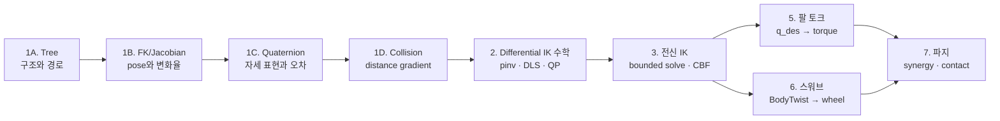
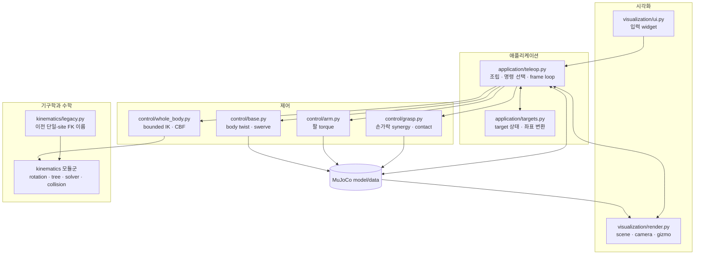

# 시스템 이해와 개발 가이드

이 페이지는 시스템의 동작 원리를 이해하는 경로와 코드를 안전하게 수정하는 경로를
하나로 모은 안내서다. 앱을 아직 실행하지 않았다면 [빠른 시작](../getting-started.md)을
먼저 따라 해보는 편이 이해가 빠르다.

## 읽기 경로 선택

시스템 개념, 코드 중심 설명과 ROS2 용어 대응을 별도 가이드로 반복하지 않는다.
아래에서 출발점을 고른 뒤 모두 같은 아키텍처와 모듈별 문서로 이어진다.

| 목적 | 권장 순서 |
|---|---|
| 시스템 동작 이해하기 | [동작 원리](../concepts.md) → [아키텍처와 데이터 흐름](../overview.md) |
| 처음 코드를 읽기 | [동작 원리](../concepts.md) → [아키텍처](../overview.md) → 이 페이지의 코드 계층 |
| 수정할 파일 찾기 | [수정 목적별 경로](#change-paths) → 해당 모듈 가이드 → [테스트](../testing.md) |
| 제어값 조정하기 | [YAML 파라미터 설정](../configuration.md) → 해당 알고리즘 문서 → 물리 회귀 테스트 |
| ROS2 경험으로 이해하기 | [아키텍처의 ROS2 대응표](../overview.md#ros2-concept-map)로 용어를 바꾼 뒤 같은 모듈 문서 읽기 |
| 제어 수학 이해하기 | [핵심 알고리즘 학습 순서](#algorithm-learning-order)를 1번부터 따라가기 |
| 좌표계·3D 조작 이해하기 | [목표와 좌표 변환](teleop_targets.md) → [UI 패널](teleop_ui.md) → [렌더링과 Gizmo](teleop_render.md) |
| 모방학습·실기 전환 준비 | [모방학습 데이터와 실기 전환](imitation-sim2real.md) |

!!! tip "사용법을 찾는 중이라면"
    키와 버튼은 [화면과 조작](../run.md), 모드 조합은
    [모드 선택](../control-modes.md), 증상 진단은
    [문제 해결](../troubleshooting.md)이 더 빠르다.

## 문서 계층과 코드 계층

왼쪽 내비게이션은 `src/ffw_sh5_grasp/`의 책임 경계를 그대로 따른다. 문서를 찾을
때는 수정하려는 코드의 상위 패키지와 같은 이름의 분류를 먼저 연다.

```text
시스템 이해와 개발
├── 시스템 기초                  # 공통 상태와 전체 데이터 흐름
├── 애플리케이션 ↔ application/ # 앱 조립, target과 좌표 변환
├── 시각화       ↔ visualization/ # UI·장면·카메라·기즈모
├── 기구학과 수학 ↔ kinematics/  # tree, FK/Jacobian, 회전, 충돌, IK
├── 제어          ↔ control/      # WBIK·팔·베이스·파지
├── 검증과 확장                  # 테스트, 개발 규칙, 모방학습·실기
└── API 참고                     # 함수별 입력·출력·사용 시점
```

| 문서 분류 | 대응 코드 | 먼저 찾을 내용 |
|---|---|---|
| 애플리케이션 | `application/` | 실행 루프, 명령 우선순위, target·좌표계 |
| 시각화 | `visualization/` | ImGui 입력, MuJoCo scene, gizmo와 overlay |
| 기구학과 수학 | `kinematics/` | tree, FK/Jacobian, quaternion, task, constraint, collision |
| 제어 | `control/` | 전신 IK 조립, 수치 최적화, 팔·베이스·손 명령 |
| 검증과 확장 | `tests/`, 향후 adapter/recorder | 회귀 기준, 변경 규칙, 데이터·실기 전환 |

이 분류는 **파일을 찾는 순서**다. 처음부터 학습할 때는 패키지 알파벳순이 아니라
입력과 수식의 의존 관계를 따라야 하므로 아래의 완독 순서와 알고리즘 학습 순서를
사용한다. 예를 들어 `application/targets.py`를 먼저 읽어 IK 입력인 world pose를
이해한 다음 `kinematics/`와 `control/`로 내려간다.

## 전체 완독 순서

처음부터 끝까지 한 번 읽을 때는 아래 순서를 권장한다. 핵심 알고리즘 안에서는
바로 다음 절의 1A~7 순서를 그대로 따른다.

1. [빠른 시작](../getting-started.md)으로 실제 화면과 기본 동작을 확인한다.
2. [동작 원리](../concepts.md) → [아키텍처와 데이터 흐름](../overview.md) →
   [MuJoCo 기본 용어](00-basics.md) → [YAML 파라미터 설정](../configuration.md)으로
   상태, 모듈 경계와 조절값의 위치를 잡는다.
3. [목표와 좌표 변환](teleop_targets.md)에서 UI 입력이 world hand pose가 되는
   과정을 읽는다.
4. [핵심 알고리즘 학습 순서](#algorithm-learning-order)의 1A~7을 읽어
   world pose가 관절·바퀴·손가락 명령으로 바뀌는 수학을 따라간다.
5. [앱 조립과 물리 루프](teleop_app.md) → [UI 패널](teleop_ui.md) →
   [렌더링과 Gizmo](teleop_render.md)로 실제 한 frame의 호출 관계를 확인한다.
6. [API 레퍼런스](../api/index.md)에서 작업별 공개 함수를 고르고,
   [개발 체크리스트](pitfalls.md)와 [테스트와 검증](../testing.md)으로 마무리한다.

이후 데이터를 수집하거나 실물 로봇으로 확장할 때만
[모방학습 데이터와 실기 전환](imitation-sim2real.md)을 읽는다. 이 페이지는 현재
구현과 아직 추가해야 할 recorder·hardware adapter의 경계를 구분한다.

이 경로를 마치면 **입력 → 좌표 변환 → 기구학/IK → actuator 명령 → 물리 → 렌더링**을
파일과 함수 단위로 추적할 수 있다. ROS2 경험자는
[한 장의 대응표](../overview.md#ros2-concept-map)로 용어만 대응하면 같은 설명을
중복해서 읽을 필요가 없다.

## 핵심 알고리즘 학습 순서 { #algorithm-learning-order }

수식의 입력을 만드는 계층부터 해를 구하는 계층, 해를 물리 actuator에 적용하는
계층 순으로 읽는다.



| 순서 | 먼저 답할 질문 | 핵심 수식 | 구현 문서 |
|---:|---|---|---|
| 1A | 모델 구조를 왜 별도 tree로 만들고 FK에 무엇을 넘기는가? | root→target body path | [Kinematic Tree](kinematic-tree.md) |
| 1B | tree의 joint 변환이 pose와 Jacobian으로 어떻게 이어지는가? | \(x=f(q),\ \dot x=J(q)\dot q\) | [FK와 Jacobian](forward-kinematics.md) |
| 1C | 회전 표현의 부호와 world-frame 자세 오차를 어떻게 정하는가? | \(q_e=q_t\otimes q_c^{-1}\) | [Quaternion과 자세 오차](quaternion-math.md) |
| 1D | point velocity가 collision distance 변화율로 어떻게 이어지는가? | \(\nabla d=n^T(J_B-J_A)\) | [Collision distance와 gradient](collision-kinematics.md) |
| 2 | 세 velocity-level 해법은 같은 task를 어떻게 푸는가? | \(A^+b\), DLS, bounded QP | [Differential IK 수학](ik-math.md) |
| 3 | base·lift·양팔과 safety constraint를 어떻게 함께 푸는가? | bounded weighted least-squares + CBF | [전신 IK와 충돌 회피](whole_body_ik.md) |
| 5 | 팔 관절 목표를 실제 torque로 어떻게 바꾸는가? | \(\tau=h+K_pe-K_d\dot q\) | [팔 토크 제어](arm_control.md) |
| 6 | base twist를 세 wheel module 명령으로 어떻게 바꾸는가? | \(v_i=v+\omega\times r_i\) | [모바일 스워브 제어](base_teleop.md) |
| 7 | 두 synergy와 접촉력으로 파지를 어떻게 명령·판정하는가? | \(u=b+c_g g+c_t t\) | [손 파지와 접촉 판정](grasp.md) |

### 공통 설명 규칙

각 알고리즘 문서는 다음 순서를 지킨다.

1. **문제와 경계**: 무엇을 입력받고 무엇을 반환하며, 하지 않는 일을 먼저 밝힌다.
2. **기호와 좌표계**: 수식 전에 벡터의 크기, frame, 단위를 정의한다.
3. **수식 유도**: 가정에서 목적함수 또는 기하 관계를 세우고 결과식까지 전개한다.
4. **코드 대응**: 수식의 각 항을 실제 파일·함수·변수 이름과 연결한다.
5. **실행 흐름**: 한 frame 또는 한 iteration에서 호출되는 순서를 보여준다.
6. **검증**: 어떤 테스트가 수식의 어떤 주장을 확인하는지 명시한다.

근사식, 물리 모델의 한계, 경험적으로 정한 gain은 증명된 기하식과 구분해서 표시한다.

### 기반 지식은 여기서 보충한다

알고리즘 문서에서 같은 배경 설명을 반복하지 않는다. 낯선 개념이 나오면 아래의 이미
설명된 페이지로 돌아간 뒤 원래 학습 순서로 복귀한다.

| 필요한 기반 지식 | 부연 설명 |
|---|---|
| `MjModel`, `MjData`, `qpos`, `qvel`, `ctrl`, contact | [MuJoCo 기본 용어](00-basics.md) |
| body–joint–site 관계와 조상 경로 | [Kinematic Tree](kinematic-tree.md) |
| 회전행렬, Rodrigues 식, geometric Jacobian | [FK와 Jacobian](forward-kinematics.md) |
| quaternion 곱·역·부호·자세 오차 | [Quaternion과 자세 오차](quaternion-math.md) |
| least-squares, pseudoinverse, DLS, QP | [Differential IK 수학](ik-math.md) |
| signed distance, gradient, CBF 경계 | [Collision distance와 gradient](collision-kinematics.md), [전신 IK의 collision avoidance](whole_body_ik.md#reactive-collision-avoidance) |
| world/base/startup-anchor 좌표계 | [목표와 좌표 변환](teleop_targets.md) |
| actuator, bias force, contact force | [팔 토크 제어](arm_control.md), [손 파지와 접촉 판정](grasp.md) |

## 코드 계층



의존 방향의 핵심은 `application/teleop.py`가 조립을 담당하고, 계산 모듈은 UI나 renderer를
알지 않는다는 점이다. `kinematics/tree.py`는 공통 FK/Jacobian을,
`kinematics/tasks.py`는 단일 팔·전신·양손이 공유하는 pose 오차 규칙을 제공한다.
각 solver는 그 위에서 출력과 제약에 맞는 해법만 소유한다.

## 수정 목적별 경로 { #change-paths }

| 수정 목적 | 먼저 볼 문서 | 함께 볼 문서 | 최소 회귀 |
|---|---|---|---|
| 이득·속도·범위 조정 | [YAML 파라미터 설정](../configuration.md) | 해당 알고리즘 문서 | Config + 해당 Phase |
| 손 pose/Jacobian | [FK와 Jacobian](forward-kinematics.md) | [Kinematic Tree](kinematic-tree.md), [Quaternion](quaternion-math.md) | Phase 3, Whole-body |
| 전신 IK·관절 한계·충돌 | [전신 IK와 충돌 회피](whole_body_ik.md) | [목표와 좌표 변환](teleop_targets.md) | Whole-body, Phase 6 |
| 팔 torque | [팔 토크 제어](arm_control.md) | [앱 조립](teleop_app.md) | Phase 3, 4 |
| 바퀴·조향·수동 주행 | [모바일 스워브 제어](base_teleop.md) | [앱 조립](teleop_app.md) | Phase 5, Whole-body |
| 손가락·파지 판정 | [손 파지와 접촉 판정](grasp.md) | [MuJoCo 기본 용어](00-basics.md) | Phase 1, 2 |
| target·marker·좌표계 | [목표와 좌표 변환](teleop_targets.md) | [동작 원리](../concepts.md) | Phase 6 |
| 패널·입력 | [UI 패널](teleop_ui.md) | [앱 조립](teleop_app.md) | Phase 6 |
| 카메라·gizmo·overlay | [렌더링과 Gizmo](teleop_render.md) | [목표와 좌표 변환](teleop_targets.md) | Phase 6 |

## 소스 파일 책임

| 파일 | 한 문장 책임 | 주요 쓰기 대상 |
|---|---|---|
| `config.py` | 기본·사용자 YAML을 병합하고 구조·자료형을 검증 | 불변 설정 스냅샷 |
| `application/teleop.py` | 모듈을 초기화하고 frame별 최종 명령을 선택 | app 상태, `data.ctrl`, physics step |
| `visualization/ui.py` | ImGui 입력을 target과 mode 상태로 변환 | app target/mode |
| `visualization/render.py` | scene, camera, gizmo, collision overlay 렌더링 | render state, gizmo target |
| `application/targets.py` | UI 값과 world pose를 왕복 변환 | target/marker state |
| `kinematics/solver.py` | pseudoinverse/DLS/QP와 safety projection | solver 설정과 수치 해법 |
| `kinematics/tasks.py` | soft velocity objective와 단위 정규화 | 모델·controller 상태 없음 |
| `kinematics/constraints.py` | joint-limit box와 collision velocity CBF | collision 기하·solver 상태 없음 |
| `kinematics/optimization.py` | box-QP와 soft barrier 수치 계산 | IK task 정책 없음 |
| `kinematics/tree.py` | MJCF 트리, FK와 Jacobian | live data 접근 없음 |
| `kinematics/rotations.py` | 회전 행렬과 쿼터니언 수학 | 모델·solver 상태 없음 |
| `kinematics/collision.py` | signed-distance gradient | target/solver 정책 없음 |
| `control/bimanual.py` | rigid-grasp 상대 pose와 Jacobian 계산 | actuator·solver 상태 없음 |
| `control/whole_body.py` | WBIK task·bound·상태를 조립하고 command 계산 | 반환 command만 |
| `control/base.py` | body twist를 steer/drive command로 변환 | controller 내부 상태 |
| `control/arm.py` | 목표 관절각을 torque로 변환 | arm `data.ctrl` |
| `control/grasp.py` | synergy를 finger command로 바꾸고 contact force 판정 | finger `data.ctrl` |
| `kinematics/legacy.py` | 이전 단일-site FK 이름만 호환 | 새 solve 기능 없음 |
| `mujoco_utils.py` | joint에서 actuator를 찾는 공용 MuJoCo helper | 없음 |

표의 경로는 모두 `src/ffw_sh5_grasp/` 기준이다. `src/teleop_app.py`는 실행 launcher,
`src/kinematics.py`와 `src/ik.py`는 기존 import 호환 facade로만 남긴다.

파일을 찾은 다음에는 [API 레퍼런스](../api/index.md)에서 해당 패키지를 연다.
각 함수의 직관적 목적, 입력, 반환값, 부작용과 사용 시점을 같은 형식으로 적었다.
이름이 `_`로 시작하는 함수는 모듈 내부 구현이므로 새 호출부에서는 공개 함수나
`TeleopApp`의 공개 메서드를 우선한다.

## 완독 후 수학 이해 범위

아래는 이 저장소가 **직접 구현한 수학**의 완주 점검표다. 각 행의 질문에 식과 실제
함수 이름을 함께 답할 수 있으면 해당 영역을 이해한 것이다.

| 영역 | 완주 질문 | 상세 문서 | 상태 |
|---|---|---|---|
| target 좌표계 | local RPY/offset이 어떻게 world pose가 되는가? | [목표와 좌표 변환](teleop_targets.md) | 구현 범위 설명 완료 |
| tree와 FK | MJCF 경로를 따라 site pose를 어떻게 합성하는가? | [Tree](kinematic-tree.md), [FK](forward-kinematics.md) | 구현 범위 설명 완료 |
| 자세와 Jacobian | quaternion 오차와 6×N Jacobian의 frame은 왜 일치하는가? | [Quaternion](quaternion-math.md), [FK](forward-kinematics.md) | 구현 범위 설명 완료 |
| Differential IK | pinv, DLS, QP가 같은 task와 box를 어떻게 푸는가? | [Differential IK 수학](ik-math.md) | 구현 범위 설명 완료 |
| 전신 IK | weighted DLS, 자유도별 비용, box-QP, CBF, rigid-grasp 항이 어떻게 한 문제에 들어가는가? | [전신 IK](whole_body_ik.md) | 구현 범위 설명 완료 |
| 충돌 거리 | 최근접점 속도에서 \(\dot d=\nabla d\dot q\)를 어떻게 얻는가? | [Collision distance](collision-kinematics.md) | 구현 범위 설명 완료 |
| 팔·베이스·손 | IK 출력을 torque, wheel command, finger command로 어떻게 변환하는가? | [팔](arm_control.md), [스워브](base_teleop.md), [파지](grasp.md) | 구현 범위 설명 완료 |

따라서 문서를 모두 읽으면 **현재 시스템이 사용하는 기하·최적화·제어 수학은
수식에서 코드까지 이해할 수 있는 구조**다. 다만 MuJoCo 접촉 solver의 내부 유도,
일반적인 강체동역학 전체 과정, 전역 motion planning, 임의 로봇을 위한 제어 안정성
증명은 이 저장소가 직접 구현하지 않으므로 범위 밖이다. 해당 항목까지 설명했다고
오해하지 않는 것이 중요하다.

## 반드시 지킬 불변식

- 초기화와 자유물체 reset 외에는 live robot `data.qpos`를 직접 덮어쓰지 않는다.
  시작 시 `_disable_legacy_box_asset()`이 사용하지 않는 box를 비활성화하는 것은
  can-only workflow를 위한 명시적 초기화 예외다.
- UI와 gizmo는 target/state만 바꾸고 actuator command를 직접 만들지 않는다.
- quaternion을 정규화하고 orientation error와 rotational Jacobian의 frame을 맞춘다.
- FK arm과 Whole-body OFF DOF는 weight가 아니라 solver bound로 정확히 고정한다.
- keyboard와 WBIK base command는 같은 `SwerveDrive` 경로를 사용한다.
- wheel-floor, finger-object 같은 의도된 contact는 collision CBF에서 제외한다.
- 좌표계나 mode 전환은 target의 world pose를 보존해야 한다.

## 개발 전후 체크

1. [개발 체크리스트](pitfalls.md)에서 MuJoCo/NumPy 함정을 확인한다.
2. 변경 파일과 직접 연결된 최소 테스트를 먼저 실행한다.
3. 최종적으로 [테스트와 검증](../testing.md)의 전체 suite를 실행한다.
4. 문서를 바꿨다면 `mkdocs build --strict`도 실행한다.

함수별 목적·입력·반환값은 [API 레퍼런스](../api/index.md)에서 찾을 수 있다.
