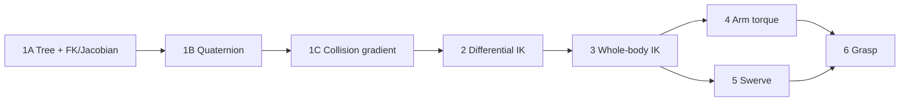

# 시스템 이해와 개발 가이드

사용법은 [화면과 조작](../run.md), 전체 코드 경계는 [시스템 구조](../overview.md),
함수별 계약은 [API 레퍼런스](../api/index.md)에서 찾는다.

## 목적별 문서

| 목적 | 문서 | 최소 회귀 |
|---|---|---|
| app loop·target 좌표 | [애플리케이션](teleop_app.md) | Phase 6 |
| UI·camera·Gizmo·overlay | [시각화](teleop_ui.md) | Phase 6 |
| FK·Jacobian·회전·충돌 수학 | [기구학 안내](kinematics.md) | Phase 3 + Whole-body |
| 전신 IK와 collision CBF | [전신 IK](whole_body_ik.md) | Whole-body + Phase 6 |
| 팔 torque | [팔 제어](arm_control.md) | Phase 3, 4 |
| wheel·수동 주행 | [스워브](base_teleop.md) | Phase 5 + Whole-body |
| 손가락·파지 | [파지](grasp.md) | Phase 1, 2 |
| 설정값 변경 | [YAML 설정](../configuration.md) | Config + 해당 Phase |
| 미구현 확장 범위 | [모방학습·실기 전환](imitation-sim2real.md) | 해당 없음 |

## 알고리즘 학습 순서 { #algorithm-learning-order }

| 순서 | 핵심 | 문서 |
|---:|---|---|
| 1A | tree 경로, FK, geometric Jacobian | [Tree, FK와 Jacobian](forward-kinematics.md) |
| 1B | quaternion 자세 오차 | [Quaternion](quaternion-math.md) |
| 1C | signed distance gradient | [Collision gradient](collision-kinematics.md) |
| 2 | Pseudoinverse, DLS, box-QP | [Differential IK](ik-math.md) |
| 3 | base·lift·양팔, collision CBF | [전신 IK](whole_body_ik.md) |
| 4 | 관절 목표에서 torque 계산 | [팔 제어](arm_control.md) |
| 5 | body twist에서 wheel 명령 계산 | [스워브](base_teleop.md) |
| 6 | finger synergy와 contact 판정 | [파지](grasp.md) |

## 변경 시 유지할 계약

- 초기화와 자유물체 reset 외에는 robot `data.qpos`를 직접 쓰지 않는다.
- UI와 renderer는 target·표시 상태만 바꾸고 IK나 actuator를 실행하지 않는다.
- FK 팔과 Whole-body OFF 자유도는 낮은 weight가 아니라 bound로 고정한다.
- keyboard와 WBIK base 명령은 같은 `SwerveDrive`를 사용한다.
- wheel-floor와 finger-object 같은 의도된 접촉은 collision CBF에서 제외한다.
- 좌표계나 mode를 바꿀 때 target의 world pose를 보존한다.
- 변경 뒤 관련 회귀와 `mkdocs build --strict`를 실행한다.

검증 명령과 범위는 [테스트와 검증](../testing.md), 자주 놓치는 항목은
[개발 체크리스트](pitfalls.md)를 참고한다.
