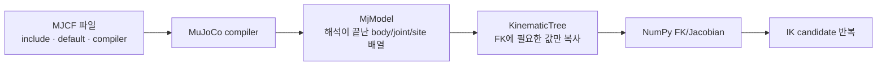
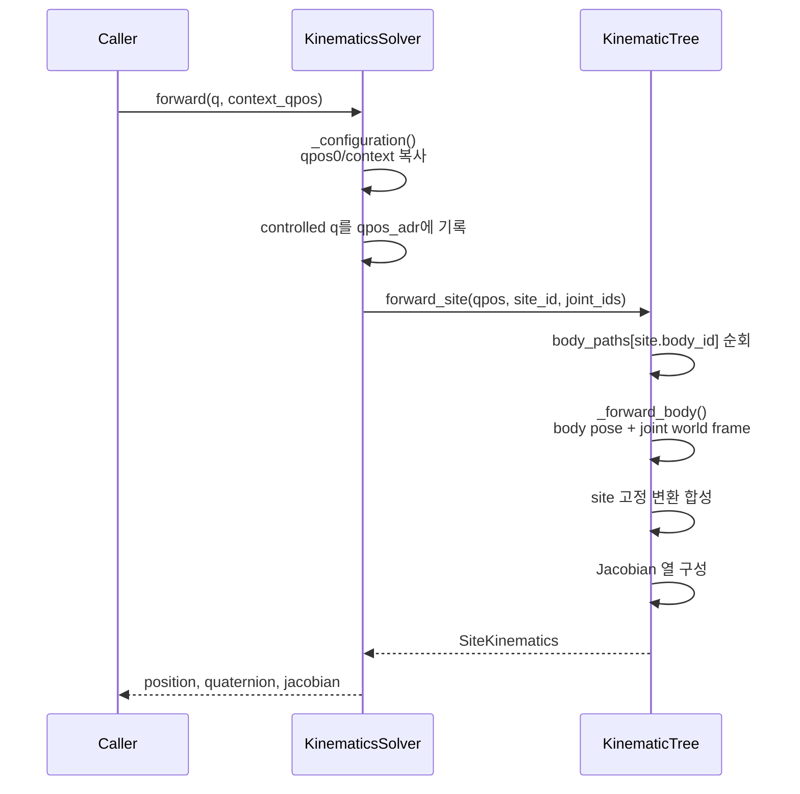

# Kinematic Tree를 만든 이유와 구성 과정

!!! info "기구학 학습 순서 1/4"
    이 문서는 기구학 계산에 필요한 구조가 왜 별도로 존재하는지 설명한다. 다음은
    이 tree를 실제로 순회하는 [FK와 geometric Jacobian](forward-kinematics.md)이다.

## 먼저 답할 질문

1. MuJoCo에 이미 body/joint 정보가 있는데 왜 `KinematicTree`를 다시 만드는가?
2. 원본 MJCF가 아니라 컴파일된 `MjModel`에서 복사하는 이유는 무엇인가?
3. tree에 어떤 정보가 저장되고 무엇은 저장되지 않는가?
4. 완성된 tree가 `forward_site()`의 FK 계산으로 어떻게 이어지는가?

## 1. 해결하려는 문제

IK는 한 번의 물리 상태만 평가하지 않는다. 현재 관절값 `q`에서 시작해 여러 후보
`q + Δq`를 반복 평가해야 한다. 후보 하나를 확인할 때마다 live `data.qpos`를 쓰고
`mj_forward()`를 호출하면 다음 문제가 생긴다.

- solver가 시뮬레이션 상태를 임시 후보값으로 덮어쓸 수 있다.
- 접촉·센서·렌더링이 어느 후보 상태를 기준으로 갱신됐는지 불명확해진다.
- 단일 팔 IK와 전신 IK가 서로 다른 pose/Jacobian 경로를 사용할 수 있다.
- UI의 Kinematic Tree와 solver가 별도 XML 해석 결과를 표시할 수 있다.

그래서 이 프로젝트는 **모델 구조**와 **시간에 따라 변하는 물리 상태**를 분리한다.

| 구분 | 소유자 | 내용 |
|---|---|---|
| 고정 모델 구조 | `KinematicTree` | parent, joint axis, body/site 고정 변환, range, 주소 |
| 후보 configuration | NumPy `qpos` 복사본 | 현재 계산에서 평가할 관절 위치 |
| live physics | MuJoCo `MjData` | 실제 `qpos/qvel`, contact, force, sensor |

`KinematicTree`는 MuJoCo dynamics를 대체하지 않는다. FK와 Jacobian만 독립적으로
계산하고, 실제 관성·접촉·actuator 응답은 계속 `mj_step()`이 담당한다.

## 2. 왜 MJCF XML을 직접 파싱하지 않는가

원본 XML에는 `include`, `default` 상속, compiler angle 설정 등이 남아 있다. 이를
별도 XML parser로 다시 해석하면 MuJoCo가 실제로 컴파일한 모델과 다른 tree를 만들
가능성이 있다.

따라서 입력은 XML 문자열이 아니라 이미 컴파일된 `mujoco.MjModel`이다.



이 선택은 두 가지를 동시에 만족한다.

- MJCF 해석 규칙은 MuJoCo의 결과를 그대로 신뢰한다.
- candidate FK는 live `MjData`와 `mj_forward()` 없이 계산한다.

## 3. tree에 저장하는 최소 정보

### 3.1 Body node

`KinematicBody`는 다음 값을 가진다.

| 필드 | 원본 `MjModel` 배열 | FK에서의 역할 |
|---|---|---|
| `parent_id` | `body_parentid` | root부터 target까지 경로 구성 |
| `position` | `body_pos` | parent 기준 고정 병진 |
| `rotation` | `body_quat` 변환 | parent 기준 고정 회전 |
| `joint_ids` | `body_jntadr/body_jntnum` | body에 속한 관절 순회 |

### 3.2 Joint node

`KinematicJoint`는 관절 종류, body-local 축과 anchor, `qpos`/DOF 주소, range를
보관한다.

| 필드 | 의미 |
|---|---|
| `kind` | hinge 또는 slide인지 구분 |
| `position` | body frame의 joint anchor |
| `axis` | body frame의 joint axis |
| `qpos_adr` | configuration에서 관절 위치를 읽는 주소 |
| `dof_adr` | generalized velocity/Jacobian 열과 연결하는 주소 |
| `limited, range` | 후보 관절값 제한 |

`qpos_adr`와 `dof_adr`은 같은 개념이 아니다. hinge/slide에서는 숫자가 우연히
비슷할 수 있지만 free/ball joint까지 포함하면 position 좌표 수와 velocity 자유도
수가 다르다. 그래서 둘을 명시적으로 분리해 저장한다.

### 3.3 Site node

`KinematicSite`는 붙어 있는 body와 그 body 기준 고정 pose만 가진다. site는 질량이나
자유도가 없으므로 자체 joint가 없다.

## 4. 생성 과정을 코드 순서로 읽기

`KinematicTree.__init__(model)`은 다음 순서로 고정 정보를 만든다.

1. `model.qpos0`를 별도 배열로 복사한다.
2. 모든 body를 `_copy_body()`로 복사한다.
3. 모든 joint를 `_copy_joint()`로 복사한다.
4. 모든 site를 `_copy_site()`로 복사한다.
5. 이름 기반 lookup인 `joint_by_name`, `site_by_name`을 만든다.
6. 각 body의 root 경로 `body_paths`를 계산한다.
7. UI 탐색용 `children_by_body`, `sites_by_body`를 만든다.
8. 각 site의 body 경로를 `site_paths`에 연결한다.

```python
self.bodies = tuple(
    self._copy_body(model, body_id)
    for body_id in range(model.nbody)
)
self.joints = tuple(
    self._copy_joint(model, joint_id)
    for joint_id in range(model.njnt)
)
self.body_paths = tuple(
    self._body_path(body.id)
    for body in self.bodies
)
```

tuple과 frozen dataclass를 쓰는 이유는 solver 반복 중 topology가 바뀌지 않는다는
계약을 코드 구조로 표현하기 위해서다.

## 5. root에서 target body까지의 경로

body `b`의 parent를 `π(b)`라 하면 target에서 root 방향으로

\[
b,\ \pi(b),\ \pi^2(b),\ldots,0
\]

을 따라가고 마지막에 순서를 뒤집는다.

```python
def _body_path(self, body_id):
    path = []
    while body_id != 0:
        path.append(body_id)
        body_id = self.bodies[body_id].parent_id
    path.reverse()
    return tuple(path)
```

예를 들어 오른손 site가 `arm_r_link7 → hx5_r_base` 아래에 있다면 FK는 world의 모든
body를 계산하지 않고 `body_paths[site.body_id]`에 있는 조상만 순서대로 누적한다.

## 6. Tree에서 FK로 이어지는 정확한 경계

tree 생성과 FK 실행 사이에는 `KinematicsSolver`가 있다.



중요한 연결은 다음 한 줄이다.

```python
return self.tree.forward_site(
    self._configuration(q, context_qpos),
    self.site_id,
    self.joint_ids,
)
```

- `_configuration()`은 **어떤 관절 상태를 평가할지** 결정한다.
- `site_id`는 **어느 좌표계까지 갈지** 결정한다.
- `joint_ids`는 **Jacobian의 열 순서**를 결정한다.
- `forward_site()`는 tree topology를 따라 **pose와 Jacobian을 함께** 계산한다.

따라서 tree는 단순한 UI 목록이 아니라 FK가 순회할 경로와 Jacobian 열의 의미를
고정하는 계산 구조다.

## 7. 왜 tree를 한 번 만들고 공유하는가

`WholeBodyIK`는 오른손과 왼손에 각각 `KinematicsSolver`를 만들지만
`KinematicTree`는 하나만 만든다.

```python
self.kinematic_tree = KinematicTree(model)
self.kinematics_solvers = {
    side: KinematicsSolver(
        model, site_names[side], self.joint_names,
        tree=self.kinematic_tree,
    )
    for side in self.site_ids
}
```

이렇게 하면 양손이 같은 body 고정 변환, 같은 `qpos0`, 같은 joint 주소 체계를
사용한다. FK마다 이름을 다시 찾거나 topology를 다시 만드는 비용도 없다.

## 8. 코드와 검증 연결

| 설계 주장 | 코드 | 검증 |
|---|---|---|
| 컴파일된 모델을 원본으로 사용 | `_copy_body/joint/site()` | Phase 3 engine pose 비교 |
| candidate state는 live data와 분리 | `KinematicsSolver._configuration()` | read-only gate |
| target 조상만 순회 | `body_paths`, `_forward_body()` | tree architecture gate |
| 두 손이 같은 topology 공유 | `WholeBodyIK.kinematic_tree` | Whole-body solver gate |
| UI와 solver가 같은 계층 사용 | `children_by_body`, `sites_by_body` | Phase 6 tree UI gate |

```bash
python3 tests/test_phase_3.py
python3 tests/test_phase_6.py
python3 tests/test_whole_body.py
```

[← 기구학 전체 안내](kinematics.md) ·
[다음: FK와 geometric Jacobian →](forward-kinematics.md)
