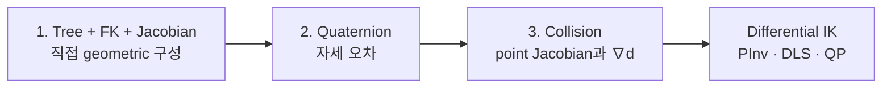
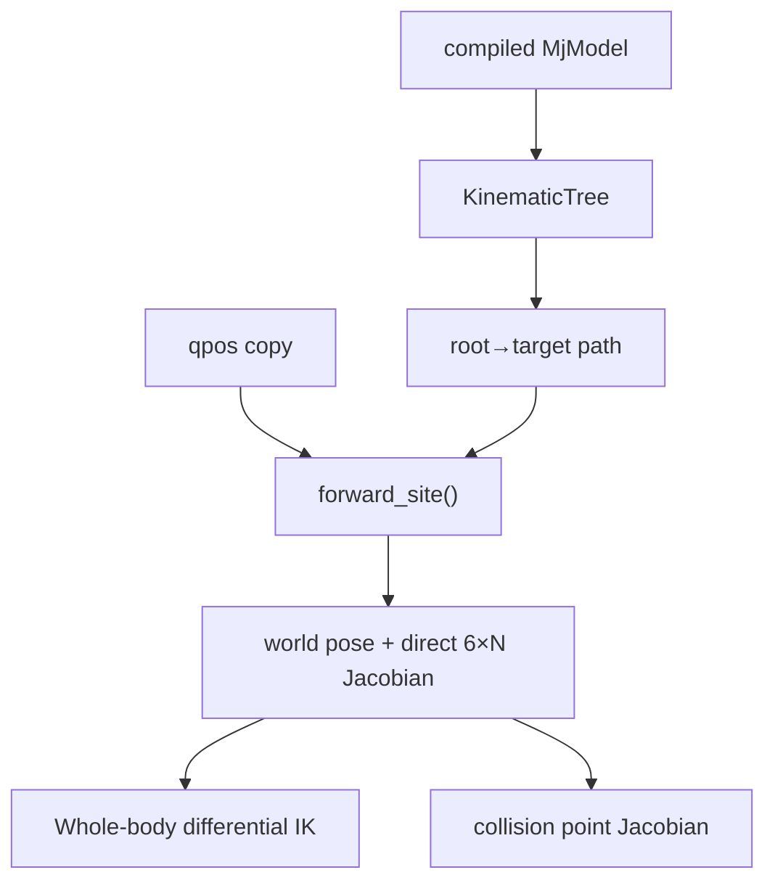

# 기구학 학습 안내

!!! info "핵심 알고리즘 학습 순서 1/6"
    Tree 구조, FK와 Jacobian을 한 문서에서 읽은 뒤 quaternion, collision gradient,
    [Differential IK](ik-math.md)로 진행한다.

## 학습 순서



| 순서 | 문서 | 핵심 질문 |
|---:|---|---|
| 1 | [Tree, FK와 Geometric Jacobian](forward-kinematics.md) | 컴파일된 model 경로에서 pose와 Jacobian 열을 어떻게 직접 만드는가? |
| 2 | [Quaternion과 Orientation Error](quaternion-math.md) | \(q\)와 \(-q\), 곱셈 순서와 world-frame 자세 오차를 어떻게 처리하는가? |
| 3 | [Collision Distance와 Gradient](collision-kinematics.md) | point velocity를 \(\nabla d\)와 CBF 입력으로 어떻게 바꾸는가? |

## 모듈별 역할

| 파일 | 역할 | 상태 접근 |
|---|---|---|
| `kinematics/tree.py` | 불변 tree, FK와 point/site Jacobian | 전달받은 NumPy `qpos` |
| `kinematics/rotations.py` | rotation matrix, quaternion, 자세 오차 | 순수 배열 |
| `kinematics/collision.py` | geometry distance와 gradient | live `MjData` read-only |
| `kinematics/tasks.py` | soft task와 단위 정규화 | 순수 배열 |
| `kinematics/constraints.py` | joint-limit box와 collision CBF | 순수 배열 |
| `kinematics/solver.py` | Pseudoinverse, DLS, QP | robot 상태 없음 |

collision query만 현재 geometry pose 때문에 `MjData`를 읽는다. 어느 기구학 경로도
live state를 수정하지 않는다.

## Site 계산 경로

```text
WholeBodyIK.site_state(data, side, current_q)
└─ live qpos 복사 + controlled q 기록
└─ KinematicTree.forward_site(qpos, site_id, joint_ids)
   ├─ root→target body FK
   ├─ joint world axis·anchor 저장
   ├─ site pose 합성
   ├─ direct geometric Jacobian 구성
   └─ SiteKinematics(position, quaternion, jacobian)
```

`SiteKinematics`의 position은 world m, quaternion은 MuJoCo `wxyz`, Jacobian은
`[translation; rotation]` 순서의 world `6×N` 배열이다.

## Tree에서 solver까지



## Direct geometric Jacobian { #direct-geometric-jacobian }

런타임은 FK 식의 chain rule이나 수치미분을 사용하지 않는다. FK 중 저장한 joint
world axis·anchor에 rigid-body 속도 공식을 적용한다.

\[
J_i^{slide}=
\begin{bmatrix}a_{w,i}\\0\end{bmatrix},
\qquad
J_i^{hinge}=
\begin{bmatrix}
a_{w,i}\times(p-c_{w,i})\\a_{w,i}
\end{bmatrix}
\]

전체 과정과 코드 대응은
[미분 없이 Jacobian 열 만들기](forward-kinematics.md#geometric-jacobian)에 있다.

## 바로가기

| 문제 | 문서 |
|---|---|
| body/site 경로, joint 주소, FK/Jacobian | [Tree, FK와 Jacobian](forward-kinematics.md) |
| orientation error와 frame | [Quaternion](quaternion-math.md) |
| collision distance와 gradient | [Collision](collision-kinematics.md) |
| 역해 안정성 | [Differential IK](ik-math.md), [전신 IK](whole_body_ik.md) |

## 검증

- candidate 계산은 live `data.qpos`를 쓰지 않는다.
- runtime pose/Jacobian은 `site_xpos/site_xmat`을 우회하지 않는다.
- direct Jacobian과 collision gradient는 테스트에서 중앙 유한차분으로 검증한다.
- Whole-body와 collision은 같은 `KinematicTree`를 사용한다.

```bash
python3 tests/test_phase_3.py
python3 tests/test_whole_body.py
```

[전체 학습 순서](index.md#algorithm-learning-order) ·
[Tree, FK와 Jacobian 시작 →](forward-kinematics.md)
