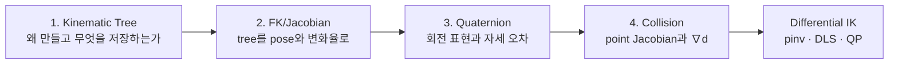
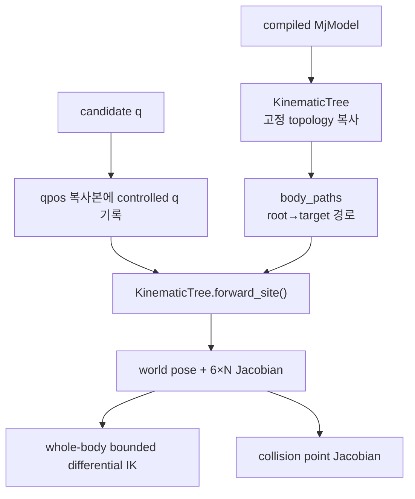

# 기구학 학습 안내

!!! info "핵심 알고리즘 학습 순서 1/7"
    기구학은 네 문서로 나누어 순서대로 설명한다. tree 구조부터 시작해
    FK/Jacobian, quaternion, collision gradient를 읽은 다음
    [Differential IK 수학](ik-math.md)으로 진행한다.

## 왜 문서를 나눴는가

기존 문서는 tree 생성 이유, FK 행렬 합성, quaternion double-cover, collision
distance gradient를 한 페이지에서 다뤘다. 각 항목은 연결되어 있지만 풀어야 하는
질문과 수식의 종류가 다르다.

- **Tree**는 “어떤 구조를 왜 복사하는가”라는 설계 문제다.
- **FK/Jacobian**은 joint 변환을 world pose와 변화율로 만드는 기하 문제다.
- **Quaternion**은 회전 표현과 orientation error의 부호·frame 문제다.
- **Collision**은 point Jacobian을 signed-distance 변화율로 연결하는 문제다.

각 문서는 [통합 가이드의 공통 설명 규칙](index.md#algorithm-learning-order)에 따라
문제 정의 → 기호 → 유도 → 코드 대응 → 검증 순서로 전개한다.

## 권장 학습 순서



| 순서 | 문서 | 읽고 나면 답할 수 있는 질문 |
|---:|---|---|
| 1 | [Kinematic Tree를 만든 이유와 구성 과정](kinematic-tree.md) | MuJoCo model을 왜 불변 tree로 복사하며, tree가 FK에 무엇을 넘기는가? |
| 2 | [FK와 Geometric Jacobian](forward-kinematics.md) | body/joint/site 변환과 Jacobian 열이 코드에서 어떻게 만들어지는가? |
| 3 | [Quaternion과 Orientation Error](quaternion-math.md) | \(q\)와 \(-q\), 곱셈 순서, world-frame 회전 오차를 어떻게 처리하는가? |
| 4 | [Collision Distance와 Gradient](collision-kinematics.md) | 최근접점 속도에서 \(\nabla d\)를 어떻게 유도하고 CBF로 넘기는가? |

## 모듈 책임

| 파일 | 책임 | 상태 접근 |
|---|---|---|
| `kinematics/tree.py` | 불변 body–joint–site tree, FK와 point/site Jacobian | 전달받은 NumPy `qpos`만 읽음 |
| `kinematics/rotations.py` | rotation matrix, quaternion, orientation error | 순수 배열 계산 |
| `kinematics/collision.py` | geometry distance, 최근접점, distance gradient | live `MjData` read-only |
| `kinematics/tasks.py` | soft task와 단위 정규화 | 순수 배열 계산 |
| `kinematics/constraints.py` | joint-limit box와 collision CBF | 순수 배열 계산 |
| `kinematics/solver.py` | pseudoinverse, DLS, QP 수치 해법 | task/robot 상태 없음 |

충돌 query만 현재 geometry pose/contact가 필요해 live `MjData`를 읽는다. 나머지는
`qpos0` 또는 `context_qpos` 복사본으로 계산하며 live state를 수정하지 않는다.

## 하나의 Site 계산 경로

Whole-body IK와 collision은 같은 tree 계산 경로를 사용한다.

```text
WholeBodyIK.site_state(data, side, current_q)
  └─ live qpos 복사 + controlled q 기록
  └─ KinematicTree.forward_site(qpos, site_id, joint_ids)
      ├─ _forward_body(): root→target body 변환
      ├─ site local transform 합성
      ├─ translational/rotational Jacobian 구성
      └─ SiteKinematics(position, quaternion, jacobian)
```

반환 형식은 다음과 같다.

```text
position    shape (3,)   world position [m]
quaternion  shape (4,)   MuJoCo 순서 (w, x, y, z)
jacobian    shape (6,N)  [translation; rotation], world frame
```

## Tree에서 Solver까지의 연결



tree를 만든 목적은 XML을 다시 표현하는 데 있지 않다. **같은 topology 위에서 여러
candidate configuration을 live physics와 분리해 평가하고, 전신·충돌
계산이 같은 joint/frame 정의를 공유하게 하는 것**이 핵심이다.

FK 뒤의 목표-현재 pose 오차와 weighted residual도 `kinematics/tasks.py`에 한 번만
정의한다. 전신·양손 경로는 같은 오차를 bounded Cartesian 속도 명령으로 바꾼다.

## Direct geometric Jacobian { #direct-geometric-jacobian }

Jacobian의 slide/hinge 열 유도와 실제 `_point_jacobian_from_frames()` 대응은
[FK와 Geometric Jacobian의 7절](forward-kinematics.md#geometric-jacobian)에
분리했다. 이 절의 anchor는 기존 문서 링크 호환을 위해 유지한다.

## 문제별 바로가기

| 증상·수정 목적 | 문서 |
|---|---|
| body/site 경로 또는 joint 주소가 이상함 | [Kinematic Tree](kinematic-tree.md) |
| FK 위치·회전 또는 Jacobian 열이 틀림 | [FK와 Jacobian](forward-kinematics.md) |
| orientation error가 튀거나 frame이 반대임 | [Quaternion](quaternion-math.md) |
| collision 선·거리·gradient가 맞지 않음 | [Collision](collision-kinematics.md) |
| pose는 맞지만 역해가 불안정함 | [Differential IK 수학](ik-math.md), [전신 IK](whole_body_ik.md) |

## 공통 불변식과 검증

- FK/IK candidate 계산은 live `data.qpos`를 쓰지 않는다.
- runtime pose/Jacobian은 `site_xpos/site_xmat`을 우회해 읽지 않는다.
- orientation error와 rotational Jacobian은 같은 world frame을 사용한다.
- analytic Jacobian과 collision gradient는 중앙 유한차분으로 검증한다.
- 전신과 collision은 같은 `KinematicTree` 구현을 사용한다.
- 전신·양손 task는 같은 `pose_error()` 부호와 world frame을 사용한다.

```bash
python3 tests/test_phase_3.py
python3 tests/test_whole_body.py
```

[전체 학습 순서](index.md#algorithm-learning-order) ·
[기구학 시작: Kinematic Tree →](kinematic-tree.md)
