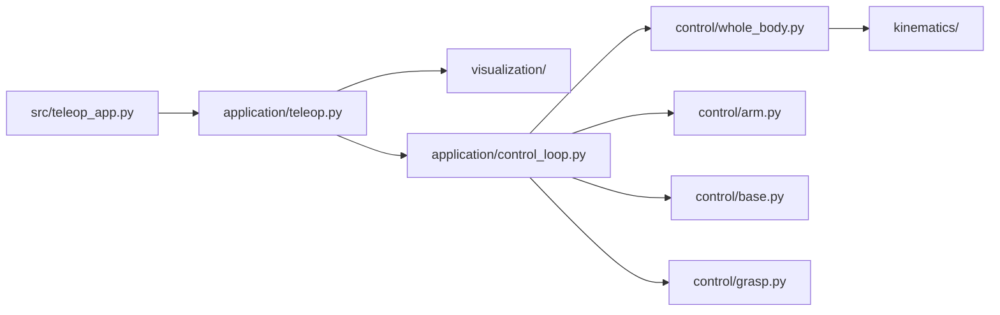
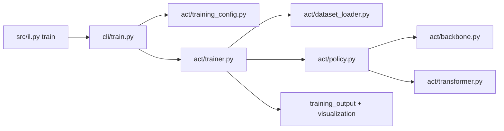
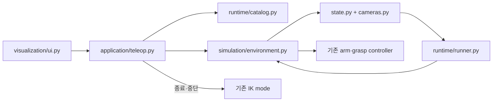
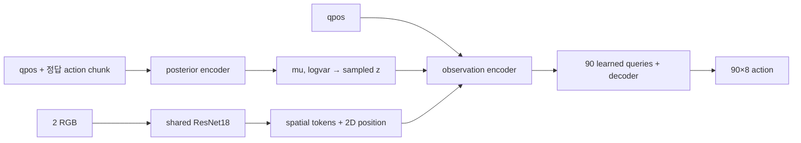

# 프로젝트 파일 트리와 역할

이 페이지는 저장소에서 파일을 찾을 때 사용하는 단일 지도다. Python 소스는 파일별로
표시하고, 같은 목적으로 반복되는 STL·학습 episode·checkpoint는 패턴으로 묶었다.
`datasets/`, `outputs/`, `site/`처럼 실행 중 내용이 바뀌는 디렉터리는 생성물 구조를
기준으로 설명한다.

## 전체 트리

```text
ffw-sh5-grasp/
├── .github/workflows/gendoc.yml       # 문서 빌드·GitHub Pages 배포
├── assets/                            # 로봇·손·캔 시각 mesh와 texture
├── config/
│   ├── default.yaml                   # teleop·IK·제어 기본 설정
│   └── imitation/
│       ├── dataset.yaml               # IL dataset 계약 참고값(현재 loader 미연결)
│       └── act.yaml                   # ACT 모델·학습·W&B 설정
├── models/
│   ├── full_scene.xml                 # 기본 teleop와 can-to-box 전체 장면
│   ├── arm_hand.xml                   # 고정 베이스 팔·손 시험 장면
│   └── hand_only.xml                  # 손과 물체만 쓰는 파지 시험 장면
├── src/
│   ├── teleop_app.py                  # 기본 teleop 진입점
│   ├── il.py                          # IL 통합 명령 진입점
│   └── ffw_sh5_grasp/
│       ├── application/               # 앱 조립과 frame loop
│       ├── control/                   # arm·base·hand·whole-body 제어
│       ├── kinematics/                # FK·Jacobian·IK·충돌 수학
│       ├── planning/                  # 오른팔 sampling-based 모션 플래닝
│       ├── visualization/             # 기본 teleop UI·렌더링
│       ├── imitation/                 # IL 데이터·ACT·실행·시각화
│       ├── cli/                       # `src/il.py` 하위 명령
│       ├── config.py                  # YAML loader와 검증
│       ├── mujoco_utils.py            # MuJoCo 이름·주소 조회 보조 함수
│       └── paths.py                   # 저장소 공통 경로
├── tests/                             # 단계별·IL 회귀와 개발 도구
├── docs/                              # MkDocs 원본 문서
├── datasets/                          # 수집한 HDF5/Rerun 데이터, Git 제외
├── outputs/                           # 학습·평가 결과, Git 제외
├── mkdocs.yml                         # 문서 사이트 설정과 내비게이션
├── requirements-runtime.txt           # 기본 teleop Python 의존성
├── requirements-imitation.txt         # IL 추가 Python 의존성
├── requirements-huggingface.txt       # 공개 자산 다운로드·배포 의존성
├── requirements-dev.txt               # pytest·Ruff 개발 의존성
├── requirements-docs.txt              # MkDocs 문서 의존성
├── requirements-presentation.txt      # 보고서·발표 자료 생성 의존성
├── README.md                          # 저장소 첫 안내
├── CHANGELOG.md                       # 변경 기록
└── .gitignore                         # 생성물·로컬 상태 제외 규칙
```

## Python 패키지 상세 트리

아래는 `src/ffw_sh5_grasp/`를 생략 없이 파일 단위로 펼친 트리다. `__init__.py`는
각 디렉터리를 Python package로 만들고, 외부에서 사용할 공개 이름을 정리한다.

```text
src/ffw_sh5_grasp/
├── __init__.py                         # 최상위 package 공개 API
├── config.py                           # YAML 설정 loader·검증
├── paths.py                            # 저장소·model·config 공통 경로
├── mujoco_utils.py                     # MuJoCo object ID/address 조회
│
├── application/                        # 최상위 앱 조립과 실행 상태
│   ├── __init__.py                     # application 공개 API
│   ├── teleop.py                       # TeleopApp 조립·lifecycle·ACT/IK 전환
│   ├── control_loop.py                 # frame별 제어 명령 중재
│   ├── state.py                        # model 주소 cache·상태 snapshot
│   └── targets.py                      # 양팔 target pose와 좌표계 변환
│
├── control/                            # target을 actuator 명령으로 변환
│   ├── __init__.py                     # controller 공개 API
│   ├── arm.py                          # 팔 PD + dynamics feed-forward torque
│   ├── base.py                         # body twist → swerve steer/drive
│   ├── bimanual.py                     # 양손 상대 pose constraint
│   ├── grasp.py                        # grasp synergy·접촉 판정
│   └── whole_body.py                   # base·lift·양팔 whole-body IK 조립
│
├── kinematics/                         # 로봇 기구학과 최적화 수학
│   ├── __init__.py                     # 기구학 공개 API
│   ├── tree.py                         # kinematic tree·FK·Jacobian
│   ├── joint_space.py                  # 선택 관절 offline FK
│   ├── rotations.py                    # quaternion·회전 수학
│   ├── tasks.py                        # IK soft task·pose residual
│   ├── constraints.py                  # 속도·위치·barrier hard constraint
│   ├── collision.py                    # signed distance와 충돌 gradient
│   ├── optimization.py                 # NumPy convex QP 수치 계산
│   └── solver.py                       # differential IK solver 진입점
│
├── visualization/                      # 기본 teleop 표시와 사용자 입력
│   ├── __init__.py                     # visualization 공개 API
│   ├── ui.py                           # ImGui 제어·진단 panel
│   ├── render.py                       # MuJoCo scene·camera·viewport
│   ├── task_space.py                   # UI 숫자 입력 → IK target
│   └── diagnostics.py                  # pose·joint·tree 진단 표시
│
├── cli/                                # `src/il.py`의 명령별 parser/handler
│   ├── __init__.py                     # IL command dispatcher
│   ├── record.py                       # demonstration 기록 명령
│   ├── replay.py                       # episode replay 명령
│   ├── validate.py                     # dataset 검증 명령
│   ├── visualize.py                    # episode RGB video 명령
│   ├── rerun.py                        # HDF5 → Rerun 변환 명령
│   ├── train.py                        # ACT 학습 명령
│   ├── evaluate.py                     # closed-loop 평가 명령
│   ├── evaluate_color_sort.py          # 4-policy PTE 평가 행렬
│   ├── gradcam.py                      # ACT action-target Grad-CAM
│   └── compare.py                      # expert-policy 비교 명령
│
└── imitation/                          # 모방학습 전체 기능
    ├── __init__.py                     # IL package 설명과 경계
    │
    ├── data/                           # 파일 형식과 episode lifecycle
    │   ├── __init__.py                 # episode I/O·schema 공개 API
    │   ├── schema.py                   # canonical 16D schema·index
    │   ├── episode.py                  # HDF5 읽기·검증·원자적 저장
    │   ├── recording.py                # obs/action 정렬·기록 buffer
    │   ├── replay.py                   # 저장 action 결정적 실행
    │   ├── validation.py               # dataset directory 구조 검사
    │   └── paths.py                    # episode filename/path 규칙
    │
    ├── simulation/                     # MuJoCo와 policy 사이 adapter
    │   ├── __init__.py                 # environment·action 공개 API
    │   ├── action.py                   # 16D action 검증·controller 분배
    │   ├── state.py                    # MuJoCo state → 16D policy state
    │   ├── cameras.py                  # named policy RGB rendering
    │   ├── task.py                     # can reset·성공 조건
    │   └── environment.py              # reset·observe·step 환경 API
    │
    ├── act/                            # ACT 신경망과 학습
    │   ├── __init__.py                 # ACTPolicy·config 공개 API
    │   ├── backbone.py                 # ResNet18·2D position embedding
    │   ├── transformer.py              # positional encoder/decoder
    │   ├── policy.py                   # CVAE ACT forward·loss
    │   ├── representations.py          # Joint/Task state·action 변환
    │   ├── dataset_loader.py           # split·정규화·action chunk sample
    │   ├── training_config.py          # 학습 YAML typed config
    │   ├── trainer.py                  # epoch·optimizer·checkpoint
    │   └── training_output.py          # CSV·JSONL·metric plot
    │
    ├── runtime/                        # 학습된 ACT 실행과 평가
    │   ├── __init__.py                 # policy run 탐색 공개 API
    │   ├── runner.py                   # checkpoint 추론·temporal ensemble
    │   ├── catalog.py                  # outputs/act run 탐색
    │   ├── task_space.py               # Task 출력 → 오른팔 IK
    │   └── evaluation.py               # rollout 실행·metric 집계
    │
    ├── apps/                           # IL 전용 interactive 앱
    │   ├── __init__.py                 # IL app package 설명(재-export 없음)
    │   ├── base.py                     # GLFW/ImGui 공통 lifecycle
    │   ├── leader.py                   # leader 입력 → 16D action
    │   └── recording.py                # demonstration 기록 UI
    │
    └── visualization/                  # IL 결과를 외부 viewer에 기록
        ├── __init__.py                 # IL visualization package 설명
        ├── rerun_blueprints.py         # 공통 Rerun layout
        ├── rerun_robot.py              # MuJoCo robot entity 기록
        ├── rerun_live.py               # 수집 중 live stream
        ├── rerun_dataset.py            # HDF5 episode 시각화
        ├── rerun_rollout.py            # rollout·expert 비교 기록
        ├── rerun_training.py           # 학습 metric Rerun 기록
        ├── gradcam.py                  # policy camera별 action attribution
        └── wandb_training.py           # 학습 metric W&B 기록
```

## 계층별 책임과 데이터 경계

같은 로봇을 다루더라도 package마다 소유하는 데이터와 출력이 다르다. 아래 경계를
지키면 UI, 제어기와 ACT가 서로 직접 얽히는 것을 막을 수 있다.

| 계층 | 주 입력 | 주 출력 | 포함하면 안 되는 책임 |
|---|---|---|---|
| `application` | 사용자 입력, app state, 설정 | frame 단위 mode와 호출 순서 | IK 수식, ACT layer 구현 |
| `control` | target pose·관절 target·body twist | actuator torque/position/velocity 명령 | 창 렌더링, dataset 저장 |
| `kinematics` | joint state, task, constraint | FK/Jacobian 또는 `dq` | ImGui, checkpoint, 학습 loop |
| `visualization` | 표시용 snapshot과 UI event | 화면 draw와 target 변경 요청 | actuator 실행, policy 학습 |
| `cli` | command-line argument | 적절한 application/service 호출 | 알고리즘 재구현 |
| `imitation.data` | NumPy observation/action | HDF5 episode와 validation 결과 | MuJoCo step, neural network |
| `imitation.simulation` | MuJoCo model/data, 16D action | policy observation, task metric | ACT 내부 구조 |
| `imitation.act` | 정규화 tensor와 training config | action chunk, loss, checkpoint | GUI, 실제 환경 reset |
| `imitation.runtime` | checkpoint, 통계, observation | 실행할 16D action과 평가 결과 | 데이터 수집 UI |
| `imitation.apps` | key/mouse event와 서비스 객체 | record/policy app lifecycle | ACT layer·HDF5 schema 재정의 |
| `imitation.visualization` | 이미 계산된 상태와 metric | Rerun/W&B log | 제어 상태 변경 |

### 기본 teleop 호출 흐름



### ACT 학습 호출 흐름



### ACT를 teleop에서 실행하는 흐름



## 루트, 설정과 모델

| 파일·경로 | 역할 |
|---|---|
| `.github/workflows/gendoc.yml` | `main`의 문서 변경 시 MkDocs를 빌드하고 `gh-pages`에 배포한다. |
| `.gitignore` | 가상환경, 캐시, dataset, output, Rerun, MuJoCo/ImGui 로컬 상태를 Git에서 제외한다. |
| `README.md` | 설치, 실행과 프로젝트 개요를 제공하는 저장소 시작점이다. |
| `CHANGELOG.md` | 기능·구조·동작 변경 이력을 기록한다. |
| `requirements-runtime.txt` | MuJoCo, GLFW, ImGui, NumPy와 YAML 등 기본 teleop 의존성이다. |
| `requirements-imitation.txt` | PyTorch, torchvision, HDF5, Rerun, W&B 등 IL 기능의 추가 의존성이다. |
| `requirements-huggingface.txt` | IL 의존성에 Hugging Face Hub CLI를 추가한다. |
| `requirements-dev.txt` | Hugging Face 프로필에 pytest와 Ruff를 추가한다. |
| `requirements-docs.txt` | MkDocs와 Material theme를 설치한다. runtime과 독립적이다. |
| `requirements-presentation.txt` | 평가 그래프와 PPTX를 다시 만드는 분석 도구를 설치한다. |
| `mkdocs.yml` | Material 테마, Markdown 확장, 문서 메뉴와 배포 사이트 정보를 정의한다. |
| `config/default.yaml` | teleop, 카메라, IK, 충돌 회피, arm/base/grasp 제어 기본값이다. |
| `config/imitation/dataset.yaml` | task, 저장 경로, 주기, camera, 차원과 split의 참고 manifest다. 현재 Python 코드에서 읽지 않으므로 실제 수집 설정은 `default.yaml`, 학습 split은 `act.yaml`이 결정한다. |
| `config/imitation/act.yaml` | camera, policy 차원, chunk, Transformer, optimizer, split, W&B 학습 설정이다. |
| `models/full_scene.xml` | FFW-SH5 전체 로봇, 바닥·테이블·캔·목표 상자·카메라·actuator를 조립한 기본 장면이다. |
| `models/arm_hand.xml` | 이동 베이스를 제외하고 팔 IK와 손 파지를 빠르게 시험하는 장면이다. |
| `models/hand_only.xml` | 손가락 접촉, synergy와 grasp 유지 시험용 최소 장면이다. |

## 자산

| 파일·경로 | 역할 |
|---|---|
| `assets/robotis_ffw/LICENSE` | ROBOTIS 모델 자산의 라이선스다. |
| `assets/robotis_ffw/ffw_*.xml` | FFW 변형별 로봇 본체 MJCF 원본이다. |
| `assets/robotis_ffw/scene_ffw_*.xml` | 원본 로봇을 단독 확인하는 예제 scene이다. |
| `assets/robotis_ffw/assets/ffw_b/*.stl` | FFW-B의 base, body, head와 양팔 visual mesh다. |
| `assets/robotis_ffw/assets/ffw_s/*.stl` | 현재 FFW-SH5가 쓰는 base, lift, wheel, head와 양팔 visual mesh다. |
| `assets/robotis_ffw/assets/hx5_d20/**` | HX5-D20 좌·우손의 base, thumb, finger link mesh다. |
| `assets/robotis_ffw/assets/rh_p12_rn/*.stl` | 대체 gripper 형상의 visual mesh다. |
| `assets/soda_can/soda_can.stl` | 캔 원본 형상이다. |
| `assets/soda_can/can_side_detail.obj` | 원주 UV를 포함한 캔 측면 visual mesh다. |
| `assets/soda_can/can_cap_detail.obj` | 윗면·밑면과 pull-tab을 유지하는 캔 cap mesh다. |
| `assets/soda_can/soda_can_label.png` | 캔 측면 OBJ에 적용하는 label texture다. |

STL/OBJ는 시각 형상이다. 충돌 안정성이나 접촉을 바꾸려면 mesh만 수정하지 말고 이를
참조하는 MJCF의 `geom`, `contype`, `conaffinity`와 contact exclude도 확인해야 한다.

## 실행 진입점과 공통 모듈

| 파일 | 역할 |
|---|---|
| `src/teleop_app.py` | YAML 경로를 받아 `TeleopApp`을 시작하는 얇은 기본 실행 파일이다. |
| `src/il.py` | `record`, `replay`, `train`, `evaluate` 등 IL 하위 명령을 선택하는 dispatcher다. |
| `src/ffw_sh5_grasp/__init__.py` | 패키지 설명과 공개 최상위 API 경계다. |
| `src/ffw_sh5_grasp/config.py` | `default.yaml`을 dataclass로 읽고 잘못된 키·범위를 검증한다. |
| `src/ffw_sh5_grasp/paths.py` | 저장소 root와 기본 model/config 경로를 한곳에서 계산한다. |
| `src/ffw_sh5_grasp/mujoco_utils.py` | joint, actuator, body 같은 MuJoCo object의 ID와 address 조회를 공통화한다. |

`src/` 루트에는 위 두 실행 파일만 둔다. 알고리즘 구현을 새 root script에 넣지 않고
책임에 맞는 `ffw_sh5_grasp` 하위 package에 추가한다.

## 애플리케이션

| 파일 | 역할 |
|---|---|
| `application/__init__.py` | 앱 계층에서 외부에 제공할 이름을 정리한다. |
| `application/teleop.py` | 창, MuJoCo model/data, controller, UI와 ACT 실행을 조립하는 최상위 `TeleopApp`이다. |
| `application/control_loop.py` | 한 frame에서 keyboard base 명령과 IK 명령을 중재하고 controller를 호출한다. |
| `application/state.py` | MuJoCo 주소 cache와 UI/제어 사이에 전달할 상태 snapshot을 정의한다. |
| `application/targets.py` | 좌·우 end-effector target pose와 좌표계 변환, 양손 target 보조 연산을 담당한다. |

## 제어

| 파일 | 역할 |
|---|---|
| `control/__init__.py` | arm, base, grasp와 whole-body controller의 공개 API다. |
| `control/arm.py` | 관절 target을 PD와 중력·코리올리 전향 보상 torque로 변환한다. |
| `control/base.py` | body twist를 세 swerve module의 steer angle과 wheel speed로 변환한다. |
| `control/bimanual.py` | rigid bimanual grasp의 상대 pose reference와 task를 계산한다. |
| `control/grasp.py` | 하나의 grasp 값에서 손가락 synergy target을 만들고 접촉력으로 파지를 판정한다. |
| `control/whole_body.py` | base, lift, 양팔 자유도를 하나의 differential whole-body IK 문제로 조립한다. |

## 기구학

| 파일 | 역할 |
|---|---|
| `kinematics/__init__.py` | tree, task, constraint, solver의 안정된 공개 import 경로다. |
| `kinematics/tree.py` | MuJoCo에서 불변 kinematic tree를 만들고 FK와 geometric Jacobian을 계산한다. |
| `kinematics/joint_space.py` | 선택 관절만 사용하는 offline FK와 demonstration 보조 계산을 제공한다. |
| `kinematics/rotations.py` | quaternion 정규화·곱·차이와 회전 변환을 제공한다. |
| `kinematics/tasks.py` | 위치·자세·posture 같은 soft IK task와 residual/Jacobian을 만든다. |
| `kinematics/constraints.py` | 관절 위치·속도 bound와 collision barrier 같은 hard constraint를 만든다. |
| `kinematics/collision.py` | MuJoCo signed distance와 kinematic Jacobian으로 충돌 제약 gradient를 계산한다. |
| `kinematics/optimization.py` | differential IK용 convex QP를 NumPy 기반으로 푸는 수치 계층이다. |
| `kinematics/solver.py` | task와 constraint를 모아 한 step의 joint velocity를 구하는 IK 진입점이다. |

## 모션 플래닝

오른팔 7-DOF sampling-based 플래너. 상세 설계는
[오른팔 모션 플래닝](motion-planning.md) 참고.

| 파일 | 역할 |
|---|---|
| `planning/__init__.py` | 하위 모듈의 공개 API를 재수출한다. |
| `planning/arm_state.py` | 오른팔 관절 이름·주소·범위 추상화(`RightArmSpace`)를 제공한다. |
| `planning/collision_state.py` | live `MjData`를 건드리지 않는 scratch 충돌 유효성 검사기(`ArmCollisionChecker`)다. |
| `planning/obstacles.py` | `clearance()` exact 보고용 충돌 쌍 목록을 만든다. |
| `planning/local_path.py` | 두 configuration 사이 선분의 충돌 검사(`EdgeChecker`)를 제공한다. |
| `planning/settings.py` | `config/default.yaml`의 `planning.*` 블록을 읽는 유일한 지점이다. |

## 기본 teleop 시각화

| 파일 | 역할 |
|---|---|
| `visualization/__init__.py` | 기본 UI와 renderer의 공개 API다. |
| `visualization/ui.py` | ImGui 제어 패널, mode, ACT run 선택과 start/stop 입력을 그린다. |
| `visualization/render.py` | MuJoCo scene, viewport, camera와 mouse 상호작용을 처리한다. |
| `visualization/task_space.py` | UI의 task-space 숫자 입력을 IK target 상태에 반영한다. |
| `visualization/diagnostics.py` | pose, joint, kinematic tree와 solver 진단 패널을 표시한다. |

## IL 구현 상세 { #il }

이 프로젝트에는 ACT를 다루는 경로가 두 가지 있다. 같은 환경 계약을 사용하지만
환경 소유권과 목적이 다르므로 먼저 구분해야 한다.

| 경로 | 진입점 | MuJoCo/창 | 목적 |
|---|---|---|---|
| 데이터 수집 | `src/il.py record` | 별도 arm-only 환경과 창 생성 | 전문가 episode 기록 |
| 기본 teleop 내 policy | `src/teleop_app.py`의 ACT panel | 현재 `TeleopApp.model/data/window` 재사용 | 같은 화면에서 ACT 실행 후 IK 복귀 |

### IL 전체 데이터 계약

```text
수집
GizmoLeader → 16D action → AIWorkerMujocoEnv.step
            ↘ obs_t/action_t → EpisodeRecorder → episode_XXXXXX.hdf5

학습
HDF5 → Joint 또는 Task 8D 변환 → train 통계 + 2 RGB → ACT → K×8 예측

추론
16D qpos/right EE pose → checkpoint 표현 선택 → ACT → K×8 → temporal ensemble
    ├─ Joint: 16D 확장 → environment.step
    └─ Task: 오른팔 IK → 16D action → environment.step
```

canonical state/action은 left-first 16차원이다.

```text
[left arm joint 1..7, left grasp,
 right arm joint 1..7, right grasp]
```

현재 `config/imitation/act.yaml`은 `policy_side: right`이므로 ACT tensor에는 index
`8..15`의 8차원만 들어간다. HDF5와 environment는 계속 16차원을 유지한다.

### IL 명령 계층

`src/il.py`는 `ffw_sh5_grasp.cli.main()`만 호출한다. `cli/__init__.py`는 첫 번째
argument를 `COMMANDS`에서 찾은 뒤 선택한 module만 지연 import한다. 따라서 예를 들어
dataset 검증만 할 때 PyTorch나 GLFW를 불필요하게 import하지 않는다.

| 명령·파일 | 직접 호출하는 구현 | 입력 | 결과와 정확한 동작 |
|---|---|---|---|
| `record` · `cli/record.py` | `apps.recording.RecordEpisodesApp` | task, dataset 경로, seed, Rerun 옵션 | Gizmo leader로 조작한 `(obs_t, action_t)`를 다음 episode 번호의 HDF5로 저장한다. |
| `replay` · `cli/replay.py` | `data.replay.replay_episode`, `AIWorkerMujocoEnv` | episode 또는 dataset/index, 허용 오차, viewer | 저장 seed로 reset한 뒤 action을 재실행한다. 기록 qpos와 최대 오차가 허용 범위 밖이면 exit code 1이다. |
| `validate` · `cli/validate.py` | `data.validation.inspect_dataset` | dataset 경로, 필수 camera 목록 | 모든 `episode_*.hdf5`의 구조·shape·dtype·finite 값을 검사하고 유효하지 않으면 exit code 1이다. |
| `visualize` · `cli/visualize.py` | `data.episode.load_episode`, ImageIO | episode 또는 dataset/index | 모든 camera frame을 가로로 연결한 H.264 MP4를 episode의 `control_hz`로 작성한다. |
| `rerun` · `cli/rerun.py` | `visualization.rerun_dataset` | episode, output 또는 live port | `.rrd`로 저장하거나 Rerun Viewer에 직접 stream한다. |
| `train` · `cli/train.py` | `act.trainer.train` | ACT YAML | split·통계·metric·plot과 best/last checkpoint가 있는 run directory를 만든다. |
| `evaluate` · `cli/evaluate.py` | `runtime.evaluation.evaluate` | checkpoint, episode 수, max steps, seed | 새 arm-only 환경에서 closed-loop rollout을 실행하고 `evaluation.json`을 쓴다. 성공해도 조기 종료하지 않고 max steps까지 진행한다. |
| `compare` · `cli/compare.py` | `load_episode`, `ACTPolicyRunner`, `RolloutRerunLogger` | checkpoint와 기록 episode | 기록된 관측에 policy를 적용하는 offline 비교다. MuJoCo에 예측 action을 실행하지 않고 expert/policy action을 `.rrd`에 함께 기록한다. |

## IL 데이터 계층

`imitation/data`는 MuJoCo와 PyTorch를 import하지 않는다. HDF5 schema, 기록 정렬과
파일 검증만 소유하므로 GPU가 없는 환경에서도 dataset을 검사할 수 있다.

| 파일 | 핵심 객체·함수 | 실제 책임 |
|---|---|---|
| `imitation/__init__.py` | package 설명 | IL 하위 package의 경계를 설명한다. 구현 객체를 다시 export하지 않는다. |
| `data/__init__.py` | `EpisodeData`, `load_episode`, `write_episode`, `resolve_episode_path`, `ACTION_*` | 공개 API는 유지하되 HDF5 episode I/O는 최초 접근 시 지연 import한다. 일반 teleop의 schema import가 `h5py`를 요구하지 않는다. |
| `data/schema.py` | `ACTION_NAMES`, `ACTION_DIM=16`, `RIGHT_POLICY_INDICES=8..15`, `ARM_JOINTS` | 저장 파일, leader, environment와 runner가 공유하는 left-first index 계약의 단일 출처다. |
| `data/episode.py` | `EpisodeData`, `validate_episode`, `write_episode`, `load_episode`, `next_episode_path` | 배열 길이·16D shape·finite·RGB dtype을 검사한다. 임시 파일에 쓴 뒤 `os.replace`하여 episode를 원자적으로 저장하고, schema version과 attrs를 기록한다. |
| `data/recording.py` | `EpisodeBuffer`, `EpisodeRecorder` | environment를 step하기 **전**의 `obs_t`와 그때 적용할 `action_t`를 복사해 정렬한다. 완료 시 seed, control Hz, model hash, Git commit, camera와 성공 여부를 attrs에 넣는다. |
| `data/replay.py` | `replay_episode` | 저장 seed로 환경을 reset하고 action을 순서대로 실행한다. 각 step 전 qpos를 기록 episode와 비교해 최대 재현 오차를 반환한다. |
| `data/validation.py` | `EpisodeInspection`, `DatasetInspection`, `inspect_episode`, `inspect_dataset` | camera frame을 한 번에 읽지 않고 metadata와 숫자 배열을 block 단위로 검사한다. episode가 하나도 없어도 dataset은 invalid다. |
| `data/paths.py` | `resolve_episode_path` | 명시 `--episode`를 우선하고, 없으면 `dataset_dir/episode_%06d.hdf5`를 만든다. 파일 존재 검사는 호출 계층이 담당한다. |

### HDF5 episode 구조

```text
episode_XXXXXX.hdf5
├── observations/
│   ├── qpos                  # float [T,16]
│   ├── qvel                  # float [T,16]
│   └── images/
│       ├── cam_high          # uint8 [T,H,W,3]
│       └── cam_right_wrist   # uint8 [T,H,W,3]
├── action                    # float [T,16]
├── debug/                    # full MuJoCo state·task pose 등 선택 정보
└── attrs                     # seed, control_hz, model_hash, success 등
```

`debug/`는 시각화와 진단용이며 ACT 학습 입력이 아니다.

## IL MuJoCo 경계

`imitation/simulation`은 정책 종류를 모른다. 16D action을 물리에 적용하고 정책용
observation을 만드는 환경 adapter이므로, ACT를 다른 정책으로 바꾸더라도 이 계층의
계약은 유지할 수 있다.

| 파일 | 핵심 객체·함수 | 실제 책임 |
|---|---|---|
| `simulation/__init__.py` | `AIWorkerMujocoEnv`, `ActionAdapter`, `DecodedAction` | 환경과 action adapter만 공개한다. camera/state/task 세부 객체는 직접 import한다. |
| `simulation/action.py` | `ActionAdapter`, `DecodedAction` | 16D shape·finite·관절 범위·grasp `[0,1]`을 검사하거나 clip하고, 좌·우 7축과 grasp로 decode한다. `encode()`는 반대 변환이다. |
| `simulation/state.py` | `PolicyStateAdapter` | MuJoCo arm qpos/qvel을 읽고, 여러 손가락 관절을 grasp command와 같은 선형 synergy에 최소제곱 투영해 16D qpos/qvel을 만든다. |
| `simulation/cameras.py` | `MujocoCameraManager` | 기본 `cam_high`, `cam_right_wrist`를 uint8 RGB로 렌더한다. 정책 관측에서 head self-occluder와 operator marker group을 제외한다. 독립 renderer와 teleop의 공유 OpenGL context 경로를 모두 지원한다. |
| `simulation/task.py` | `CanInBoxTask`, `TaskMetrics` | target site 기준 원판 안에서 캔 시작 위치를 randomize한다. 상자 XY 내부·높이 범위·속도 제한을 모두 만족할 때만 성공이다. `reset()`은 캔 free joint만 변경한다. |
| `simulation/environment.py` | `AIWorkerMujocoEnv`, `enable_task_collisions` | 새 model/data를 소유하거나 기존 teleop model/data에 attach한다. 설정상 기본 25 Hz control frame 동안 arm torque와 grasp를 반복 적용한다. lift·head·wheel actuator는 home 명령으로, planar base는 passive stiffness/damping으로 유지하고 target bin과 오른손 task contact를 활성화한다. |

### Environment 생성 방식

| 방식 | 사용 위치 | reset 의미 |
|---|---|---|
| `AIWorkerMujocoEnv()` | record, replay, evaluate | 자체 model/data를 만들고 home keyframe으로 로봇 전체를 reset한 뒤 캔을 randomize한다. |
| `AIWorkerMujocoEnv(model=..., data=..., reset_on_init=False, ...)` | 기본 `TeleopApp` 내 ACT | 현재 화면의 model/data와 로봇 자세를 그대로 사용한다. 초기화 시 로봇이나 캔을 재배치하지 않는다. |

environment observation은 다음 dictionary다.

| key | 값 | policy 사용 여부 |
|---|---|---|
| `qpos` | `[16]` arm joint + 측정 grasp synergy | 사용하며 runner가 policy index만 선택 |
| `qvel` | `[16]` joint/synergy velocity | HDF5에는 저장하지만 현재 ACT 입력에는 미사용 |
| `images` | `{camera_name: uint8[H,W,3]}` | 사용 |
| `task` | success, 위치 오차, 물체 속도 | 평가·UI에 사용, ACT 입력에는 미사용 |
| `debug` | full qpos/qvel, 물체·target·양손 pose | 기록·Rerun 진단용, ACT 입력에는 미사용 |

## ACT 모델과 학습

### 파일별 책임

| 파일 | 핵심 객체·함수 | 실제 책임 |
|---|---|---|
| `act/__init__.py` | `ACTPolicy`, `ACTPolicyConfig` | 외부에 모델과 직렬화 가능한 architecture config만 공개한다. 학습은 `trainer`에서 직접 import한다. |
| `act/backbone.py` | `FrozenBatchNorm2d`, `ResNet18Backbone`, `PositionEmbeddingSine2D` | torchvision ResNet18의 마지막 pooling/FC를 제거해 stride-32, 512-channel spatial feature를 반환한다. ImageNet BatchNorm 통계는 고정하고 2D DETR 위치 embedding을 만든다. |
| `act/transformer.py` | `PositionalEncoder*`, `PositionalDecoder*` | PyTorch attention의 query/key에 매 layer 위치 embedding을 더하는 post-normalized DETR식 encoder/decoder를 구현한다. |
| `act/policy.py` | `ACTPolicyConfig`, `ACTPolicy` | posterior encoder, image/qpos/latent observation encoder, learned action-query decoder를 조립한다. 학습은 sampled latent, 추론은 `z=0`이며 masked L1 + `kl_weight·KL`을 반환한다. |
| `act/representations.py` | `JointRepresentation`, `RightTaskRepresentation` | 같은 HDF5에서 Joint 8D 또는 right EE pose+grasp Task 8D state/action을 만든다. Task target은 기록된 joint action의 FK 결과다. |
| `act/dataset_loader.py` | `DatasetStats`, `split_episodes`, `compute_stats`, `ACTEpisodeDataset` | representation 변환 뒤 train 통계를 만들고, 각 episode에서 임의 timestep 하나와 최대 `K` action을 image와 정렬해 읽는다. |
| `act/training_config.py` | `WandbConfig`, `ACTTrainingConfig` | YAML의 representation, policy side, camera, 차원, split, optimizer 값을 하나의 계약으로 검증한다. |
| `act/trainer.py` | `train`, `_run_epoch`, `_optimizer` | seed를 고정하고 DataLoader·ACT·AdamW를 만든다. backbone과 나머지 parameter group에 별도 learning rate를 적용하고 매 epoch train/validation, logger, best/last checkpoint를 갱신한다. |
| `act/training_output.py` | `write_metrics`, `plot_metric` | 전체 history를 CSV/JSONL로 다시 쓰고 Pillow만으로 loss·L1·KL·learning-rate PNG를 만든다. loss plot에는 best validation epoch를 표시한다. |

### 한 training sample의 실제 shape

현재 오른팔 설정에서 `ACTEpisodeDataset.__getitem__()`은 다음을 반환한다.

```text
qpos    : float32 [8]             # t의 오른팔 qpos, train 통계로 정규화
images  : float32 [2,3,240,320]   # t의 RGB, [0,1]
actions : float32 [90,8]          # t:t+90, train 통계로 정규화
is_pad  : bool    [90]            # episode 끝 이후 True
```

DataLoader가 batch 축을 추가한다. `policy.py` 내부에서는 다음 순서로 흐른다.



한 epoch의 dataset 길이는 전체 frame 수가 아니라 **train episode 수**다. 각 episode는
그 epoch에 임의 timestep 하나를 제공하고, 2000 epoch 동안 다른 timestep을 반복
sampling한다. split의 test episode 목록은 `episode_splits.json`에 저장되지만 현재
`trainer.py`는 train과 validation loader만 실행한다. test 성능은 별도 평가 단계에서
측정해야 한다.

## ACT 실행 계층

| 파일 | 핵심 객체·함수 | 실제 책임 |
|---|---|---|
| `runtime/__init__.py` | `PolicyRun`, `discover_policy_runs` | UI에서 필요한 run catalog만 package API로 공개한다. runner와 evaluate는 해당 module에서 직접 import한다. |
| `runtime/catalog.py` | `ACT_OUTPUT_DIR`, `PolicyRun`, `discover_policy_runs` | `outputs/act/<run>/checkpoints/*.ckpt`만 찾는다. run은 checkpoint 수정 시각 최신순, checkpoint는 best → last → 나머지 이름순이다. |
| `runtime/runner.py` | `ACTPolicyRunner`, `TemporalAggregator` | checkpoint의 Joint/Task 표현과 통계를 복원한다. 동일 target timestep 후보를 ensemble하고 Joint는 16D로 확장하며 Task는 EE target을 반환한다. |
| `runtime/evaluation.py` | `evaluate` | seed를 episode마다 1씩 늘려 새 환경을 reset한다. 매 rollout을 max steps까지 수행하고 성공률, 최종 오차, action 크기·변화를 `evaluation.json`에 저장한다. |

`ACTPolicyRunner.reset()`은 timestep과 temporal candidate를 모두 지운다. 새 episode,
캔 reset 또는 policy 종료 후 이를 호출하지 않으면 이전 chunk의 미래 action이 다음
작업에 섞일 수 있다.

### 기본 teleop에 삽입되는 경로

1. `visualization/ui.py`가 `outputs/act`의 run/checkpoint와 max steps를 선택한다.
2. `application/teleop.py`가 checkpoint 경로가 `outputs/act` 내부인지 검사한다.
3. `ACTPolicyRunner`를 만들고 현재 `self.model`, `self.data`, `self.context`를 넘겨
   `AIWorkerMujocoEnv(reset_on_init=False)`를 만든다.
4. policy camera만 shared offscreen framebuffer로 렌더한 뒤 항상 window framebuffer를
   복구한다.
5. policy가 physics를 소유하는 동안 일반 IK step을 건너뛴다.
6. max steps 또는 `Stop + Return to IK`에서 현재 양손 pose·관절·grasp를 읽고 policy
   environment를 닫은 다음 IK target을 그 측정값에 맞춰 rebase한다.

`R`은 이 embedded 경로에서 로봇 전체가 아니라 캔만 reset하며 runner의 temporal state도
초기화한다. task success만으로 rollout을 끝내지 않으므로 demonstration에 들어 있는
원점 복귀 동작은 max steps까지 계속 실행될 수 있다.

## IL interactive 앱

| 파일 | 핵심 객체·함수 | 실제 책임 |
|---|---|---|
| `apps/__init__.py` | package 설명 | 현재 별도 객체를 re-export하지 않는다. |
| `apps/base.py` | `KeyEdge`, `render_operator_frame` | key가 눌리는 순간만 검출하고 MuJoCo scene → overlay → ImGui → swap 순서의 공통 frame을 그린다. |
| `apps/leader.py` | `Leader`, `GizmoLeader` | leader interface를 정의한다. GizmoLeader는 양손 target을 arm-only DLS IK로 16D 절대 action에 바꾸며, 속도가 제한된 joint-space home return과 grasp toggle을 제공한다. |
| `apps/recording.py` | `RecordEpisodesApp` | 자체 환경, GizmoLeader, EpisodeRecorder와 live Rerun logger를 조립한다. 매 frame `record(obs_t, action_t)` 후 `env.step(action_t)` 순서를 지킨다. `R`은 진행 중 episode를 버리고 로봇 home+캔을 reset한다. |

## IL 시각화와 외부 logger

이 계층은 계산된 관측·행동·metric을 표시할 뿐 environment를 step하거나 policy를
학습하지 않는다. Rerun과 W&B는 사용하는 시점에만 import하는 optional dependency다.

| 파일 | 핵심 객체·함수 | 기록하는 내용 |
|---|---|---|
| `visualization/__init__.py` | package 설명 | 현재 객체를 다시 export하지 않는다. |
| `visualization/rerun_blueprints.py` | dataset/live/training/rollout blueprint | camera, robot 3D, joint/action time series와 metric panel 배치를 만든다. |
| `visualization/rerun_robot.py` | `MujocoRobotRerunLogger` | `base_link` 하위의 collision 없는 visual geom 형상을 한 번 기록하고, 매 frame world transform을 갱신한다. |
| `visualization/rerun_live.py` | `LiveRecordingRerunLogger` | 수집 중 RGB, 16D qpos/qvel/action, task 성공·오차와 recording 상태를 viewer에 stream한다. |
| `visualization/rerun_dataset.py` | `log_episode`, `stream_episode` | HDF5의 RGB와 action/state를 기록한다. `debug/full_qpos`가 있으면 MuJoCo visual robot pose도 복원한다. |
| `visualization/rerun_rollout.py` | `RolloutRerunLogger` | 평가/비교의 RGB, state, 실행 action, 선택적 expert action과 전체 predicted chunk tensor를 `.rrd`로 쓴다. |
| `visualization/rerun_training.py` | `TrainingRerunLogger` | epoch 시간축에 train/val loss·L1·KL과 learning rate를 기록한다. |
| `visualization/wandb_training.py` | `TrainingWandbLogger` | W&B run을 열고 전체 config를 저장하며 epoch metric을 `global_step` 기준으로 전송하고 정상/오류 종료 상태로 finish한다. |

## 테스트와 개발 도구

| 파일 | 검증 범위 |
|---|---|
| `tests/test_config.py` | YAML 기본값, 부분 override와 알 수 없는 key 거부 |
| `tests/test_phase_0.py` | 공식 FFW model과 기본 model 구성 |
| `tests/test_phase_1.py` | hand-only scene, 손가락 관절과 충돌 |
| `tests/test_phase_2.py` | 손 파지·들기와 접촉 유지 |
| `tests/test_phase_3.py` | arm-hand scene, 6D IK와 torque 제어 |
| `tests/test_phase_4.py` | 전체 로봇 고정 base 회귀 |
| `tests/test_phase_5.py` | swerve 이동, 정지와 물리 안정성 |
| `tests/test_phase_6.py` | can target, UI와 teleop 통합 |
| `tests/test_whole_body.py` | mobile kinematics와 whole-body IK |
| `tests/test_il_action.py` | 16D action 계약, 고정 왼팔과 home return bound |
| `tests/test_il_cameras.py` | camera extrinsic, 영상 shape와 debug marker 제외 |
| `tests/test_il_dataset.py` | HDF5 episode 저장·읽기 round trip |
| `tests/test_il_dataset_validation.py` | dataset 검사 결과와 통계 |
| `tests/test_il_episodes.py` | episode path와 번호 해석 |
| `tests/test_il_record_alignment.py` | observation/action timestep 정렬 |
| `tests/test_il_replay.py` | 기록 action의 결정적 replay |
| `tests/test_il_state_adapter.py` | MuJoCo state와 16D policy state 변환 |
| `tests/test_il_env.py` | arm-only reset/step, 기존 teleop model 재사용과 can-only reset |
| `tests/test_il_act.py` | ACT shape/loss, checkpoint 복원과 temporal ensemble |
| `tests/test_il_training.py` | 1-epoch 학습과 output artifact 생성 |
| `tests/test_il_policy_catalog.py` | 출력 디렉터리의 Joint/Task policy run 탐색 |
| `tests/test_il_rerun.py` | Rerun optional dependency 경계 |
| `tests/generate_can_label_mesh.py` | 원본 캔 STL에서 UV가 있는 side/cap OBJ를 만드는 일회성 asset 도구 |
| `tests/measure_hand_meshes.py` | 손 mesh 크기와 기준점을 측정하는 개발 도구 |
| `tests/offline_pose_ik.py` | 회귀용 목표 관절 pose를 계산하는 offline IK 도구 |
| `tests/record_demo.py` | scripted grasp/lift 동작을 GIF로 기록하는 개발 도구 |
| `tests/render_snapshot.py` | model pose를 offscreen snapshot으로 확인하는 개발 도구 |

## 문서 파일

| 경로 | 역할 |
|---|---|
| `docs/index.md` | 문서 사이트 홈 |
| `docs/getting-started.md` | 설치와 최초 실행 |
| `docs/run.md`, `docs/control-modes.md` | 화면 조작과 제어 mode |
| `docs/configuration.md` | YAML parameter reference |
| `docs/imitation-commands.md` | `src/il.py` 전체 명령 reference |
| `docs/overview.md` | 시스템 구성 요소와 데이터 흐름 |
| `docs/guide/index.md` | 시스템 이해와 개발 문서의 목적별 index |
| `docs/guide/project-tree.md` | 현재 읽고 있는 프로젝트 파일 지도 |
| `docs/guide/source-layout.md` | 새 코드를 둘 위치와 legacy 삭제 원칙 |
| `docs/guide/il/` | BC, ResNet, sequence model, CVAE와 ACT 기반 지식 |
| `docs/guide/act-implementation.md` | ACT 논문과 현재 코드의 세부 대응 |
| `docs/guide/imitation-code-structure.md` | IL package의 의존 방향과 정식 import 경로 |
| `docs/guide/imitation-sim2real.md` | 데이터 수집부터 실제 로봇 전환 범위 |
| `docs/guide/*.md` | 기구학·제어·UI 구성 요소별 설계 설명 |
| `docs/api/*.md` | package별 공개 Python API reference |
| `docs/testing.md` | 변경 영역별 검증 명령과 gate |
| `docs/troubleshooting.md` | 실행·렌더링·제어·IL 문제 해결 |
| `docs/releases.md` | 문서화된 release 변경 사항 |
| `docs/assets/` | 문서에 삽입하는 그림·GIF·SVG |
| `docs/css/custom.css` | Material theme 보조 style |
| `docs/javascripts/mathjax.js` | 수식 렌더링 설정 |
| `docs/Makefile` | `make build`, `serve`, `deploy`를 MkDocs 명령에 연결 |

## 실행 중 생성되는 파일

다음 파일은 소스가 아니며 `.gitignore` 대상이다.

```text
datasets/can_to_box/
├── episode_XXXXXX.hdf5           # qpos·qvel·action·RGB demonstration
└── episode_XXXXXX.rrd            # 선택적으로 만든 Rerun 기록

outputs/act/<run_name>/
├── config.yaml                   # 실제 학습에 사용한 설정 snapshot
├── dataset_stats.pkl             # qpos/action 정규화 통계
├── episode_splits.json           # train/validation/test episode 목록
├── checkpoints/
│   ├── policy_best.ckpt          # validation 기준 최상 checkpoint
│   └── policy_last.ckpt          # 마지막 epoch checkpoint
├── metrics/                      # CSV와 JSONL 학습 지표
├── plots/                        # loss·L1·KL·learning-rate plot
├── rerun/training.rrd            # 학습 Rerun 기록
└── evaluation/                   # 평가 요약과 rollout Rerun 기록

site/                             # MkDocs build 결과
wandb/                            # 로컬 W&B run/log
imgui.ini                         # 창 배치 상태
MUJOCO_LOG.TXT                    # MuJoCo runtime log
*.rrd                             # 임시 Rerun 기록
__pycache__/, .pytest_cache/      # Python/test cache
```

checkpoint를 실행할 때는 `.ckpt`만 복사하지 말고 같은 run의 `dataset_stats.pkl`과 설정을
함께 보존해야 한다. 디렉터리 배치 규칙과 코드 추가 원칙은
[소스 구조와 정리 원칙](source-layout.md), IL package 의존성은
[모방학습 코드 구조](imitation-code-structure.md)를 참고한다.
