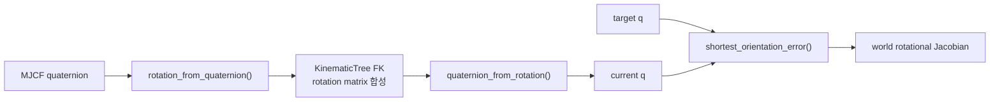

# Quaternion과 World-frame Orientation Error

!!! info "기구학 학습 순서 2/3"
    [FK](forward-kinematics.md)의 rotation matrix 출력을 quaternion pose로 바꾸고
    IK의 world-frame 자세 오차를 계산한다.

## 규칙

이 프로젝트는 MuJoCo 순서 \(q=[w,x,y,z]^T=[w,\mathbf v]^T\)를 사용한다.
`kinematics/rotations.py`가 모든 변환을 담당한다.

### 정규화

\[
q\leftarrow\frac{q}{\|q\|}
\]

norm이 유한하지 않거나 \(10^{-12}\)보다 작으면 identity \([1,0,0,0]\)을 반환한다.
일반 출력은 \(w\ge0\) 부호로 통일한다.

### Double cover

\[
R(q)=R(-q)
\]

두 pose의 최단 오차를 구할 때 \(q_t\cdot q_c<0\)이면 target 부호를 뒤집는다.
quaternion을 직접 빼지 않는다.

## World-frame relative rotation

current를 target으로 바꾸는 world-frame 회전은

\[
R_e=R_tR_c^T
\]

이므로 quaternion 순서는

\[
\boxed{q_e=q_t\otimes q_c^{-1}}
\]

이다. 반대 순서 \(q_c^{-1}\otimes q_t\)는 local-frame 회전이다. 이 프로젝트의
rotational Jacobian은 world axis이므로 `shortest_orientation_error()`는 위 순서를
사용한다.

## Axis-angle error

최단 부호를 선택한 \(q_e=[w_e,\mathbf v_e]^T\)에서

\[
\theta=2\operatorname{atan2}(\|\mathbf v_e\|,w_e)
\]

이고 IK에 사용하는 3차원 오차는

\[
\boxed{e_R=\mathbf v_e\frac{\theta}{\|\mathbf v_e\|}}
\]

이다. \(\|\mathbf v_e\|<10^{-12}\)이면 0을 반환한다.

## Rotation matrix 변환

단위 quaternion의 회전행렬은

\[
R(q)=
\begin{bmatrix}
1-2(y^2+z^2)&2(xy-zw)&2(xz+yw)\\
2(xy+zw)&1-2(x^2+z^2)&2(yz-xw)\\
2(xz-yw)&2(yz+xw)&1-2(x^2+y^2)
\end{bmatrix}
\]

`rotation_from_quaternion()`은 정규화 후 이 행렬을 만든다.
`quaternion_from_rotation()`은 trace가 양수면 trace branch를, 180° 부근에서는
가장 큰 대각 원소의 x/y/z branch를 사용해 작은 분모를 피한다.

## 함수 대응

| 함수 | 용도 |
|---|---|
| `normalize_quaternion()` | 단위 norm과 대표 부호 |
| `multiply_quaternions()` | MuJoCo 순서 quaternion 합성 |
| `inverse_quaternion()` | 단위 quaternion의 역회전 |
| `shortest_orientation_error()` | world-frame axis-angle 오차 |
| `rotation_from_quaternion()` | quaternion → matrix |
| `quaternion_from_rotation()` | matrix → quaternion |
| `rpy_deg_to_quat()`, `quat_to_rpy_deg()` | UI RPY 왕복 |
| `clip_norm()` | 목표 선속도·각속도 norm 제한 |
| `wrap_angle()` | yaw를 \([-\pi,\pi)\)로 정규화 |
| `skew()` | rigid-grasp Jacobian의 회전·병진 결합 |

## 오류와 검증

| 오류 | 결과 |
|---|---|
| quaternion 직접 뺄셈 | \(q/-q\) 경계에서 불연속 |
| 곱셈 순서 반대 | local 오차를 world Jacobian에 입력 |
| 정규화 생략 | rotation matrix 직교성 저하 |
| matrix 변환에서 trace branch만 사용 | 180° 부근 수치 불안정 |

`tests/test_phase_3.py`는 quaternion norm, \(q/-q\) 동치, MuJoCo rotation과 tree
FK의 일치, rotational Jacobian의 중앙 유한차분을 검사한다.

[← 이전: FK와 geometric Jacobian](forward-kinematics.md) ·
[다음: Collision distance와 gradient →](collision-kinematics.md)
