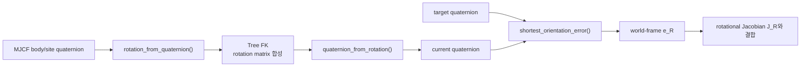

# Quaternion과 World-frame Orientation Error

!!! info "기구학 학습 순서 3/4"
    [FK와 geometric Jacobian](forward-kinematics.md)은 rotation matrix로 pose를
    누적한다. 이 문서는 그 결과를 quaternion으로 변환하고 IK의 자세 오차를 만드는
    과정을 분리해 설명한다. 다음은 [Collision distance와 gradient](collision-kinematics.md)다.

## 먼저 답할 질문

1. \(q\)와 \(-q\)가 같은 자세인데 왜 오차가 튈 수 있는가?
2. target과 current 중 어느 quaternion을 먼저 곱해야 하는가?
3. orientation error의 축은 world frame인가 local frame인가?
4. FK 내부는 rotation matrix인데 공개 pose는 왜 quaternion인가?

## 1. 표기와 규칙

이 프로젝트는 MuJoCo 순서인

\[
q=[w,x,y,z]^T=[w,\mathbf v]^T
\]

를 사용한다. \(w\)가 scalar part, \(\mathbf v=[x,y,z]^T\)가 vector part다.

| 기호 | 의미 |
|---|---|
| \(q_c\) | current orientation |
| \(q_t\) | target orientation |
| \(q_e\) | current에서 target으로 가는 relative orientation |
| \(R(q)\) | quaternion과 같은 회전을 나타내는 \(3×3\) 행렬 |
| \(e_R\) | IK가 사용하는 3차원 axis-angle error vector |

`kinematics_math.py`의 함수는 모델이나 solver 상태를 가지지 않는 순수 수학
경계다.

## 2. 단위 Quaternion으로 정규화

회전 quaternion은

\[
\|q\|=1
\]

이어야 한다. 입력 \(q_{raw}\)는

\[
q=\frac{q_{raw}}{\|q_{raw}\|}
\]

로 정규화한다. norm이 유한하지 않거나 \(10^{-12}\)보다 작으면 회전을 정의할 수
없으므로 identity quaternion

\[
q_I=[1,0,0,0]^T
\]

를 반환한다.

```python
norm = float(np.linalg.norm(result))
if not np.isfinite(norm) or norm < 1e-12:
    return np.array([1.0, 0.0, 0.0, 0.0])
result /= norm
```

## 3. Double cover와 부호 선택

quaternion은

\[
R(q)=R(-q)
\]

인 double-cover 표현이다. 같은 실제 자세도 배열로는 두 값이 될 수 있다. 시간에
따라 \(q\)와 \(-q\)가 번갈아 선택되면 단순 뺄셈 \(q_t-q_c\)는 큰 불연속을 만든다.

`normalize_quaternion()`은 일반 출력의 대표 부호를 \(w\ge0\)으로 정한다.

```python
if result[0] < 0.0:
    result *= -1.0
```

두 pose 사이의 최단 오차를 구할 때는 scalar part만 보지 않고 내적을 본다.

\[
q_t\cdot q_c<0
\quad\Longrightarrow\quad
q_t\leftarrow -q_t
\]

단위 quaternion의 내적은 4차원 구면에서 두 표현 사이의 가까움을 나타낸다. 부호를
뒤집으면 같은 회전을 나타내면서 current에 더 가까운 표현을 선택한다.

```python
if float(np.dot(target, current)) < 0.0:
    target *= -1.0
```

## 4. Relative rotation의 곱셈 순서

단위 quaternion의 inverse는 conjugate다.

\[
q_c^{-1}=[w_c,-x_c,-y_c,-z_c]^T
\]

current world orientation을 target world orientation으로 바꾸는 spatial/world-frame
relative rotation은 rotation matrix로

\[
R_e=R_tR_c^T
\]

다. quaternion 곱으로 같은 순서를 쓰면

\[
\boxed{q_e=q_t\otimes q_c^{-1}}
\]

이다.

```python
current_inverse = current.copy()
current_inverse[1:] *= -1.0
error = np.zeros(4)
mujoco.mju_mulQuat(
    error, target, current_inverse
)
```

반대로 \(q_c^{-1}\otimes q_t\)를 쓰면 current body/local frame에서 표현된 relative
rotation이 된다. 이 프로젝트의 rotational Jacobian 아래 3행은 world axis이므로
오차도 \(q_t\otimes q_c^{-1}\) 순서여야 한다.

## 5. Quaternion에서 Axis-angle Error로

최단 부호를 선택하고 정규화한 relative quaternion을

\[
q_e=[w_e,\mathbf v_e]^T
\]

라 하자. 단위 quaternion의 axis-angle 정의는

\[
w_e=\cos\frac{\theta}{2}
\]

\[
\mathbf v_e=\hat a\sin\frac{\theta}{2}
\]

다. 따라서

\[
\|\mathbf v_e\|=\sin\frac{\theta}{2}
\]

이고, 작은 각도와 \(\pi\) 부근에서 모두 안정적인 `atan2` 형태로

\[
\boxed{
\theta=2\operatorname{atan2}
(\|\mathbf v_e\|,w_e)}
\]

를 얻는다.

회전축은

\[
\hat a=\frac{\mathbf v_e}{\|\mathbf v_e\|}
\]

이므로 IK에 넣을 3차원 orientation error는

\[
\boxed{
e_R=\theta\hat a
=\mathbf v_e
\frac{\theta}{\|\mathbf v_e\|}}
\]

다.

```python
vector_norm = float(np.linalg.norm(error[1:]))
if vector_norm < 1e-12:
    return np.zeros(3)
angle = 2.0 * np.arctan2(
    vector_norm, max(error[0], 0.0)
)
return error[1:] * (angle / vector_norm)
```

\(\|\mathbf v_e\|\)가 거의 0이면 회전각도 0이므로 0벡터를 반환한다. 작은 값으로
나누어 noise를 키우지 않는다.

## 6. Quaternion에서 Rotation Matrix로

단위 quaternion \(q=[w,x,y,z]^T\)의 회전행렬은

\[
R(q)=
\begin{bmatrix}
1-2(y^2+z^2) & 2(xy-zw) & 2(xz+yw)\\
2(xy+zw) & 1-2(x^2+z^2) & 2(yz-xw)\\
2(xz-yw) & 2(yz+xw) & 1-2(x^2+y^2)
\end{bmatrix}
\]

이다. `rotation_from_quaternion()`은 먼저 정규화한 뒤 이 행렬을 그대로 만든다.
`KinematicTree`가 `model.body_quat`와 `model.site_quat`를 복사할 때 이 함수를
사용한다.

## 7. Rotation Matrix에서 Quaternion으로

FK는 회전행렬을 누적하지만 `SiteKinematics`는 quaternion을 반환한다. 행렬의 trace가
양수일 때

\[
s=2\sqrt{1+\operatorname{tr}(R)}
\]

\[
w=\frac{s}{4},\quad
x=\frac{R_{32}-R_{23}}{s},\quad
y=\frac{R_{13}-R_{31}}{s},\quad
z=\frac{R_{21}-R_{12}}{s}
\]

를 쓸 수 있다.

180° 회전 부근에서는 trace가 \(-1\)에 가까워 \(s\)가 작아진다. 이때 작은 값으로
나누지 않도록 `quaternion_from_rotation()`은 \(R_{11},R_{22},R_{33}\) 중 가장 큰
대각 원소를 기준으로 x/y/z branch를 선택한다. 마지막에는 다시
`normalize_quaternion()`을 호출해 단위 norm과 대표 부호를 보장한다.

이 branch는 서로 다른 회전을 만드는 근사가 아니다. 같은 행렬→quaternion 식을
수치적으로 가장 큰 분모를 사용하도록 바꾼 것이다.

## 8. FK와 IK 사이에서의 역할



FK 내부 합성에는 rotation matrix가 편하고, pose API·target 저장·보간에는 quaternion이
편하다. `kinematics_math.py`가 두 표현 사이의 단일 변환 규칙을 제공하므로 단일 팔
IK와 전신 IK가 다른 부호나 곱셈 순서를 사용하지 않는다.

## 9. 수식과 코드의 대응

| 수식 | 코드 |
|---|---|
| \(q/\|q\|\), \(w\ge0\) | `normalize_quaternion()` |
| \(q_t\cdot q_c<0\) | target 부호 선택 |
| \(q_c^{-1}=[w,-\mathbf v]\) | `current_inverse[1:] *= -1` |
| \(q_e=q_t\otimes q_c^{-1}\) | `mujoco.mju_mulQuat()` |
| \(\theta=2\operatorname{atan2}(\|\mathbf v\|,w)\) | `angle` |
| \(e_R=\theta\mathbf v/\|\mathbf v\|\) | 최종 return |
| \(R(q)\) | `rotation_from_quaternion()` |
| \(q(R)\) | `quaternion_from_rotation()` |

## 10. 흔한 오류

| 오류 | 결과 |
|---|---|
| quaternion을 단순히 뺌 | double-cover에서 불연속 |
| \(q_c^{-1}\otimes q_t\) 사용 | local error를 world Jacobian에 입력 |
| norm 정규화 생략 | rotation matrix의 직교성 저하 |
| \(\arccos(w)\)만 사용 | 0 또는 \(\pi\) 부근 수치 민감도 증가 |
| matrix→quaternion에서 trace branch만 사용 | 180° 부근 작은 분모 |

## 11. 검증

`tests/test_phase_3.py`는 다음을 확인한다.

- FK quaternion norm이 1인지
- \(q\)와 \(-q\)의 orientation error가 0인지
- tree FK rotation과 MuJoCo engine rotation이 일치하는지
- rotational Jacobian의 중앙 유한차분이 같은 world-frame error와 일치하는지

```bash
python3 tests/test_phase_3.py
```

[← 이전: FK와 geometric Jacobian](forward-kinematics.md) ·
[다음: Collision distance와 gradient →](collision-kinematics.md)
