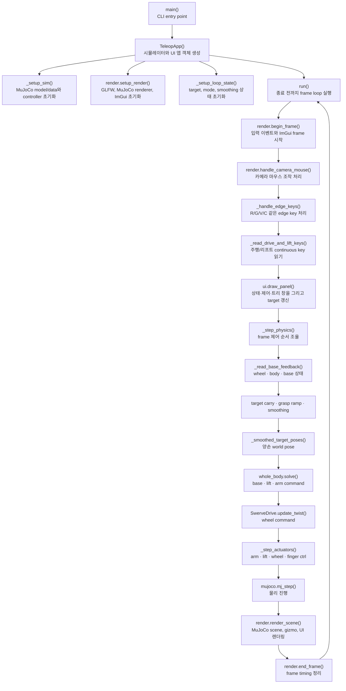

# `src/ffw_sh5_grasp/application/teleop.py`

앱의 조립 지점이다. MuJoCo model/data를 만들고, UI/렌더/target/IK/control 모듈을
연결한 뒤 메인 루프를 실행한다.

사용자는 기존과 같이 `python3 src/teleop_app.py`로 실행한다. 루트 파일은 새
`ffw_sh5_grasp.application.teleop` 모듈의 `main()`을 호출하는 얇은 실행기다.
`python3 src/teleop_app.py --config config/local.yaml`로 사용자 YAML을 선택할 수 있다.
앱 주기·창·목표 변화율은 `application` 구역에서 조절한다.

렌더 프레임과 물리 서브스텝의 정확한 호출 순서는
[아키텍처와 데이터 흐름](../overview.md#frame-call-flow)에서 해설한다.

## 책임

| 구분 | 내용 |
|---|---|
| 초기화 | model/data, whole-body IK, arm/swerve controller, actuator/site/joint id 준비 |
| 입력 | 키보드 edge 입력, 주행/리프트 continuous 입력 |
| 상태 | `app.targets`, arm mode, grab state, Cyclo state |
| 물리 step | target smoothing, IK solve, actuator command, `mj_step` |
| 연결 | `ui`, `render`, `targets` 모듈의 공개 함수를 호출 |

## 메인 루프

```python
while not glfw.window_should_close(self.window):
    io = render.begin_frame(self)
    render.handle_camera_mouse(self, io)
    self._handle_edge_keys(io)
    drive_keys = self._read_drive_and_lift_keys(io)
    ui.draw_panel(self)
    self._step_physics(drive_keys)
    render.render_scene(self)
    render.end_frame(self, t0)
```

## 함수와 메서드

### 모듈 함수

| 이름 | 역할 |
|---|---|
| `_named_id(model, object_type, name)` | 필수 MuJoCo object id 조회, 누락 시 명확한 오류 반환 |
| `_joint_address(model, name, addresses)` | joint의 qpos 또는 DOF 주소 조회 |
| `_reset_can_random(model, data, rng)` | 캔 free joint를 home 근처에 랜덤 리셋 |
| `_parse_args(argv)` | CLI 인자 파싱 |
| `main(argv=None)` | `TeleopApp().run()` 실행 |

### `KeyEdge`

| 메서드 | 역할 |
|---|---|
| `pressed(window, key)` | 눌림 edge를 한 번만 true로 반환 |

### `TeleopApp`

| 메서드 | 역할 |
|---|---|
| `__init__()` | sim, render, loop state 초기화 |
| `_setup_sim()` | model/data 로드, solver/controller/id/target 상태 생성 |
| `_setup_loop_state()` | q_des, FK slider, timing, input 상태 생성 |
| `reset_can()` | 캔 free-joint qpos/qvel만 리셋; 파생 물리 상태는 다음 `mj_step()`에서 갱신 |
| `reset_active_object()` | 캔/grab/Cyclo 상태 리셋 |
| `_disable_legacy_box_asset()` | XML에 남은 box asset 비활성화 |
| `cycle_camera()` | 카메라 preset 전환 |
| `set_arm_mode(side, mode)` | 손별 IK/FK 전환; FK→IK는 자체 `site_state()` pose로 target 동기화 |
| `set_whole_body_enabled(enabled)` | world target을 보존하며 whole-body/arm-only 전환 |
| `toggle_whole_body_control()` | UI 버튼용 전신 제어 토글 |
| `_handle_edge_keys(io)` | `R/G/V/C` edge key 처리 |
| `_read_drive_and_lift_keys(io)` | 주행/리프트 continuous key 처리 |
| `_read_base_feedback()` | wheel 상태, body twist, base pose를 한 번에 읽기 |
| `_update_grasp_targets()` | Grab/Release 상태를 grasp/thumb 값으로 rate-limit |
| `_smooth_hand_targets()` | raw XYZ/RPY를 frame 이동 한계 안으로 보간 |
| `_smoothed_target_poses()` | 보간된 UI 값을 양손 world pose로 변환 |
| `_step_actuators(wheel_commands)` | 물리 substep마다 모든 actuator command와 `mj_step` 적용 |
| `_step_physics(drive_keys)` | 위 단계의 순서와 수동/WBIK 명령 우선순위 조율 |
| `run()` | 전체 frame loop 실행 |

## 함수 흐름



### `application.targets`와의 연결

좌표 변환과 marker 동기화는 `targets.target_world_pose(app, side)`처럼 전용 모듈의
공개 함수를 직접 호출한다. `TeleopApp`에 같은 인자의 전달용 메서드를 반복하지 않으므로
구현 위치와 호출 위치가 한 번에 드러난다. 앱에는 UI 명령의 의미가 있는 아래 세
메서드만 남는다.

| 앱 메서드 | 실제 역할 |
|---|---|
| `capture_grasp()` | Bimanual MoveL 캡처 후 solver의 rigid-grasp 기준도 갱신 |
| `release_grasp()` | Bimanual MoveL 캡처와 solver 기준 해제 |
| `apply_virtual_object_target()` | virtual object pose로 양손 target 갱신 |

순수 회전 계산은 `kinematics.rotations`, target 좌표 변환은
`application.targets`, Gizmo 행렬 변환은 `visualization.render`가 각각 한 번만
구현한다.

## `_step_physics()` 내부 순서

1. `_read_base_feedback()`으로 steer 위치, wheel 속도, chassis body twist와 base pose를 읽는다.
2. 키보드 주행 입력과 실제 정지 여부를 판정한다.
3. 수동 주행 또는 제동 중이면 target frame을 측정된 base SE(2) 이동만큼 운반한다.
4. Bimanual capture 상태의 virtual object와 Grab/Release 상태를 raw target에 반영한다.
5. `_smooth_hand_targets()`로 XYZ/RPY target을 frame 이동 한계 안에서 rate-limit한다.
6. `_smoothed_target_poses()`가 현재 mode에 맞는 양손 world pose를 만든다.
7. `whole_body.solve()`가 ON이면 base x/y/yaw, lift, IK 모드 양팔을 한 문제로
   풀고, OFF면 base/lift 속도를 0으로 고정해 팔만 푼다.
8. FK 모드인 손은 FK slider 값을 사용하고 whole-body arm 변수는 0속도로 고정한다.
9. 키보드 base 명령이 있으면 우선한다. 키가 없을 때 ON은 whole-body twist, OFF는
   zero twist를 선택한다.
10. `SwerveDrive.update_twist()`로 wheel command를 계산한다.
11. `_step_actuators()`가 각 물리 substep에 arm, lift, wheel, finger command를 쓰고
    `mujoco.mj_step()`을 호출한다.

## 직접 쓰는 `data`

| 쓰기 위치 | 목적 |
|---|---|
| `_reset_can_random()` | 자유물체 캔 리셋 |
| `_disable_legacy_box_asset()` | legacy box asset 비활성화 |
| `_step_actuators()` | actuator command 기록과 `mj_step` |

로봇 관절 위치를 live `data.qpos`로 직접 덮어쓰지 않는다.

ROS/MoveIt/Pinocchio/OSQP를 import하지 않는다. 공식 AIWorker/Cyclo에서 참고한 것은
body-twist 스워브 제어와 weighted differential IK 알고리즘 구조뿐이다.
