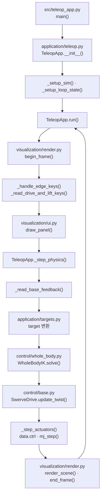
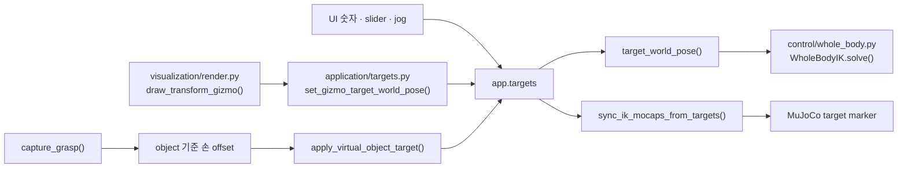

# 애플리케이션과 목표 좌표

`application/teleop.py`는 model/data와 controller를 만들고 프레임 반복 실행을 담당한다.
`application/targets.py`는 UI 값, world pose와 marker pose 사이의 변환만 담당한다.

```bash
python3 src/teleop_app.py
python3 src/teleop_app.py --config config/local.yaml
```

## 모듈별 역할

| 파일 | 역할 | 하지 않는 일 |
|---|---|---|
| `application/teleop.py` | 초기화, 입력, 모드 전환, 명령 중재, physics step | FK·IK 수식 중복 구현 |
| `application/targets.py` | target frame 변환, 양손 capture, marker 동기화 | IK solve, actuator 기록 |

루트의 `src/teleop_app.py`는 설정 경로를 적용한 뒤
`ffw_sh5_grasp.application.teleop.main()`을 호출하는 실행기다.

## 실행 흐름



### `_step_physics()` 순서

1. steering, wheel velocity, body twist와 base pose를 읽는다.
2. 수동 주행 중이면 측정된 base SE(2) 이동만큼 target 기준을 운반한다.
3. grasp target과 손 target 변화율을 제한한다.
4. 양손 target을 world pose로 변환하고 `WholeBodyIK.solve()`를 호출한다.
5. manual, 제동용 zero, WBIK 중 하나의 `BodyTwist`를 선택한다.
6. wheel·arm·lift·finger command를 각 physics substep에 기록하고 `mj_step()`을 실행한다.

base 명령 중재와 wheel 제어는 [모바일 스워브 제어](base_teleop.md#base-function-flow)에
정리되어 있다.

## 목표 좌표계 { #target-frames }

| 저장값 | Whole-body ON | Whole-body OFF |
|---|---|---|
| 손 `pos/rpy` | startup 또는 수동 주행으로 운반된 anchor 기준 | 현재 live base 기준 |
| virtual object | anchor의 절대 local pose | live base의 절대 local pose |
| solver 입력 | world pose | world pose |

ON에서는 target이 world에 고정되어야 base가 움직여 task error를 줄일 수 있다. 손 위치
목표는 시작 손 위치와 anchor 방향을 사용한다.

\[
p_{target}^{w}=p_{home}^{w}+R_z(\theta_{anchor})\,\Delta p_{ui}
\]

virtual object 위치는 손 offset과 달리 anchor-local 절대 위치이므로 anchor 원점도
더한다.

\[
p_{object}^{w}=
\begin{bmatrix}x_{anchor}\\y_{anchor}\\0\end{bmatrix}
+R_z(\theta_{anchor})p_{object}^{anchor}
\]

<figure markdown>
  
  <figcaption>Whole-body ON의 손 target은 live base가 아니라 anchor를 기준으로 world에 고정된다.</figcaption>
</figure>

자세도 같은 구분을 사용한다.

\[
q_{world}^{ON}=q_{home\_world}\otimes q_{rpy},\qquad
q_{world}^{OFF}=q_{base\_world}\otimes q_{home\_base}\otimes q_{rpy}
\]

`set_whole_body_enabled()`는 전환 전에 손과 virtual object의 world pose를 저장하고,
전환 후 새 좌표계의 값으로 역변환한다. 따라서 UI 숫자는 달라질 수 있지만 marker의
world pose는 유지된다. FK→IK도 현재 site pose를 새 target으로 사용해 전환 점프를
막는다.

## 양손 capture

`capture_grasp()`는 virtual object에서 본 두 손의 상대 transform을 저장한다.

\[
p_{offset}=R_{obj}^{T}(p_{hand}-p_{obj}),\qquad
R_{offset}=R_{obj}^{T}R_{hand}
\]

이후 `apply_virtual_object_target()`은 반대 변환으로 두 손 target을 갱신한다.

\[
p_{hand}=p_{obj}+R_{obj}p_{offset},\qquad
R_{hand}=R_{obj}R_{offset}
\]

`release_grasp()`는 저장된 상대 transform과 solver의 rigid-grasp 기준을 함께 해제한다.

## Target 변환 흐름



수동 주행은 `carry_world_targets_with_base()`로 anchor와 손 home reference를 측정된 base
이동만큼 옮긴다. 이 과정은 UI offset을 직접 수정하지 않는다.

## 주요 함수

| 함수 | 역할 |
|---|---|
| `TeleopApp.run()` | 입력 → UI → 물리 → 렌더링 프레임 반복 |
| `TeleopApp.set_arm_mode()` | IK/FK 전환과 현재 상태 동기화 |
| `TeleopApp.set_whole_body_enabled()` | world pose를 보존하며 ON/OFF 전환 |
| `TeleopApp._step_physics()` | target, solver, 명령 중재와 physics 순서 조율 |
| `target_world_pose()` | 손 target을 최종 world pose로 변환 |
| `world_to_target_pos()` | world 위치를 현재 target frame으로 역변환 |
| `capture_grasp()` / `apply_virtual_object_target()` | virtual object 기준 양손 target 저장·복원 |
| `sync_ik_mocaps_from_targets()` | target pose를 표시용 mocap에 복사 |

`_step_actuators()`만 robot actuator의 `data.ctrl`을 기록한다. `reset_can()`과 legacy
box 비활성화는 자유물체 초기화를 위해 해당 object의 state/model 속성을 수정한다.

## 검증

```bash
python3 tests/test_phase_6.py
```

Phase 6는 초기 target 일치, world↔target 변환, Whole-body 전환 pose 보존, 양손 capture,
marker 동기화와 Task Space 입력을 검사한다.

[← 시스템 구조](../overview.md) · [시각화 →](teleop_ui.md)
