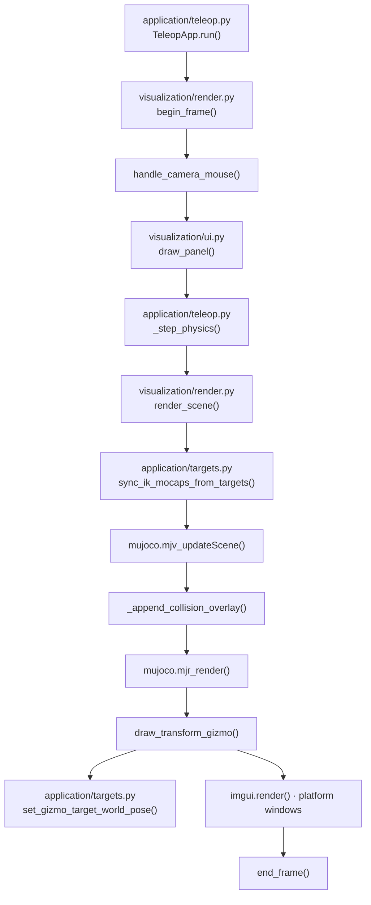

# UI와 시각화

`visualization/ui.py`는 ImGui widget을 그리고 target·mode·표시 상태를 바꾼다.
`visualization/render.py`는 GLFW, MuJoCo scene, camera, 3D Gizmo와 collision overlay를
담당한다.

## 모듈별 역할

| 파일 | 읽기 | 쓰기 |
|---|---|---|
| `ui.py` | app 상태, `data` 진단값 | `app.targets`, mode, UI 상태 |
| `render.py` | model/data, target, collision 진단값 | camera·target 상태, framebuffer/window 출력 |

두 모듈 모두 IK를 풀거나 actuator command를 기록하거나 `mj_step()`을 호출하지 않는다.

## UI 구성

```text
FFW-SH5 Status & Windows
├── Control Center
│   ├── Target                 MoveL, capture/release, marker jog
│   ├── Task Space             world XYZ/RPY 숫자 입력
│   ├── Right / Left Arm       IK pose 또는 FK joint
│   ├── Pose Graph             target/current pose와 오차
│   ├── IK Solver              Pseudoinverse, DLS, QP 설정
│   └── Robot / Grasp          lift, 표시, 손가락 명령
└── Diagnostics
    ├── Kinematic Tree
    └── Joint Monitor
```

`draw_panel()`이 두 workspace를 구성한다. Control Center와 Diagnostics는 ImGui
multi-viewport로 메인 MuJoCo 창 밖의 OS 창으로 분리하거나 다시 주 창으로 가져올 수
있다. 표시 상태는 `app.ui_windows`에 저장된다.

### Task Space 입력

Task Space 탭은 오른손 또는 왼손의 MuJoCo world-frame 절대 XYZ(m)와 RPY(deg)를
입력받는다. `_apply_task_space_target()`은 다음만 수행한다.

1. 3개씩의 유한한 숫자인지 검사한다.
2. 캡처된 양손 모드라면 해제하고 선택한 팔을 IK 모드로 바꾼다.
3. `application.targets`의 역변환으로 내부 target 값을 갱신한다.
4. marker를 동기화한다.

이후 target smoothing, IK와 actuator 적용은 기존 `_step_physics()` 경로가 담당한다.
도달 불가능한 pose는 관절·속도·collision 제약 안에서 가능한 만큼 추종한다.

## 렌더링 흐름 { #render-flow }



collision 표시가 꺼져 있으면 `_append_collision_overlay()` 단계는 생략된다.
`collision_visualization_data()`는 WBIK가 계산한 동일한 `CollisionConstraint`만 읽으며
거리나 gradient를 다시 계산하지 않는다.

## Gizmo 좌표

`pose_to_imguizmo_matrix()`와 `imguizmo_matrix_to_pose()`가 world pose와 4×4 Gizmo
행렬을 변환한다. MuJoCo scene은 framebuffer 좌표를 사용하지만 multi-viewport ImGui는
desktop 좌표를 사용하므로, Gizmo의 draw rect는 `imgui.get_main_viewport()`의 위치와
크기를 사용한다. camera projection의 aspect ratio만 framebuffer 크기를 따른다.

Gizmo drag 결과는 `set_gizmo_target_world_pose()`를 통해 내부 target frame으로
역변환된다. target 좌표의 의미는 [애플리케이션](teleop_app.md#target-frames)을
참고한다.

## 주요 함수

| 함수 | 역할 |
|---|---|
| `ui.draw_panel(app)` | UI 프레임 진입점 |
| `ui.kinematic_tree_body_ids(...)` | 진단 트리에 표시할 body 범위 선택 |
| `render.setup_render(...)` / `shutdown(...)` | GLFW·ImGui·MuJoCo render 자원 생명주기 |
| `render.begin_frame(...)` / `end_frame(...)` | event 처리와 프레임 시간 조절 |
| `render.handle_camera_mouse(...)` | UI가 사용하지 않는 mouse 입력으로 camera 이동 |
| `render.render_scene(...)` | marker, scene, overlay, Gizmo와 ImGui 렌더 |
| `render.draw_transform_gizmo(...)` | 활성 target의 world pose 조작 |

## 검증

```bash
python3 tests/test_phase_6.py
```

Phase 6는 UI jog clamp, Task Space 입력, window 상태, kinematic tree 범위, Gizmo 행렬
왕복, target/marker 동기화와 collision overlay를 검사한다.

[← 애플리케이션](teleop_app.md) · [시스템 구조](../overview.md)
