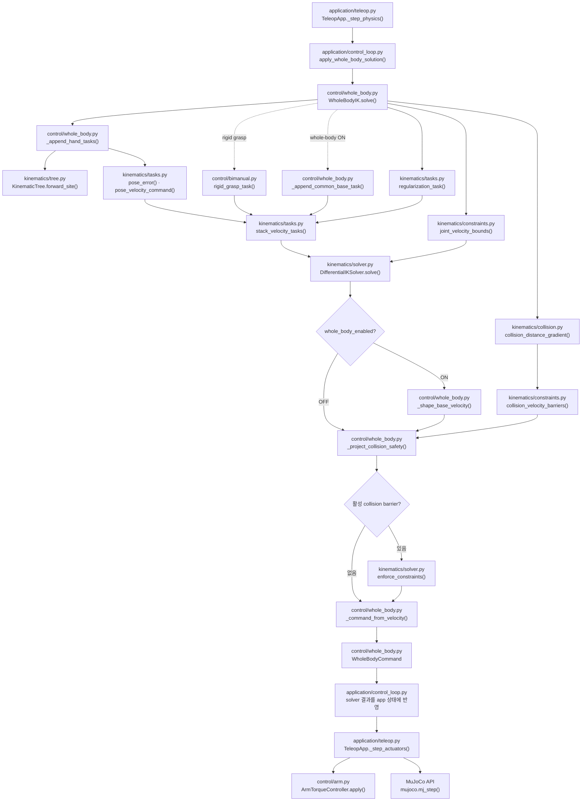

# `src/ffw_sh5_grasp/control/whole_body.py`

!!! info "핵심 알고리즘 학습 순서 3/6"
    [Differential IK 수학](ik-math.md)의 velocity task를 base·lift·양팔과 safety
    constraint로 조립한다. 출력된 팔 목표는 [팔 토크 제어](arm_control.md)가 적용한다.

`WholeBodyIK`는 모바일 베이스 3축, 리프트 1축, 양팔 14축의 속도를 함께 푼다.
설정은 `config/default.yaml`의 `whole_body_ik` 구역에 있다.

## 모듈 구성

| 파일 | 역할 |
|---|---|
| `control/whole_body.py` | reference 상태, solve 순서, `WholeBodyCommand` 조립 |
| `control/bimanual.py` | 양손 상대 pose와 rigid-grasp task |
| `kinematics/tasks.py` | pose 명령, velocity task 정규화·적층 |
| `kinematics/constraints.py` | joint-limit box, collision velocity CBF |
| `kinematics/solver.py` | Pseudoinverse/DLS/QP 선택과 soft-CBF 보정 |
| `kinematics/optimization.py` | box-QP와 soft-barrier 수치 구현 |
| `kinematics/collision.py` | signed distance와 gradient |

## Solver 사용 { #solver-comparison }

세 해법은 이 페이지에서 만든 같은 task와 velocity box를 입력으로 받는다.

!!! info "수치 solver 상세"

    - [Pseudoinverse·DLS·QP와 실제 코드](ik-math.md#solver-methods)
    - [해법별 velocity bound 처리](ik-math.md#bounded-solver-paths)
    - [Collision soft-CBF 보정](ik-math.md#7-collision-safety-projection)

전신 조립에서의 차이는 QP에만 자유도별 damping task가 추가된다는 점이다.
`common_base`와 posture task는 세 해법 모두 사용하며, collision 보정은 명목 solve와
base shaping 뒤에 공통으로 실행된다. `bimanual.rigid_grasp_task()`도 solver가 아니라
6행 velocity task를 만드는 함수다.

### QP 자유도 비용

QP에서만 zero-velocity identity task를 추가한다.

\[
\dot q^TR\dot q,\qquad
R_{ii}=\frac{\operatorname{damping\_strength}_i}
{\operatorname{velocity\_limit}_i^2}
\]

| 자유도 | 기본 strength |
|---|---:|
| base x/y | `0.075625` |
| base yaw | `0.392` |
| lift | `0.0147` |
| 각 팔 관절 | `0.91125` |

큰 값일수록 해당 자유도 사용이 비싸다. `common_base` task는 별도이며 세 해법 모두에
포함된다.

## 제어 변수와 출력

\[
\dot q=[\dot x_b,\dot y_b,\dot\theta_b,\dot q_{lift},
\dot q_{r,1:7},\dot q_{l,1:7}]^T
\]

| 성분 | 적용 경로 |
|---|---|
| base x/y/yaw | body frame 변환 → `SwerveDrive.update_twist()` |
| lift | `lift_joint` position actuator |
| 양팔 | `ArmTorqueController`의 PD + feedforward torque |

solver는 `data.qpos`를 읽지만 쓰지 않는다. `WholeBodyCommand`는 base twist, lift·팔
위치 외에 generalized velocity, 손별 오차, 최소 충돌 거리, 활성 pair와 남은 CBF
위반량을 반환한다.

## Whole-body 모드 { #whole-body-modes }

| 모드 | 활성 자유도 |
|---|---|
| ON, `participation_scale: 1.0` | base + lift + IK 팔 |
| ON, `0 < participation_scale < 1` | 제한된 base + lift + IK 팔 |
| ON, `participation_scale: 0.0` | lift + IK 팔; base hard pin |
| OFF | IK 팔; base와 lift hard pin |

`participation_scale`은 common-base 목표와 base 속도 상한을 함께 줄인다. UI에서
Whole-body 모드를 전환하면 손과 virtual-object의 world pose를 보존하고, smoothing과
solver reference를 다시 맞춘 뒤 cached base twist를 0으로 지운다.

```yaml
whole_body_ik:
  base:
    participation_scale: 0.05  # common-base 목표와 base 속도 상한에 함께 적용
```

## 한 frame의 solve 순서

`WholeBodyIK.solve()`의 핵심 순서는 다음 한 줄로 요약된다.

`task 생성` → `bound 생성` → `명목 solve` → `base shaping` → `collision 보정` → `명령 조립`

실제 파일과 함수 단위 호출은
[함수 흐름](#whole-body-function-flow), solver 내부 분기는
[Differential IK 수학](ik-math.md#solver-methods)을 참고한다.

## Joint-limit bound

관절 margin 안쪽의 안전함수를 적용하면

\[
-\alpha(q-q_{min}-m)\le\dot q\le
\alpha(q_{max}-m-q)
\]

을 얻는다. `joint_velocity_bounds()`는 이 범위를 기본 속도 상한과 교차한다.

- 한계에 가까워지면 접근 속도가 0으로 줄어든다.
- margin 밖에서는 복귀 방향만 허용한다.
- \(\alpha_{eff}=\min(\alpha,1/\Delta t)\)로 한 Euler step의 경계 통과를 막는다.

## Reactive collision avoidance

`collision.default_collision_pairs()`는 양팔 사이, 팔의 비인접 link, 팔과 상체·base·
lift·head·table을 검사한다. wheel-floor, 손가락-object, can 접촉은 제외한다.

최근접점 \(p_A,p_B\)와 point Jacobian으로 distance gradient를 계산한다.

\[
n=\frac{p_B-p_A}{\|p_B-p_A\|},\qquad
\nabla d=n^T(J_B-J_A)
\]

3 cm buffer 안의 충돌쌍에서 CBF를 만들며 기본 안전 거리는 1 cm다. CBF 부등식,
정규화와 soft penalty의 정확한 식은
[Collision soft-CBF 보정](ik-math.md#7-collision-safety-projection)에 정리했다.
`collision_constraint_violation`은 보정 후 남은 최대 위반량이다.

palm-table은 table-normal clearance, palm-palm은 bounding sphere, 나머지는 MuJoCo
최근접점을 사용한다.

### Collision 시각화

`V` 또는 **Collision CBF Viz**를 켜면 collision geometry와 활성 pair의 최근접점을
표시한다.

| 색 | 거리 |
|---|---|
| 노랑 | 1~3 cm |
| 주황 | 0~1 cm |
| 빨강 | signed distance < 0 |

상태줄에는 활성 pair 수, 최소 거리와 CBF 위반량이 표시된다. `G`의 contact force
표시와는 독립적이다.

## Bimanual rigid grasp

Capture Grasp는 왼손 pose를 오른손 frame에 저장하고 상대 task를 추가한다.

\[
J_g=J_L-
\begin{bmatrix}I&-[r_{RL}]_\times\\0&I\end{bmatrix}J_R,
\qquad J_g\dot q=\dot x_{rel}^*
\]

목표 twist는 캡처한 상대 pose로의 복귀 명령이며 선형·각속도 상한을 적용한다.
Release Grasp는 reference와 task를 제거한다.

## World-fixed target

Whole-body ON에서는 앱 시작 시 base pose를 anchor로 저장한다. 손 offset은 anchor 축으로
표현하지만 최종 target은 world에 고정된다. 그래야 base 이동이 task error를 줄인다.
수동 주행 중에는 의도한 재배치로 간주해 target anchor도 실제 base SE(2) 이동만큼
옮기고, 정지 후 solver reference를 `rebase()`한다.

## 전신 조립 코드

| 단계 | 함수 | 파일 |
|---|---|---|
| 손 task 추가 | `_append_hand_tasks()` | `control/whole_body.py` |
| common-base task 추가 | `_append_common_base_task()` | `control/whole_body.py` |
| mode별 hard pin | `_apply_mode_velocity_bounds()` | `control/whole_body.py` |
| base shaping | `_shape_base_velocity()` | `control/whole_body.py` |
| 충돌쌍 제약 생성 | `_collision_constraints()` | `control/whole_body.py` |
| 충돌 안전 투영 | `_project_collision_safety()` | `control/whole_body.py` |
| actuator 계층 명령 변환 | `_command_from_velocity()` | `control/whole_body.py` |
| 양손 상대 task | `rigid_grasp_task()` | `control/bimanual.py` |

task 수식과 수치 solver 함수는 [Differential IK 수학](ik-math.md)에 모았다.

## 함수 흐름 { #whole-body-function-flow }



## 검증 범위

`tests/test_whole_body.py`는 다음을 검사한다.

- tree 기반 FK/Jacobian과 read-only solve
- Pseudoinverse/DLS/QP의 bound 처리와 QP optimum
- joint-limit·self/table collision CBF
- rigid-grasp 상대 pose 보존
- Whole-body/arm-only mode hard pin과 target 보존
- 수동 주행 handover
- 실제 wheel-ground contact에서 4방향 target 추종
- 평균 solve latency 5 ms 미만

현재 회귀에서 collision 비활성 solve는 약 1.1 ms, table CBF 활성 solve는 약 1.7 ms다.
물리 target 최종 오차 비율은 longitudinal `0.024`, lateral `0.011`, vertical `0.020`,
yaw `0.058`이다.

[← 이전: Differential IK 수학](ik-math.md) ·
[전체 학습 순서](index.md#algorithm-learning-order) ·
[다음: 팔 토크 제어 →](arm_control.md)
