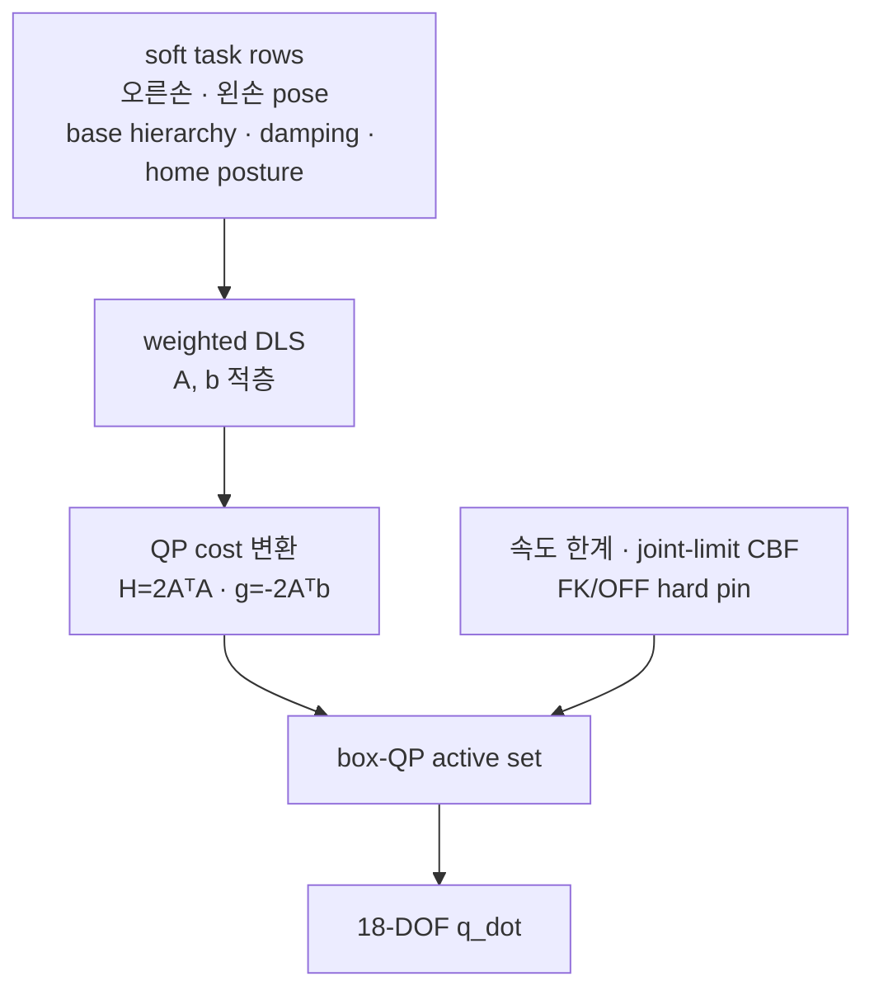
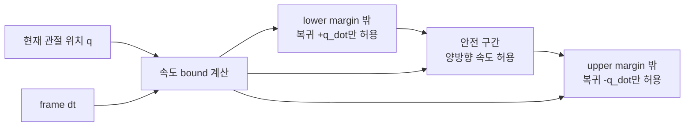
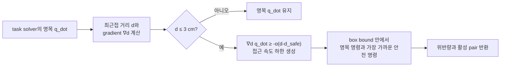
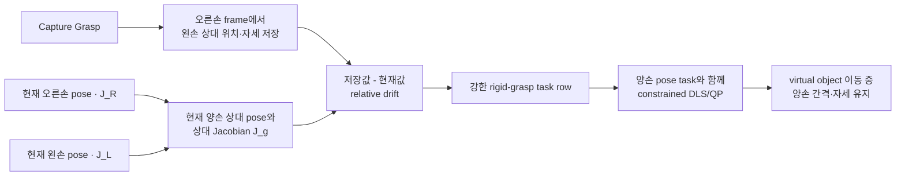
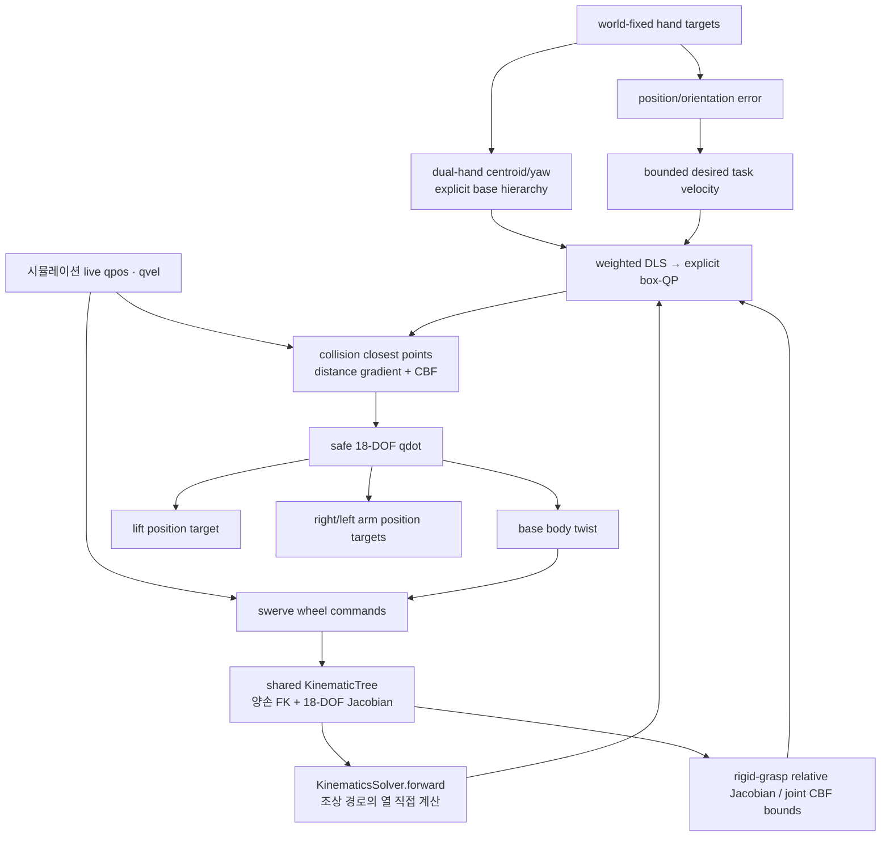

# `src/ffw_sh5_grasp/control/whole_body.py`

!!! info "핵심 알고리즘 학습 순서 4/7"
    [단일 팔 IK](ik.md)의 \(J\Delta q\approx e\)를 base·lift·양팔과 safety
    constraint까지 확장한다. 다음은 해의 팔 관절 목표를 실제 torque로 바꾸는
    [팔 토크 제어](arm_control.md)다.

손 target을 팔만으로 맞추지 않고 모바일 베이스 3축, 리프트 1축, 양팔 14축을 한
문제에서 푸는 ROS 비의존 differential whole-body IK다.

작업 가중치, 속도 한계와 관절·충돌 CBF 값은 `config/default.yaml`의
`whole_body_ik` 구역에서 조절한다. 적용·검증 규칙은
[YAML 파라미터 설정](../configuration.md)을 참고한다.

## 모듈 구성

`WholeBodyIK`가 모든 수학을 직접 소유하지 않도록 상태를 쓰는 제어 로직과 순수 계산을
분리했다.

| 파일 | 책임 |
|---|---|
| `control/whole_body.py` | robot state, task row, 속도/관절 bound와 최종 command 조립 |
| `control/optimization.py` | 모델을 모르는 box-QP와 collision soft-barrier active-set 해법 |
| `control/bimanual.py` | rigid-grasp reference와 상대 pose/Jacobian 계산 |
| `kinematics/tasks.py` | 모든 IK가 공유하는 pose 오차와 bounded Cartesian 속도 명령 |
| `kinematics/rotations.py` | 회전 행렬·쿼터니언·각도·벡터 공용 함수 |
| `kinematics/collision.py` | geometry signed distance와 gradient 계산 |

중복된 private 호환 별칭은 두지 않는다. 수치 최적화는 `control.optimization`, 강체
양손 task는 `control.bimanual`, pose 오차·속도 명령은 `kinematics.tasks`, 회전 계산은
`kinematics.rotations`의 공개 함수를 직접 호출한다.

ROS2/MoveIt 관점의 개념 비교와 legacy DLS 식의 역할은
[DLS와 위치 우선 IK 수학](ik-math.md)과 [단일 팔 IK](ik.md)를 먼저 보면,
같은 pose task가 18축 bounded 문제로 확장되는 차이를 확인할 수 있다.

## 단일 팔·전신·양손 해석의 관계 { #solver-comparison }

세 경로는 FK/Jacobian, 위치 오차 부호, quaternion 최단 회전과 world frame 규칙을
공유하지만 출력과 실행 시점이 달라 수치해법 전체를 하나로 강제하지 않는다.

| 경로 | 실제 정체 | 출력 | 유지해야 하는 고유 처리 |
|---|---|---|---|
| `KinematicsSolver.solve_pose()` | 반복형 position-level IK | 최종 관절각 $q$ | 위치 우선 null-space DLS, backtracking, multistart |
| `WholeBodyIK.solve()` | 실시간 velocity-level constrained IK | 다음 주기의 $\dot q$와 actuator 목표 | 속도·관절 한계, posture, base hierarchy, collision CBF |
| `bimanual.rigid_grasp_task()` | 전신 문제에 넣는 상대 pose task 생성기 | 상대 Jacobian과 목표 twist | 캡처한 두 손 관계와 spatial transform |

즉 `bimanual.py`는 세 번째 IK solver가 아니다. 만든 행이 `WholeBodyIK`의 동일한
constrained DLS/QP 문제에 추가된다. 세 경로에서 실제로 같아야 하는 계산만
`kinematics.tasks.pose_error()`와 `pose_velocity_command()`로 통일했다.

전신 목적함수는 수학적으로 **제약 DLS를 QP 형태로 확장한 것**으로 볼 수 있다.
적층한 식을 $\min\|A\dot q-b\|^2$로 쓰면 다음 convex QP와 동치다.

\[
\min_{\dot q}\;\frac12\dot q^T(2A^TA)\dot q-(2A^Tb)^T\dot q
\]

제약과 task weight를 제거하고 정규화 행을 $\lambda I$로 두면 일반적인 DLS 해로
돌아간다. 실제 코드는 `least_squares_to_qp()`로 $H=2A^TA$, $g=-2A^Tb$를 만든 뒤
`bounded_quadratic_program()`을 호출한다. 범용 QP 패키지 대신 작은 18변수 문제에
맞춘 NumPy active-set과 collision soft-barrier active-set을 사용한다.

### 모바일 자유도 비용을 조절하기 위해 QP를 선택한 이유

팔만 있는 IK와 달리 전신 제어에서는 같은 손 이동을 base, lift, 팔의 여러 조합으로
만들 수 있다. 단순 최소노름 해에 맡기면 양손에 동시에 영향을 주는 base Jacobian 열을
과도하게 사용할 수 있지만, 실제 모바일 베이스는 조향 정렬과 차체 관성 때문에 팔보다
응답이 늦다. 반대로 base 비용을 무조건 크게만 두면 팔 workspace 끝에서도 차체가
참여하지 않아 목표에 도달하지 못한다.

이를 세밀하게 조절하려고 QP 목적함수에 자유도별 비용을 둔다.

\[
\dot q^TR\dot q,
\qquad
R=\operatorname{diag}(r_{base_x},r_{base_y},r_{base_yaw},r_{lift},r_{arm,1:14})
\]

`config/default.yaml`의 현재 `damping_weights`는 다음과 같다.

| 자유도 | 비용 weight | 의미 |
|---|---:|---|
| base x/y | 0.25 / 0.25 | 작은 공통 오차에 차체가 불필요하게 움직이는 것을 억제 |
| base yaw | 0.20 | 작은 자세 오차로 스워브 방향이 반복 반전되는 것을 억제 |
| lift | 0.12 | 수직 이동에 쓰되 팔보다 완만하게 참여 |
| 각 팔 관절 | 0.045 | 빠른 국소 오차 보정을 우선 담당 |

weight가 클수록 해당 속도는 QP에서 더 비싼 선택이 된다. 다만 양손 target이 공통으로
크게 이동하면 `common_base` task가 명시적으로 base 목표를 만들어 필요한 차체 이동을
요청한다. 이 selector task도 다른 task·비용·제약과 함께 **같은 QP 안에서** 절충한다.
QP를 푼 뒤 base 3축만 강제로 덮어쓰지 않으므로 damping 비용, 속도 bound와 collision
CBF가 실제 최종 명령에 모두 반영된다.

`whole_body_ik.base.participation_scale`은 이 명시적 목표와 base 3축 속도 상한을 같은
비율로 줄인다. 목표만 줄이면 손 task가 base Jacobian 열을 다시 크게 쓸 수 있고,
상한만 줄이면 작은 참여율에서도 base가 계속 포화될 수 있기 때문이다. 따라서 비용의
상대적 선호는 `damping_weights`, 실제 허용 참여량은 `participation_scale`로 나누어
조절한다.

QP 표현을 사용하면 이 자유도별 비용 외에도 위치/자세/양손 task weight, 속도 상한,
joint-limit bound와 Whole-body OFF hard pin을 같은 변수 $\dot q$에 일관되게 적용할 수
있다. 충돌 CBF도 같은 $\dot q$를 쓰지만, base 가속 shaping 뒤의 명령을 안전하게
보정해야 하므로 두 번째 safety projection QP에서 처리한다. 이것이 전신 경로를 단일
팔의 닫힌형 DLS 식 그대로 두지 않고 constrained QP 기반 DLS로 구성한 핵심 이유다.

## 제어 변수와 출력

제어 속도 벡터는 다음 18개 자유도다.

\[
\dot q = [\dot x_b,\dot y_b,\dot\theta_b,\dot q_{lift},
\dot q_{r,1:7},\dot q_{l,1:7}]^T
\]

| 해의 성분 | 실제 적용 경로 |
|---|---|
| base x/y/yaw 속도 | body frame으로 회전 → `SwerveDrive.update_twist()` → 실제 바퀴 마찰 |
| lift 위치 | `lift_joint` position actuator |
| 양팔 위치 | `ArmTorqueController`의 PD + feedforward 토크 |

solver는 live `data.qpos`를 읽되 변경하지 않는다. 이 값을 공유 `KinematicTree`에
넣어 양손 pose와 18열 Jacobian을 직접 계산한 뒤 다음 명령만 반환한다.

site pose, world-aligned Jacobian, signed-distance gradient가 만들어지는 과정은
[기구학과 충돌 거리](kinematics.md)에 분리해 설명한다. 이 문서는 그 결과를 어떻게
전신 task와 safety constraint로 조립하는지에 집중한다.

## Whole-body와 모바일 베이스 참여 모드 {#whole-body-modes}

UI의 **Whole-body Control** 버튼과 YAML의 `whole_body_ik.base`는 서로 다른 범위를
제어한다.

| 모드 | differential IK 변수 | 동작 |
|---|---|---|
| ON + `participation_scale: 1.0` | base x/y/yaw + lift + IK 모드 팔 | 기본 전신 QP |
| ON + `participation_scale: 0.05` | 제한된 base + lift + IK 모드 팔 | base 목표와 속도 상한을 5%로 축소 |
| ON + `participation_scale: 0.0` | lift + IK 모드 팔 | base 3축만 `[0, 0]` bound로 고정 |
| OFF (arm-only) | IK 모드 팔 | base/lift 네 속도 bound를 `[0, 0]`으로 고정 |

모바일 베이스를 거의 움직이지 않으려면 다음 사용자 YAML을 사용한다. 기본 속도 상한
`[0.55, 0.55, 1.4]`도 `[0.0275, 0.0275, 0.07]`로 함께 낮아진다.

```yaml
whole_body_ik:
  base:
    participation_scale: 0.05
```

베이스 자동 명령을 정확히 0으로 만들면서 lift와 팔은 계속 쓰려면 참여율을 `0.0`으로
설정한다. 반면 UI의 Whole-body OFF는 base뿐 아니라 lift도 고정하는 arm-only 모드다.
두 hard gate는 task weight를 낮추는 방식이 아니므로 damping, nominal posture와
collision slack의 수치 절충으로 잔류 속도가 생기지 않는다. Joint-limit CBF와 collision
CBF는 그대로 남아 있고, 리프트 slider와 키보드 base 주행은 IK 밖의 독립 수동
명령이므로 계속 사용할 수 있다.

전환 시 앱은 양손/virtual-object의 world pose를 먼저 저장한 뒤 새 모드 좌표계로
target 값을 역변환한다. smoothing 값도 함께 맞추고 solver reference를 `rebase()`하며
cached base twist를 0으로 지워 marker jump나 과거 명령 재생을 막는다.

구조는 ROBOTIS의
[`cyclo_motion_controller_core`](https://github.com/ROBOTIS-GIT/cyclo_control/tree/ceffbd7562028f6b317e462911e2a0991b9ba735/cyclo_motion_controller_core)가
pose/Jacobian을 한 kinematics 계층에서 계산하고 weighted task QP에 속도·관절 한계·
양손 제약을 넣는 방식과 collision pair의 최근접점 Jacobian/CBF를 참고했다. 여기서는
ROS, Pinocchio, FCL, OSQP를 가져오지 않고 MuJoCo+NumPy 알고리즘으로만 구현한다.
구체적으로 공식
[`kinematics_solver.cpp`](https://github.com/ROBOTIS-GIT/cyclo_control/blob/ceffbd7562028f6b317e462911e2a0991b9ba735/cyclo_motion_controller_core/src/kinematics/kinematics_solver.cpp)의
distance gradient와
[`vr_controller.cpp`](https://github.com/ROBOTIS-GIT/cyclo_control/blob/ceffbd7562028f6b317e462911e2a0991b9ba735/cyclo_motion_controller_core/src/controllers/ai_worker/vr_controller.cpp)의
collision CBF/slack 구성을 기준으로 삼았다.

## 전신 IK 수식 증명: pose 선형화에서 QP까지 { #whole-body-proof }

이 절은 구현이 푸는 문제를 pose 오차에서 시작해 QP, KKT 조건, 충돌 안전 투영까지
순서대로 유도한다. 결론부터 말하면 이 구현은 **현재 자세 주변에서 선형화한 weighted
DLS를 box-constrained convex QP로 푼 뒤, 충돌이 가까울 때 별도의 convex safety
projection QP를 한 번 더 푸는 구조**다.

### 1. FK를 한 제어 주기 동안 선형화한다

$i$번째 손의 FK를 $x_i=f_i(q)$라고 하자. 현재 자세 $q$에서 Taylor 전개하면

\[
f_i(q+\Delta q)
=f_i(q)+J_i(q)\Delta q+O(\lVert\Delta q\rVert^2)
\]

이고, 한 제어 주기 $\Delta t$에서 $\Delta q=\dot q\Delta t$이므로 $\Delta t$로
나누고 2차 이상 항을 버리면 다음 velocity-level 관계를 얻는다.

\[
\boxed{\dot x_i\simeq J_i(q)\dot q}
\]

위치와 회전 모두 world frame으로 계산한다. 회전 오차는 quaternion 부호가 바뀌어도
같은 회전을 뜻하도록 최단 회전을 선택한 $\operatorname{Log}(R_i^*R_i^T)$다. 현재
손 twist의 damping까지 포함한 목표 task 속도는

\[
\dot x_i^*=
\begin{bmatrix}
\operatorname{clip}(K_p(p_i^*-p_i)-D_pv_i)\\
\operatorname{clip}(K_R\operatorname{Log}(R_i^*R_i^T)-D_R\omega_i)
\end{bmatrix}
\]

이다. `kinematics.tasks.pose_error()`가 두 오차를, `pose_velocity_command()`가 gain,
damping과 선형·각속도 제한을 적용한다. `WholeBodyIK.site_state()`의 geometric
Jacobian도 같은 world frame이므로 $J_i\dot q$와 $\dot x_i^*$를 직접 비교할 수 있다.

### 2. 모든 요구를 weighted residual로 쓴다

손 하나의 residual을

\[
r_i(\dot q)=W_i(J_i\dot q-\dot x_i^*)
\]

로 둔다. $W_i$의 대각 원소는 YAML task weight의 제곱근이므로
$\lVert r_i\rVert^2$을 전개하면 설정한 위치·자세 weight가 정확히 한 번 곱해진다.
그 밖의 항도 같은 형태로 표현할 수 있다.

| 요구 | residual | 의미 |
|---|---|---|
| 오른손·왼손 pose | $W_i(J_i\dot q-\dot x_i^*)$ | 손의 world twist 오차 |
| rigid grasp | $\sqrt{w_g}(J_g\dot q-\dot x_g^*)$ | 캡처한 양손 상대 pose 복원 |
| 공통 base 이동 | $W_b(S_b\dot q-v_b^*)$ | $S_b=[I_3\;0]$로 base 3축 선택 |
| 자유도별 damping | $R^{1/2}\dot q$ | base·lift·팔 사용 비용 |
| nominal posture | $P^{1/2}(\dot q-\dot q_{post}^*)$ | $\dot q_{post}^*=K_h(q_{nom}-q)$ |

여기서 $R=\operatorname{diag}(r_j)$와 $P=\operatorname{diag}(p_j)$다. 실제 코드는
`WholeBodyIK.solve()`의 `rows`, `rhs`에 위 행들을 차례로 추가한다.

### 3. residual 합을 하나의 least-squares로 적층한다

활성화된 항을 세로로 쌓아 다음 $A,b$를 정의한다.

\[
A=
\begin{bmatrix}
W_RJ_R\\ W_LJ_L\\ \sqrt{w_g}J_g\\ W_bS_b\\ R^{1/2}\\ P^{1/2}
\end{bmatrix},\qquad
b=
\begin{bmatrix}
W_R\dot x_R^*\\ W_L\dot x_L^*\\ \sqrt{w_g}\dot x_g^*\\
W_bv_b^*\\ 0\\ P^{1/2}\dot q_{post}^*
\end{bmatrix}.
\]

rigid-grasp 또는 common-base task가 꺼져 있으면 해당 block만 빠진다. 행렬곱의 block
정의에 따라

\[
\lVert A\dot q-b\rVert^2
=\sum_k\lVert r_k(\dot q)\rVert^2
\]

이므로 여러 residual의 제곱합과 적층 least-squares는 완전히 같은 목적함수다.

### 4. weighted DLS와 QP가 동치임을 보인다

$z=\dot q$로 놓고 적층 비용을 전개하면

\[
\begin{aligned}
\lVert Az-b\rVert^2
&=(Az-b)^T(Az-b)\\
&=z^TA^TAz-2b^TAz+b^Tb.
\end{aligned}
\]

$b^Tb$는 $z$와 무관하므로 표준 QP

\[
\min_z\;\frac12z^THz+g^Tz
\]

와 비교하면

\[
\boxed{H=2A^TA,\qquad g=-2A^Tb}
\]

를 얻는다. 이것이 `control.optimization.least_squares_to_qp()`의 두 반환식이다.
또한 임의의 벡터 $y$에 대해

\[
y^THy=2y^TA^TAy=2\lVert Ay\rVert^2\ge0
\]

이므로 $H$는 positive semidefinite이고 목적함수는 convex다. 현재 설정처럼 모든
자유도의 damping weight가 양수이면 $A$가 $R^{1/2}$ block을 포함하므로 $y\ne0$에서
$\lVert Ay\rVert^2\ge r_{min}\lVert y\rVert^2>0$이다. 따라서 $H$는 positive
definite이고 명목 QP 해는 유일하다.

### 5. 속도·관절 한계를 hard box로 만든다

명목 문제는 다음 box constraint를 함께 만족해야 한다.

\[
\boxed{\dot q_{min}\le\dot q\le\dot q_{max}}
\]

기본 속도 상한과 더불어 관절 위치 한계는 control barrier function(CBF)으로 box에
교차한다. lower margin의 안전함수 $h_l=q-q_{min}-m$, upper margin의 안전함수
$h_u=q_{max}-m-q$를 두면 $h_l,h_u\ge0$이 안전영역이다. 조건
$\dot h\ge-\alpha h$를 각각 적용하면

\[
\dot q\ge-\alpha(q-q_{min}-m),\qquad
\dot q\le\alpha(q_{max}-m-q)
\]

를 얻는다. 이것이 `_velocity_bounds()`가 만드는 lower/upper다. 실효 gain을
$\alpha_{eff}=\min(\alpha,1/\Delta t)$로 제한하면 lower 쪽 Euler step은

\[
h_{l,k+1}=h_{l,k}+\Delta t\dot q
\ge(1-\Delta t\alpha_{eff})h_{l,k}\ge0
\]

이고 upper 쪽도 같은 방식이므로 안전영역 안에서 한 step에 margin을 건너지 않는다.
Whole-body OFF와 FK mode 팔은 soft 비용을 키우는 대신 해당 축에 lower=upper=0을 넣어
정확히 고정한다.

### 6. active-set 종료 조건이 전역 최적 조건이다

box QP의 lower/upper multiplier를 각각 $\mu^-,\mu^+\ge0$라 하면 KKT 조건은

\[
Hz+g-\mu^-+\mu^+=0,
\]

\[
l\le z\le u,\qquad
\mu_j^-(z_j-l_j)=0,\qquad
\mu_j^+(u_j-z_j)=0
\]

이다. 따라서 free 변수에서는 gradient $(Hz+g)_j=0$, lower bound에서는
$(Hz+g)_j\ge0$, upper bound에서는 $(Hz+g)_j\le0$이어야 한다. 이 부호를 위반한
변수를 free set으로 되돌리고 reduced QP를 다시 푸는 과정이
`bounded_quadratic_program()`의 active-set loop다. 4절에서 목적함수가 convex임을
보였으므로 feasible 해가 이 KKT 조건을 만족하면 국소해가 아니라 **전역 최적해**다.

### 7. 충돌은 두 번째 safety projection QP로 푼다

명목 QP의 해를 base 가속·근접 fade로 shaping한 명령을 $\bar z$라고 하자. 충돌 pair
$j$의 signed distance CBF는

\[
G_jz\ge h_j,\qquad
G_j=\nabla d_j,\quad h_j=-\alpha(d_j-d_{safe})
\]

다. task가 물리적으로 불가능해도 유한한 명령을 반환하도록 $s\ge0$인 soft slack을
두면 두 번째 문제는

\[
\boxed{
\min_{l\le z\le u,\;s\ge0}
\lVert z-\bar z\rVert^2+\rho\lVert s\rVert^2
\quad\text{s.t.}\quad Gz+s\ge h
}
\]

가 된다. $z$를 고정하면 비용을 최소화하는 slack은 각 행마다

\[
s_j^*(z)=\max(0,h_j-G_jz)
\]

다. 이를 대입하면 slack 변수를 없앤 동치 문제를 얻는다.

\[
\min_{l\le z\le u}
\lVert z-\bar z\rVert^2
+\rho\sum_j\max(0,h_j-G_jz)^2
\]

현재 위반 중인 행 집합을 $\mathcal C$로 고정하면 해당 구간의 Hessian과 선형항은

\[
H_{\mathcal C}=2I+2\rho G_{\mathcal C}^TG_{\mathcal C},\qquad
g_{\mathcal C}=-2\bar z-2\rho G_{\mathcal C}^Th_{\mathcal C}
\]

다. $H_{\mathcal C}$는 $2I$ 때문에 positive definite이므로 각 active-set subproblem도
유일한 convex QP 해를 갖는다. `bounded_quadratic_program_with_barriers()`는 위반
집합이 바뀌지 않을 때까지 이 식을 반복한다.

중요한 구분은 충돌 항이 최초 task Hessian에 동시에 들어가는 것이 아니라는 점이다.
실제 순서는 `명목 WBIK box-QP → base shaping → 명목 명령에 가장 가까운 collision
safety projection QP`다. 이 덕분에 shaping이 CBF를 나중에 다시 깨지 않지만, slack을
허용하므로 충돌 CBF는 hard guarantee가 아니다. 반환되는 `collision_violation`으로
남은 위반량을 확인해야 한다.

### 8. 이 증명이 보장하는 범위

- 명목 해는 **현재 자세에서 선형화한 한 제어 주기**의 box QP 전역 최적해다.
- 충돌 보정은 활성 집합이 안정된 piecewise-convex soft-barrier 문제의 최적해다.
- base shaping은 두 QP 사이의 명시적 heuristic이므로 전체 pipeline을 하나의 목적함수로
  합친 전역 최적해라고 주장하지 않는다.
- Taylor 전개의 2차항을 버렸으므로 임의로 먼 목표에 대한 global pose IK 증명은 아니다.
- 충돌 slack, 모델 오차와 이산 시간 때문에 미래 trajectory 전체의 무충돌 증명도 아니다.

따라서 매 frame FK/Jacobian과 CBF를 다시 계산하는 closed-loop 반복이 필요하다.



그림에서 세로로 쌓인 각 row는 “이 요구를 얼마나 잘 맞출 것인가”를 뜻한다. 반면
아래쪽 bound는 절충 대상이 아니라 해가 반드시 머물러야 하는 범위다. 그래서
Whole-body OFF와 FK 팔은 작은 weight가 아니라 lower=upper=0으로 고정한다.

관절 위치 한계는 Cyclo와 같은 control-barrier velocity bound를 box에 교차한다. 위
5절의 유도식을 그림으로 나타내면 다음과 같다.

\[
-\alpha(q-q_{min}-m)\le\dot q\le
\alpha(q_{max}-m-q)
\]

따라서 한계에 가까울수록 접근 속도가 연속적으로 0으로 줄고, 외력 때문에 margin
밖으로 나간 경우에는 복귀 방향 속도만 허용한다. Euler 한 step이 경계를 넘지 않도록
실효 gain은 \(\min(\alpha,1/\Delta t)\)다.



관절이 안전 구간 중앙에 있으면 원래 속도 상한을 쓸 수 있다. 양끝에 가까워질수록
경계 방향 bound가 0으로 좁아지고, margin 밖에서는 반대 방향인 복귀 속도만 남는다.

## Reactive collision avoidance

`collision.default_collision_pairs()`는 WBIK가 실제로 움직일 수 있는 geometry만
고른다. 양팔 사이, 한 팔의 비인접 link, 팔과 base/lift/상체/head, 팔/손과 table을
포함한다. 반면 wheel-floor 접촉, 손가락-object 접촉, can은 의도된 물리/그립
접촉이므로 제외한다. 경로를 미리 만드는 motion planner가 아니라 매 제어 frame의
안전한 속도를 만드는 reactive avoidance다.

각 pair의 signed distance \(d\)와 최근접점 \(p_A,p_B\)를 MuJoCo에서 얻고, 두
점의 world Jacobian으로 Cyclo와 같은 distance gradient를 계산한다.

\[
n={p_B-p_A\over\|p_B-p_A\|},\qquad
\nabla d=n^T(J_B-J_A)
\]

<figure markdown>
  
  <figcaption>두 최근접점의 상대 속도를 법선에 투영하면 signed distance가 줄거나 늘어나는 속도 \(\dot d=\nabla d\,\dot q\)가 된다.</figcaption>
</figure>

관통 중에는 최근접점 segment 방향이 뒤집히므로 gradient 부호도 뒤집는다. oriented
palm box와 table box에서 MuJoCo 3.10의 일반 convex-distance 값이 불연속적으로 0이
되는 경우가 있어, 그 한 조합만 palm AABB의 table-normal support point clearance로
계산한다. palm-palm도 같은 GJK feature 전환을 피하기 위해 두 palm box의 보수적인
bounding sphere 거리와 center Jacobian을 쓴다. 나머지 mesh pair는 실제 최근접점을
쓴다.

거리 3 cm 안에서 다음 collision CBF가 활성화된다.

\[
\nabla d\,\dot q\ge-\alpha(d-d_{safe}),\qquad d_{safe}=0.01\text{ m}
\]



거리가 충분하면 명목 IK 명령을 그대로 쓴다. 3 cm buffer 안에서는 “더 가까워지는
속도”만 제한하며, 이미 1 cm 안전거리 안이라면 오른쪽 항이 양수가 되어 실제로
떨어지는 방향의 속도를 요구한다.

실효 \(\alpha=\min(50,1/\Delta t)\)라 Euler 한 step이 1 cm 경계를 건너는 속도를
막고, 이미 관통하거나 1 cm 안으로 밀린 상태에서는 양의 분리 속도를 요구한다.
Cyclo의 slack penalty 1000을 ROS 없는 squared-hinge active set으로 풀어 task가
물리적으로 불가능한 경우에도 유한한 최선 해를 반환한다. 이 보정은 base 가속
shaping 뒤에 적용하므로 명령 smoothing이 안전 제약을 다시 깨지 않는다.

### Collision 시각화

앱에서 `V`를 누르거나 **Collision CBF Viz** 체크박스를 켜면 실제 MuJoCo collision
geometry(group 3)가 반투명 청색으로 표시된다. 동시에 controller가 3 cm buffer 안에서
평가 중인 pair의 최근접점 두 개와 연결선을 그린다.

| 색 | 의미 |
|---|---|
| 노랑 | 1~3 cm: buffer 안이지만 안전거리 밖 |
| 주황 | 0~1 cm: 안전거리 안, 분리 CBF 활성 |
| 빨강 | 음의 signed distance: 이미 관통 |

화면 상태줄에는 active pair 수, 최소 거리, soft-CBF slack 위반량도 표시한다. 이 선은
`WholeBodyIK.collision_distances()`를 통해 제어기와 정확히 같은 geometry/거리 함수를
사용한다. `G`의 물리 contact point/force 표시는 별도 토글이므로 두 시각화를 동시에
비교할 수도 있다.

position/orientation task weight는 각각 10/5, error gain은 10/9다. task 속도는
linear 1.2 m/s, angular 3.0 rad/s로 제한하고, base x/y·yaw, lift, arm 속도 상한은
각각 0.55 m/s·1.4 rad/s, 0.35 m/s, 4.5 rad/s다. 각 DOF의 damping/posture weight도
서로 다르다.

양손이 함께 움직일 때 14개 팔 자유도만으로 공통 오차를 흡수하면 물리 베이스가
늦게 따라오고 해의 작은 부호 변화가 스워브 반전을 반복시킬 수 있다. 그래서 첫
solve에서 base pose와 양손 pose를 기준으로 저장하고, 이후 두 target의 평균 이동과
평균 yaw 변화를 명시적인 base x/y/yaw 목표로 만든다. selector row에 높은 가중치를
주되 이 목표도 명목 QP 내부에서 손 task, 자유도 비용, 속도·관절 제약과 함께 푼다.
충돌 제약은 그 결과와 base shaping 뒤의 두 번째 safety projection QP가 처리한다.
과거처럼 QP 계산 뒤 base 3축을 별도 목표값으로 덮어쓰지 않는다. 따라서 `damping_weights`와
`base.participation_scale`을 바꾸면 최종 base 명령이 실제로 달라지며, lift와 팔은 같은
문제 안에서 각 손의 나머지 residual을 푼다.

base 명령은 큰 오차에서는 빠르게 사용하되 손 위치 오차 8 cm, 자세 오차 0.25 rad
안쪽에서 점차 fade한다. 선형 8 m/s², 각 4 rad/s² 가속 제한으로 한 프레임짜리 부호
반전을 억제한다. 앱의 target도 프레임당 최대 3 cm/8°로 ramp해 급격한 marker 이동을
물리적으로 추종 가능한 명령으로 바꾼다.

## Bimanual rigid-grasp 제약

Capture Grasp 시 왼손 pose를 오른손 frame에 저장한다. 캡처가 활성화되면 Cyclo의
bimanual MoveL과 같은 상대 twist Jacobian을 강한 task row로 추가한다.

\[
J_g = J_L -
\begin{bmatrix}I&-[r_{RL}]_\times\\0&I\end{bmatrix}J_R,
\qquad J_g\dot q=\dot x_{rel}^*
\]



\(\dot x_{rel}^*\)는 캡처한 상대 위치·자세로 되돌리는 drift correction이다. 접촉으로
오차가 커져도 전체 QP를 압도하는 불가능한 속도가 되지 않도록 선형/각속도 norm을
제한한다. Release Grasp 시 이 reference와 task를 함께 제거한다.

## 왜 target은 world에 고정하는가

기존 target은 현재 base frame에 붙어 있었다. 베이스가 10 cm 움직이면 target도 같은
방향으로 10 cm 움직였기 때문에 팔만 제어할 때는 편했지만, 베이스를 IK 변수로 넣으면
베이스가 움직여도 오차가 줄지 않는다. 목표가 계속 도망가는 셈이다.

whole-body 모드에서는 앱 시작 시 base pose를 target anchor로 캡처한다. 이후
`pos_r/l`은 그 anchor 축에서 표현하되 최종 target world pose는 고정된다. 따라서
solver가 base Jacobian 열을 사용해 실제 task error를 줄일 수 있다.

## 명시적 QP active-set 구현

OSQP, SciPy, Pinocchio, ROS를 추가하지 않고 18변수 convex box-QP를 NumPy
active-set으로 푼다. 런타임 호출 순서는 다음과 같다.

1. `least_squares_to_qp(A, b)`가 $H=2A^TA$, $g=-2A^Tb$를 만든다.
2. unconstrained $H\dot q=-g$ 해를 box로 투영해 시작한다.
3. 현재 active bound를 고정하고 free 변수의 reduced QP 해를 구한다.
4. 새 해가 box 밖이면 경계까지 line search하고 그 bound를 active로 만든다.
5. feasible 해에서는 QP gradient $H\dot q+g$의 KKT 부호를 검사해 잘못 고정된 bound를 해제한다.
6. 모든 active/free 변수가 KKT 조건을 만족하면 종료한다.

이전 one-way active set은 한 번 bound에 고정한 변수를 다시 해제하지 못해 결합된
Jacobian 열에서 feasible하지만 최적이 아닌 해를 낼 수 있었다. 새 solver는 bound에
들어갔다가 나오는 좌표를 자연스럽게 처리한다. 3변수 문제의 모든 active set을
완전탐색하는 회귀와 비교하고, QP 목적함수와 원래 least-squares 비용이 상수항을
제외하고 일치하는지도 검사한다. 현재 머신의 충돌 비활성 양손 solve는 약 1.0 ms,
table CBF가 활성화된 solve는 약 1.6 ms다. 회귀 gate는 5 ms 미만을 요구해 25 Hz 앱의
40 ms 프레임 예산을 잠식하는 구현 회귀를 막는다.

## 수식에서 코드까지

| 수식 단계 | 코드 표현 | 담당 모듈 |
|---|---|---|
| \(\dot x_i^*=K e_i-D\dot x_i\) | `pose_error()`, `pose_velocity_command()` | `kinematics/tasks.py` |
| weighted task를 \(A\dot q\approx b\)로 적층 | `rows`, `rhs`, `matrix`, `vector` | `WholeBodyIK.solve()` |
| $\lVert A\dot q-b\rVert^2$를 QP로 변환 | `least_squares_to_qp()` | `control/optimization.py` |
| \(\dot q_{min}\le\dot q\le\dot q_{max}\) | `lower`, `upper`, `_velocity_bounds()` | `control/whole_body.py` |
| box-constrained QP | `bounded_quadratic_program()` | `control/optimization.py` |
| \(\nabla d\,\dot q\ge-\alpha(d-d_{safe})\) | `_collision_constraints()` | `control/whole_body.py` |
| CBF soft slack penalty | `bounded_quadratic_program_with_barriers()` | `control/optimization.py` |
| 양손 상대 pose 보존 | `rigid_grasp_task()` | `control/bimanual.py` |

각 행을 만드는 정책은 `WholeBodyIK`, robot model을 모르는 수치 최적화는
`optimization`, 상대 pose 기하는 `bimanual`에 둔다. 이 경계로
수식의 한 항이 여러 파일에 중복 구현되지 않는다.

## 함수 흐름



## 테스트

`tests/test_whole_body.py`는 다음을 확인한다.

- 런타임 FK/Jacobian 경로에 MuJoCo Jacobian 호출이나 `site_xpos/site_xmat` 우회가 없는지
- 스워브 역기구학→정기구학 100개 무작위 왕복
- 주입한 ±90° 조향 범위의 동치각과 전역 wheel saturation
- 3변수 box-QP 25개의 완전탐색 optimum 비교
- 전신 런타임이 legacy least-squares wrapper가 아니라 명시적 QP API를 호출하는지
- 관절 한계 접근 감속·한 step 안전·margin 밖 복귀 CBF
- self-collision 최근접점 distance gradient와 중앙 유한차분의 최대 오차
- 손-상체 자기충돌 접근 명령이 분리 속도로 바뀌는지
- table 하강 명령의 CBF 위반 감소, lift 방향 전환, 활성 상태 latency
- collision pair가 멀 때 기존 solver와 명령이 bit 단위로 같은지
- collision 시각화 on/off, 색상, 최근접점/연결선 render primitive 생성
- 충돌하는 양손 명령에서 rigid-grasp 상대 twist 감소
- virtual object 80 mm 명령의 실제 동역학에서 hand midpoint 77.1 mm 이동,
  상대 pose drift 0.2 mm/0.02°
- base가 움직여도 hand/virtual-object target이 world에 고정되는지
- solver가 live qpos를 바꾸지 않고 base/lift/양팔을 모두 쓰는지
- arm-only solve에서 base/lift 네 속도가 정확히 0이고 양팔 오차는 감소하는지
- UI ON/OFF 왕복에서 손/virtual-object world pose가 보존되고 cached twist가 0인지
- 양손 whole-body solve 평균 latency가 5 ms 미만인지
- 무작위 XYZ/yaw target 40개 모두에서 한 step 뒤 오차 감소, read-only, 속도 bound
- 실제 wheel-ground contact에서 longitudinal/lateral/vertical/yaw 양손 target 추종

물리 회귀의 최종 combined pose error 비율은 longitudinal 0.039, lateral 0.049,
vertical 0.008, yaw 0.164다. yaw 25° 명령의 2초 결과는 base yaw 22.2°, 손 위치
오차 23.9 mm, 손 자세 오차 1.4°다. 완전한 순간 수렴을 주장하지 않고, 정해진 시간과
물리 접촉 안에서 오차가 안정적으로 줄어드는지를 gate로 둔다.

수동 주행 중에는 world target frame을 실제 base SE(2) 이동만큼 함께 운반하고,
정지 handover에서 solver의 base/hand reference를 현재 target으로 `rebase()`한다.
그러지 않으면 startup target이 수동 이동을 새 WBIK 오차로 해석해 키를 놓은 뒤
원래 위치로 돌아간다. 테스트는 수정 전 -0.320 m/s였던 복귀 twist가 0인지, 실제
물리 release의 역방향 이동이 5 mm 미만인지, 이후 새 target에 다시 반응하는지 본다.

[← 이전: 단일 팔 IK](ik.md) ·
[전체 학습 순서](index.md#algorithm-learning-order) ·
[다음: 팔 토크 제어 →](arm_control.md)
