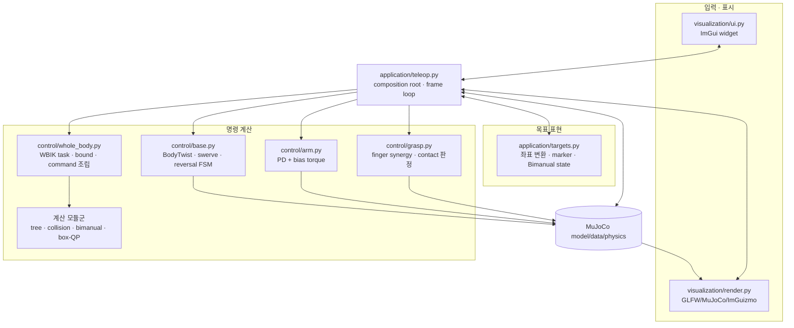
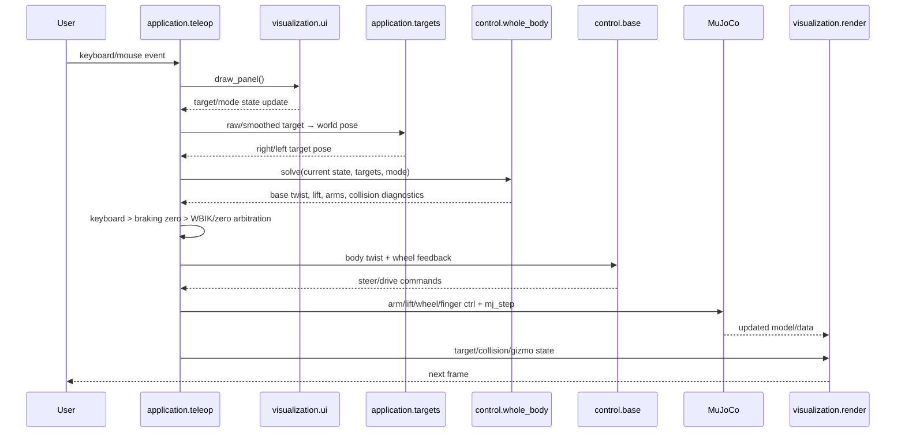
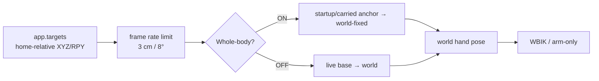

# 아키텍처와 데이터 흐름

코드를 읽기 전에 “어느 파일이 무엇을 소유하는가”를 빠르게 찾는 문서다. 제어 개념이
먼저 필요하면 [동작 원리](concepts.md)를 읽는다.

## 한 문장 구조

`application/teleop.py`가 입력, target 변환, whole-body solver, actuator controller와 renderer를
한 frame loop에 조립하며, 나머지 모듈은 각자의 계산만 담당한다.

모든 실제 구현은 `src/ffw_sh5_grasp/` 패키지 아래에 있다. 저장소의
`src/teleop_app.py`, `src/kinematics.py`, `src/ik.py`는 기존 실행 명령과 import를
유지하는 얇은 호환 진입점이다.

실행·알고리즘 튜닝값은 `config/default.yaml`이 소유하며 `config.py`가 시작 시 한 번
검증한다. 자세한 적용법은 [YAML 파라미터 설정](configuration.md)을 참고한다.

## 계층별 구조



## 파일 책임 지도

| 파일 | 입력 | 출력 | 하지 않는 일 |
|---|---|---|---|
| `config.py` | 기본·사용자 YAML | 검증된 설정 스냅샷 | 제어 상태 변경 없음 |
| `application/teleop.py` | 모든 app 상태와 입력 | frame별 actuator command + `mj_step` | 수학 구현을 중복하지 않음 |
| `visualization/ui.py` | app 상태 | target/mode 상태 변경 | IK, physics, 3D render 없음 |
| `visualization/render.py` | model/data/target pose | scene, camera, gizmo | controller 계산 없음 |
| `application/targets.py` | UI target, base/anchor pose | world hand/virtual pose | actuator 접근 없음 |
| `kinematics/` | model/data, site/geom id | 정규화 pose/Jacobian/distance gradient | target 정책 없음 |
| `control/bimanual.py` | 두 손 pose/Jacobian, 캡처 reference | rigid-grasp 상대 task | actuator 접근 없음 |
| `kinematics/solver.py` | pose 또는 행렬·벡터·bound·해법 | 반복 IK와 pseudoinverse/DLS/QP 해 | control 정책 없음 |
| `kinematics/optimization.py` | Hessian·선형항·제약 | box/soft-barrier QP 해 | robot model 접근 없음 |
| `control/whole_body.py` | current state, world target | base twist, lift/arm position | 수치 solver 중복·live qpos write 없음 |
| `control/base.py` | keys/BodyTwist, wheel feedback | steer angle + wheel speed | MuJoCo/ROS import 없음 |
| `control/arm.py` | current arm state, `q_des` | motor torque | IK target 해석 없음 |
| `control/grasp.py` | grasp/thumb, contact | finger target, grasp 판정 | 물체 weld 없음 |
| `kinematics/legacy.py` | 한 손 pose | 단일 팔 관절 해 | 현재 teleop WBIK 경로 아님 |
| `mujoco_utils.py` | joint id | 연결된 actuator id | 제어 정책 없음 |

조절 가능한 실행·알고리즘 값의 원본은 `config/default.yaml`이다. 각 계산 모듈은
`config.py`가 검증한 값을 읽으며, 사용자 파일의 적용법은
[YAML 파라미터 설정](configuration.md)에 정리되어 있다.

구현을 수정할 때는 [시스템 이해와 개발 가이드](guide/index.md)의 목적별 경로에서 해당 모듈과
최소 회귀 테스트를 함께 찾을 수 있다. 공용 pose/Jacobian/distance 계산은
[기구학과 충돌 거리](guide/kinematics.md)에 따로 정리되어 있다.

## 상태의 소유권

| 상태 | 소유/갱신 위치 | 소비 위치 |
|---|---|---|
| `app.targets` | UI, gizmo, target transition | teleop target 변환, physics step |
| `whole_body_enabled` | UI toggle / app transition | target frame, solver participation, arbitration |
| `arm_mode` | arm panel | active solver side 또는 FK slider |
| `cyclo_grasp_captured` | Capture/Release | virtual-object target과 rigid-grasp task |
| `commanded_base_twist` | app arbitration | `SwerveDrive.update_twist()`와 status |
| `q_des[side]` | WBIK 또는 FK selection | `arm_controllers[side]` |
| collision diagnostics | WBIK command | status와 render overlay |
| `data.qpos/qvel` | MuJoCo physics | 모든 feedback 계산 |

## 한 frame의 호출 흐름 { #frame-call-flow }



## Target 좌표 흐름



ON/OFF 전환은 현재 world pose를 저장한 뒤 반대 표현으로 역변환한다. 이 때문에 UI의
숫자는 바뀔 수 있지만 marker의 실제 world 위치는 보존된다.

## Base 명령 우선순위

```text
키보드 입력 중
  → keyboard BodyTwist
키 해제 뒤 물리 제동 중
  → zero BodyTwist
정지 완료 + Whole-body ON
  → WBIK BodyTwist
정지 완료 + Whole-body OFF
  → zero BodyTwist
```

모든 경우 마지막 단계는 같은 `SwerveDrive.update_twist()`다. 수동/자동 경로가 다른
wheel controller를 사용하지 않는다.

## ROS2 용어 대응표 { #ros2-concept-map }

이 프로젝트는 ROS2 node를 흉내 내는 별도 계층을 두지 않는다. 익숙한 ROS2 개념을
아래처럼 현재 코드 경계로 바꿔 읽으면, 나머지 알고리즘 문서는 동일하다.

| ROS2에서 흔한 구성 | 이 프로젝트의 경계 |
|---|---|
| node | 하나의 `TeleopApp` 인스턴스와 frame loop |
| topic/action | 함수 인자·반환값과 `app.targets` 상태 |
| tf2 frame | MuJoCo body/site와 `application/targets.py`의 명시적 변환 |
| URDF | `models/*.xml`의 MJCF |
| joint state | `data.qpos`, `data.qvel` 직접 읽기 |
| MoveIt Servo/IK | `WholeBodyIK.solve()`와 `DifferentialIKSolver.solve()` |
| collision checker | MuJoCo geom distance + 자체 점 Jacobian CBF |
| `cmd_vel` | `BodyTwist(vx, vy, wz)` |
| `twist_mux` | `_step_physics()`의 keyboard/WBIK 명령 우선순위 |
| swerve controller plugin | `SwerveDrive.update_twist()` |
| `ros2_control` controller | `ArmTorqueController`, `SwerveDrive`, `apply_grasp()` |
| RViz Interactive Marker | ImGuizmo와 MuJoCo mocap marker |
| parameter server | 시작 시 검증되는 `config/default.yaml`과 사용자 override |
| launch | `python3 src/teleop_app.py --config ...` |
| `colcon test` | `tests/test_phase_*.py`, `tests/test_whole_body.py` |

실행 중 topic이나 tf tree가 갱신되는 구조가 아니라, 한 프로세스에서 다음 함수가
순서대로 호출된다. 실기 ROS2 adapter를 추가할 때도 알고리즘을 다시 쓰기보다 이
입출력 경계에서 message와 Python 값 객체를 변환하는 것이 기준이다.

## 테스트 연결

| 계층 | 가장 직접적인 테스트 |
|---|---|
| target/UI/state transition | `test_phase_6.py` |
| swerve input/FSM/물리 | `test_phase_5.py` |
| WBIK/QP/collision/physical mobile | `test_whole_body.py` |
| 단일 팔 FK/Jacobian/IK | `test_phase_3.py` |
| grasp/contact | `test_phase_1.py`, `test_phase_2.py` |

변경 영역별 실행 순서는 [테스트와 검증](testing.md)에 있다.
