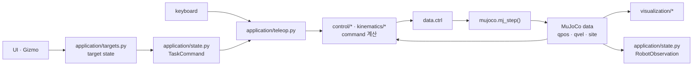
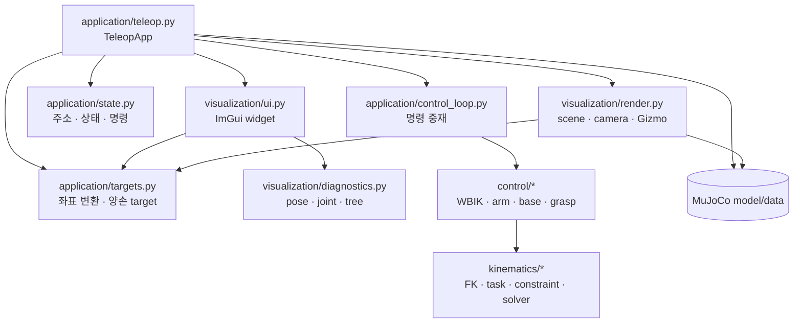

# 시스템 구조

이 프로젝트는 ROS 없이 하나의 Python 프로세스에서 입력, IK, actuator 제어, MuJoCo
물리와 렌더링을 순서대로 실행한다. 조립 지점은
`src/ffw_sh5_grasp/application/teleop.py`의 `TeleopApp`이다.

## 상태와 명령

| 구분 | 의미 | 대표 값 |
|---|---|---|
| `TaskCommand` | 사용자가 원하는 상태 | 손 pose, lift, grasp 값 |
| `ControlCommand` | 물리 적용 단계에 전달할 값 | 양팔·lift·wheel·손 명령 |
| `RobotObservation` | MuJoCo가 적분한 실제 상태 | qpos, qvel, base twist, 손 pose |

UI와 Gizmo는 target만 바꾼다. controller가 command를 계산하고 `mj_step()`이 실제
state를 갱신한다. 캔 reset 같은 자유물체 초기화를 제외하면 로봇의 `data.qpos`를
직접 덮어쓰지 않는다.



## 코드 계층



의존 방향의 기준은 다음과 같다.

- `application`은 모듈 조립, 프레임 실행 순서와 상태 전환을 담당한다.
- `visualization`은 target과 표시 상태만 변경하며 IK나 actuator를 실행하지 않는다.
- `control`은 로봇 명령 정책, `kinematics`는 재사용 가능한 수학 계산을 담당한다.
- 설정 원본은 `config/default.yaml`이고 `config.py`가 시작할 때 검증한다.

## 파일별 역할

| 수정하려는 내용 | 구현 파일 | 상세 문서 |
|---|---|---|
| 프레임 반복·초기화·모드 전환 | `application/teleop.py` | [애플리케이션](guide/teleop_app.md) |
| 모델 주소·상태·명령 스냅샷 | `application/state.py` | [애플리케이션 API](api/application.md#state) |
| 수동/WBIK 명령 중재 | `application/control_loop.py` | [애플리케이션](guide/teleop_app.md) |
| target frame·양손 capture | `application/targets.py` | [애플리케이션](guide/teleop_app.md#target-frames) |
| ImGui 입력·작업 창 | `visualization/ui.py` | [시각화](guide/teleop_ui.md) |
| Task Space 숫자 목표 | `visualization/task_space.py` | [시각화](guide/teleop_ui.md) |
| pose·joint·tree 진단 | `visualization/diagnostics.py` | [시각화](guide/teleop_ui.md) |
| scene·camera·Gizmo·overlay | `visualization/render.py` | [시각화](guide/teleop_ui.md#render-flow) |
| FK·Jacobian·충돌 거리·IK 해법 | `kinematics/*` | [기구학 안내](guide/kinematics.md) |
| 전신 task와 명령 조립 | `control/whole_body.py` | [전신 IK](guide/whole_body_ik.md) |
| 팔·base·손 actuator 정책 | `control/arm.py`, `base.py`, `grasp.py` | [제어 학습 순서](guide/index.md#algorithm-learning-order) |

새 soft task는 `kinematics/tasks.py`, velocity bound나 CBF는
`kinematics/constraints.py`, 새로운 IK 해법은 `kinematics/solver.py`에 둔다. 한
controller 내부에서 상태를 유지하는 정책은 해당 `control` 모듈에 남긴다.

## 한 프레임의 호출 흐름 { #frame-call-flow }

```mermaid
sequenceDiagram
    participant App as application/teleop.py<br>TeleopApp.run()
    participant Loop as application/control_loop.py
    participant State as application/state.py
    participant UI as visualization/ui.py<br>draw_panel()
    participant Target as application/targets.py
    participant IK as control/whole_body.py<br>WholeBodyIK.solve()
    participant Base as control/base.py<br>SwerveDrive.update_twist()
    participant MJ as MuJoCo
    participant Render as visualization/render.py

    App->>Render: begin_frame() · handle_camera_mouse()
    App->>UI: draw_panel(self)
    UI-->>App: target/mode state 변경
    App->>Loop: 수동 입력·base feedback 갱신
    App->>Target: target pose를 world pose로 변환
    App->>State: TaskCommand 생성
    App->>Loop: WBIK solve·결과 반영 요청
    Loop->>IK: solve(data, targets, mode)
    IK-->>Loop: base · lift · arm command
    Loop->>Base: 선택된 BodyTwist + wheel feedback
    Base-->>Loop: steer/drive command
    Loop->>State: ControlCommand 생성
    State-->>App: 물리 적용용 명령 스냅샷
    App->>MJ: data.ctrl 기록 · mj_step()
    App->>State: RobotObservation 생성
    App->>Render: render_scene() · end_frame()
```

세부 target 변환은 [애플리케이션](guide/teleop_app.md), base 명령 우선순위는
[모바일 스워브 제어](guide/base_teleop.md#base-function-flow)에 정리되어 있다.

## 상태 갱신 위치

| 상태 | 갱신 위치 | 소비 위치 |
|---|---|---|
| `app.targets` | UI, Gizmo, target 전환 함수 | WBIK, marker render |
| `app.bindings` | 모델 초기화 | frame loop, target, UI 진단 |
| `last_task_command` | `_step_physics()` | WBIK, 기록기 확장 지점 |
| `last_control_command` | `build_control_command()` | `_step_actuators()`, 기록기 확장 지점 |
| `last_observation` | `TeleopApp.observe()` | UI/IL 확장 지점 |
| `whole_body_enabled`, `arm_mode` | `TeleopApp`의 전환 메서드 | target frame, solver |
| `q_des` | WBIK 또는 FK UI 값 | `ArmTorqueController` |
| `commanded_base_twist` | `control_loop.select_base_command()` | `SwerveDrive` |
| collision 진단값 | `WholeBodyIK.solve()` 결과 | status UI, overlay |
| `data.qpos/qvel` | `mujoco.mj_step()` | 모든 feedback 계산 |

## 필요한 MuJoCo 용어

| 용어 | 이 프로젝트에서의 역할 |
|---|---|
| `MjModel` | MJCF에서 컴파일된 body, joint, geom, actuator 구조 |
| `MjData` | 현재 `qpos`, `qvel`, `ctrl`, site와 contact 상태 |
| body / joint | 강체와 자유도 |
| geom / site | 충돌·표시 형상과 질량 없는 기준 좌표계 |
| actuator | 위치·속도·torque 입력을 joint에 적용 |
| `mj_forward()` | 시간을 진행하지 않고 현재 state의 파생량 재계산 |
| `mj_step()` | 한 timestep 물리 적분 |

## 검증

| 변경 영역 | 최소 회귀 |
|---|---|
| app·target·UI·render | `python3 tests/test_phase_6.py` |
| base | `python3 tests/test_phase_5.py` |
| 기구학·WBIK·collision | `python3 tests/test_whole_body.py` |
| 팔 FK·torque | `python3 tests/test_phase_3.py`, `python3 tests/test_phase_4.py` |
| grasp/contact | `python3 tests/test_phase_1.py`, `python3 tests/test_phase_2.py` |

전체 실행 순서는 [테스트와 검증](testing.md)을 따른다.
