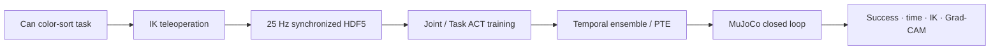

# ACT 모방학습 파이프라인 연구 개요

이 페이지는 `IK_Teleoperation_v3.pdf`의 발표 흐름을 저장소의 실제 구현, 데이터와
평가 결과에 맞춰 문서화한 것이다. 슬라이드의 개념 설명은 유지하되 episode manifest,
checkpoint metadata와 closed-loop 평가 로그로 수치를 다시 확인했다. 상세 수식과 API는
각 절의 연결 문서에서 이어서 볼 수 있다.

!!! note "보고서에서 교차검증한 항목"

    - MuJoCo demonstration은 카메라, joint, EE pose와 action을 한 physics/control tick에서
      **25 Hz로 동기 수집**하며 현재 ACT 학습도 25 Hz sequence를 사용한다.
    - D97 실제 전체 색상 구성은 Green 50 / Red 47이고, D150은 Green 50 / Red 47 /
      Orange 24 / Blue 29다.
    - PTE 평가 범위는 `f = 0, 5, 10, 15, 20`이며 25 Hz에서 각각
      `0.0, 0.2, 0.4, 0.6, 0.8초`다.

## 1. Task definition

목표는 무작위 위치에 놓인 캔을 시각적으로 분류하고 알맞은 상자에 넣는 조작 정책을
학습하는 것이다.

| 캔 | 목표 상자 |
|---|---|
| Green, Blue | Blue bin |
| Red, Orange | Red bin |

환경 reset은 캔 위치, 캔 색과 좌우 상자 색 배치를 바꾼다. 정책은 정답 action이나 목표
trajectory를 입력받지 않고 `cam_high`, `cam_right_wrist` RGB와 현재 robot state만으로
closed-loop action을 출력한다. 연구 질문은 세 가지다.

1. 학습에서 보지 못한 유사 색상으로 일반화할 수 있는가?
2. Joint-space와 Task-space 중 어떤 action 표현이 더 유효한가?
3. 예측 chunk의 미래 action을 앞당겨 실행하면 속도와 안정성이 어떻게 바뀌는가?

## 2. System overview



전체 시스템은 하나의 MuJoCo 모델과 custom kinematics 계층을 공유하지만 두 실행 경로는
분리되어 있다.

- 일반 텔레오퍼레이션은 base, lift와 양팔을 포함하는 whole-body IK를 사용한다.
- ACT 수집·평가는 base/lift/head를 고정한 arm-only 환경에서 수행한다.
- UI는 target만 바꾸고 actuator command와 `mujoco.mj_step()`이 실제 상태를 만든다.

애플리케이션 호출 순서는 [시스템 구조](overview.md), 계층별 파일은
[프로젝트 트리](guide/project-tree.md)에서 확인한다.

## 3. IK-based teleoperation

추가 leader arm이나 VR 장비 없이 end-effector pose를 직접 조작하기 위해 IK 기반 방식을
선택했다. MJCF에서 body–joint–site tree를 구성하고 같은 tree에서 FK, 6×N geometric
Jacobian과 collision point Jacobian을 계산한다.

| Solver | 장점 | 주의점 |
|---|---|---|
| Pseudoinverse | 구현이 단순하고 최소-norm 해를 제공 | 특이점 근처에서 불안정 |
| DLS | damping으로 특이점 근처 변화량 억제 | task 우선순위와 hard bound 표현이 제한적 |
| Box-QP | soft objective와 속도·관절·충돌 제약 통합 | 제약과 gain 설정을 함께 검증해야 함 |

Whole-body QP는 base x/y/yaw, lift와 양팔 관절을 한 decision vector로 풀고, 모드에 따라
base/lift 참여율을 바꾼다. 차체 twist는 3-wheel swerve inverse kinematics로 module
velocity로 변환하며, 동치 steering angle 선택과 전역 wheel saturation으로 속도 비율을
보존한다.

- 수학과 solver: [Differential IK](guide/ik-math.md)
- 전신 제약과 충돌: [Whole-body IK](guide/whole_body_ik.md)
- 베이스 명령: [스워브 제어](guide/base_teleop.md)

## 4. Dataset construction and synchronization

각 demonstration은 RGB, joint state/action과 양손 world-frame EE pose를 같은 HDF5 episode에
저장한다.

```text
episode_xxxxxx.hdf5
├── observations/images/{cam_high,cam_left_wrist,cam_right_wrist}
├── observations/qpos, observations/qvel
├── observations/ee_pose/{left,right}
├── action
└── attrs/{success,object_variant,target_label,control_hz,...}
```

### 주기와 센서 동기화

현재 MuJoCo 수집기에서는 RGB, qpos/qvel, EE pose와 action을 **같은 25 Hz control tick**에서
샘플링한다. 따라서 카메라와 관절 신호를 별도 10 Hz로 resampling하지 않는다. ACT의
chunk step과 PTE 초 단위 환산도 25 Hz를 기준으로 한다.

실제 로봇에서는 이 가정을 그대로 사용할 수 없다. 카메라 exposure timestamp와 joint
controller timestamp를 공통 clock으로 기록하고, 학습 sample 시점에 nearest/interpolated
state를 대응시켜야 한다. 단순히 두 stream의 배열 index만 맞추면 통신 지연과 frame drop이
action label에 섞일 수 있다.

### D97와 D150


| Dataset | 범위 | Green | Red | Orange | Blue | 합계 |
|---|---|---:|---:|---:|---:|---:|
| D97 | 전체 | 50 | 47 | 0 | 0 | 97 |
| D97 | train | 39 | 38 | 0 | 0 | 77 |
| D150 | 전체 | 50 | 47 | 24 | 29 | 150 |
| D150 | train | 39 | 39 | 20 | 22 | 120 |

D150은 단순히 episode 수만 늘린 조건이 아니라 Orange/Blue coverage를 추가한 조건이다.
따라서 D97/D150 차이에는 데이터 양과 색상 다양성이 동시에 변하는 confound가 있다.
D97의 Orange/Blue 평가는 out-of-distribution 일반화로 해석해야 한다. 각 데이터 조건에서
Joint와 Task 정책은 동일한 episode split을 사용한다.

## 5. Joint-space and Task-space ACT

네 정책은 동일한 ACT CVAE Transformer, ResNet-18 visual backbone, 두 policy camera와
90-step action chunk를 사용한다. 입력·출력 표현만 다르다.

| Representation | State / action 8D | 실행 경로 |
|---|---|---|
| Joint | 오른팔 관절 7 + grasp | Joint target → actuator |
| Task | 오른팔 EE `[xyz,wxyz]` + grasp | EE target → bounded IK → Joint target → actuator |

Joint-space는 특정 robot joint configuration을 직접 학습해 posture consistency가 높지만
embodiment에 종속된다. Task-space는 목표를 Cartesian pose로 표현해 kinematic redundancy가
실행 IK에 남으며, IK gain·속도 bound와 collision constraint가 실제 동작에 영향을 준다.

ACT 구조는 [ACT 아키텍처](guide/il/act.md), 구현 대응은
[ACT 구현 대응표](guide/act-implementation.md), 학습 명령은
[Joint/Task 학습](modular-act-training.md)을 참고한다.

## 6. PTE inference

기본 ACT temporal ensemble은 같은 현재 action을 예측한 과거 chunk들을 시간 가중 평균한다.
PTE(Proleptic Temporal Ensemble)는 학습 checkpoint를 바꾸지 않고 각 chunk에서 `f` step
미래의 action을 현재 시점 후보로 사용한다.

| F | 25 Hz look-ahead |
|---:|---:|
| 0 | 0.0 s |
| 5 | 0.2 s |
| 10 | 0.4 s |
| 15 | 0.6 s |
| 20 | 0.8 s |

중간 look-ahead는 느린 초기 접근을 건너뛰어 완료 시간을 줄일 수 있지만, 너무 큰 값은
접촉·파지에 필요한 중간 action을 건너뛰어 reliability cliff를 만든다. 카메라와 joint
state의 관측 주기는 계속 25 Hz이며 F는 센서 stream을 서로 어긋나게 만드는 옵션이 아니라
예측 chunk 안에서 실행할 미래 index를 선택하는 옵션이다.

## 7. Closed-loop evaluation

HDF5 expert trajectory를 replay하지 않고 실제 MuJoCo에서 정책 action을 적용해 다음 관측을
얻는다. D97/D150 × Joint/Task × F 5개 조합을 조건당 100회 평가했으며 모든 셀은 동일한
ordered seed set을 사용한다.


| Policy | F=0 | F=5 | F=10 | F=15 | F=20 |
|---|---:|---:|---:|---:|---:|
| D97 Joint | 79% | 80% | 75% | 57% | 11% |
| D97 Task | 95% | 100% | 97% | 64% | 17% |
| D150 Joint | 100% | 100% | 98% | 88% | 34% |
| D150 Task | 83% | 100% | 90% | 16% | 0% |


평균 시간은 실패를 20초 timeout으로 포함한 penalized completion time을 함께 봐야 한다.
성공한 소수 episode만 평균내면 F=15/20처럼 성공률이 낮은 조건이 인위적으로 빨라 보인다.
신뢰구간, 색상별 결과, paired seed와 Task IK 진단은
[평가 결과 상세 분석](evaluation-results.md)에 정리되어 있다.

## 8. Closed-loop signed EE-Y Grad-CAM

ACT는 class logit이 아니라 연속 action chunk를 출력한다. 표현 간 공정한 비교에서는 전체
chunk norm을 target으로 삼지 않고 동일한 물리 의미인 **world-frame 오른손 EE Y 방향**을
설명한다.

- Task 정책: 출력 action의 world-frame EE Y 성분을 직접 사용한다.
- Joint 정책: 현재 MuJoCo 오른팔 Jacobian의 Y row `J_y`로 미래 joint action을 EE Y로
  투영하고 normalized output에는 `action_std`를 반영한다.
- 각 frame에서 +Y와 -Y score를 모두 계산·저장하며 성공 결과를 보고 방향을 선택하지 않는다.
- Grad-CAM 입력은 checkpoint가 실제 소비하는 `cam_high`, `cam_right_wrist`만 사용한다.
  외부 observer camera는 행동 시각화용이며 attribution 대상이 아니다.

분석은 expert HDF5 frame이 아니라 한 closed-loop rollout의 RGB, trajectory와 최종 결과를
함께 사용해야 한다. 성공 판정 후 frame을 계속 분석했다면 해당 구간을 post-success
continuation으로 구분한다.

!!! warning "해석 한계"

    Grad-CAM은 선택한 출력에 대한 국소 gradient 기반 상관 설명이다. 캔이나 상자에 높은
    activation이 나타나도 색상 인식의 인과성을 증명하지 않는다. 원 heatmap 크기와 gradient
    크기를 함께 보고, 색 가림·교체 intervention과 성능 평가로 별도 검증해야 한다.

일반 action-target Grad-CAM 명령과 원본 NPZ 형식은
[모방학습 명령어](imitation-commands.md#explain-act-predictions-with-grad-cam)에서 확인한다.

## 9. Findings, limitations and next questions

| 연구 질문 | 현재 근거가 지지하는 답 |
|---|---|
| 색상 일반화 | 더 다양한 D150이 coverage를 개선하지만 D97 Task도 unseen color에서 강한 일반화를 보였다. 데이터 수와 diversity 효과는 분리되지 않았다. |
| 표현 | Task-space는 D97 unseen 조건에서 우세했고 Joint-space는 큰 F에서 상대적으로 완만하게 저하됐다. 표현 하나가 모든 조건에서 우월하지는 않다. |
| 추론 | F=5는 네 정책의 공통 안정 운용점이었고, F=10은 일부 정책에서 더 빨랐다. F≥15는 대부분 reliability를 크게 잃었다. |

현재 결과는 MuJoCo의 단일 robot, 오른팔 color-sort task에 한정된다. 다음 단계는 다음과
같다.

1. robot embodiment가 다른 환경에서 Task-space policy의 cross-robot transfer 평가
2. 실제 robot의 timestamp synchronization, camera calibration과 safety layer 검증
3. 데이터 수와 색상 diversity를 독립적으로 통제한 ablation
4. 더 빠른 완료 시간과 접촉 안정성을 동시에 최적화하는 adaptive PTE

## 재현 진입점

```bash
# 네 정책 학습
python3 src/il.py train --config config/imitation/act_color_sort_joint.yaml
python3 src/il.py train --config config/imitation/act_color_sort_task.yaml
python3 src/il.py train --config config/imitation/act_color_sort_joint_aug150.yaml
python3 src/il.py train --config config/imitation/act_color_sort_task_aug150.yaml

# 4 policies × 5 F values × 100 episodes
MUJOCO_GL=egl python3 src/il.py evaluate-color-sort --num-episodes 100

# 공개 artifact 확인
python3 scripts/prepare_huggingface_release.py
```

데이터와 checkpoint를 바로 내려받는 방법은 [Hugging Face 배포](huggingface.md)를
참고한다.
